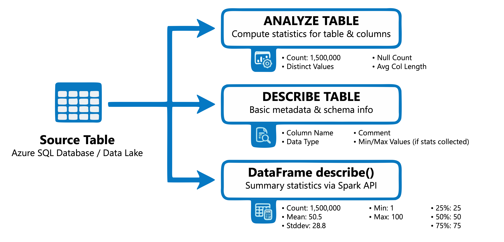
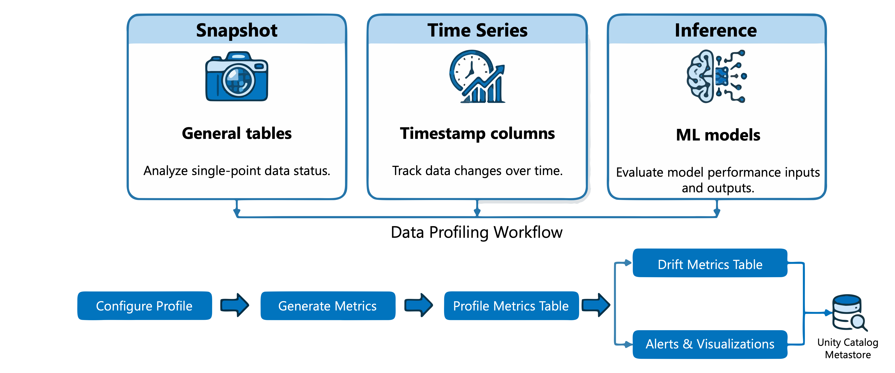

>[!VIDEO https://learn-video.azurefd.net/vod/player?id=9641bd12-f1cf-4ef0-be79-1dd29424da72]

Before you cleanse or transform data, you need to understand what's in your tables. **Profiling data** means examining your datasets to generate summary statistics—counts, averages, value distributions, and null percentages—that reveal the quality and structure of your data. This foundation helps you identify issues like missing values, outliers, and unexpected patterns before they cause problems downstream.

In this unit, you learn how to generate summary statistics using SQL commands and the data profiling feature in Azure Databricks.

## Generate summary statistics using SQL

Azure Databricks provides SQL commands that collect and display statistics about your tables. These statistics help the query optimizer choose efficient execution plans and give you insight into your data's characteristics.

[](../media/2-generate-summary-statistics-using-sql.png#lightbox)

### Collect statistics with ANALYZE TABLE

The `ANALYZE TABLE` command computes statistics for a table or specific columns. These statistics include row counts, column-level metrics like minimum and maximum values, null counts, and distinct value counts.

```sql
-- Collect basic table statistics (row count and size)
ANALYZE TABLE sales.transactions COMPUTE STATISTICS;

-- Collect statistics for specific columns
ANALYZE TABLE sales.transactions COMPUTE STATISTICS FOR COLUMNS 
    transaction_id, amount, customer_id;

-- Collect statistics for all columns
ANALYZE TABLE sales.transactions COMPUTE STATISTICS FOR ALL COLUMNS;
```

When you analyze a specific column, you get detailed metrics:

```sql
-- View column-level statistics
DESC EXTENDED sales.transactions amount;
```

This returns metrics including minimum value, maximum value, number of nulls, distinct count, average column length, and maximum column length.

### View statistics with DESCRIBE TABLE

The `DESCRIBE TABLE EXTENDED` command displays collected statistics alongside table metadata:

```sql
DESCRIBE TABLE EXTENDED sales.transactions;
```

You can also use PySpark to retrieve table metadata and generate summary statistics:

```python
# Generate summary statistics for numeric columns using the DataFrame API
df = spark.table("sales.transactions")
df.describe().show()
```

The `describe()` method returns count, mean, standard deviation, min, and max for numeric columns.

The output shows the table's size in bytes and row count, confirming that profiling has been performed. For Unity Catalog managed tables, predictive optimization automatically runs `ANALYZE` to keep statistics current.

> [!TIP]
> Run `ANALYZE TABLE` after bulk data loads or significant changes to ensure the query optimizer has accurate statistics for planning efficient queries.

## Use data profiling in Unity Catalog

Beyond SQL commands, Azure Databricks provides **data quality monitoring** in Unity Catalog—an umbrella that covers two distinct capabilities:

- **Anomaly detection** monitors all tables in a schema automatically. It analyzes historical patterns to evaluate each table's freshness (how recently it was updated) and completeness (whether the expected number of rows arrived). You enable it once at the schema level in Catalog Explorer, and Azure Databricks handles the rest using intelligent scanning. Use anomaly detection for broad, automated coverage across all your tables without per-table configuration.
- **Data profiling** provides deep per-table statistical analysis—tracking distributions, null percentages, drift metrics, and model performance over time. You configure it individually for each table. Use data profiling for your most critical tables where you need detailed historical trends.

For data engineering work focused on cleansing and quality, you'll use both: anomaly detection as an early-warning system across all tables, and data profiling for in-depth monitoring of key tables.

[](../media/2-use-data-profiling-in-unity-catalog.png#lightbox)

### Understand profile types

Data profiling supports three analysis types, each suited to different scenarios:

| Profile type    | Use case                      | Key characteristics                                        |
| --------------- | ----------------------------- | ---------------------------------------------------------- |
| **Snapshot**    | General-purpose tables        | Computes metrics over the entire table with each refresh   |
| **Time series** | Tables with timestamp columns | Tracks metrics across time windows to detect trends        |
| **Inference**   | ML model inference tables     | Monitors model inputs, predictions, and accuracy over time |

For data engineering tasks focused on data quality, the snapshot and time series profiles are most relevant.

### Create a profile using the UI

To create a profile in Catalog Explorer:

1. Navigate to your table in Catalog Explorer.
2. Select the **Quality** tab.
3. If anomaly detection is **not** enabled for the schema, select **Enable**. If anomaly detection is already enabled, select **Configure**.
4. In the **Data Quality Monitoring** dialog, in the **Data profiling** field, select **Configure**.
5. Choose your profile type and configure options like granularity and scheduling.

The profile generates two metric tables: a profile metrics table with summary statistics and a drift metrics table tracking distribution changes over time.

### Create a profile using the API

For programmatic access, use the Databricks SDK. Install or upgrade the SDK to get the current API:

```python
%pip install "databricks-sdk>=0.68.0"
```

Then create a snapshot profile for a table:

```python
from databricks.sdk import WorkspaceClient
from databricks.sdk.service.dataquality import Monitor, DataProfilingConfig, SnapshotConfig

w = WorkspaceClient()

# Retrieve the table ID and schema ID required by the API
table = w.tables.get(full_name="main.sales.transactions")
schema = w.schemas.get(full_name="main.sales")

w.data_quality.create_monitor(
    monitor=Monitor(
        object_type="table",
        object_id=table.table_id,
        data_profiling_config=DataProfilingConfig(
            output_schema_id=schema.schema_id,
            assets_dir="/Workspace/Users/user@example.com/monitoring",
            snapshot=SnapshotConfig()
        )
    )
)
```

To refresh the profile and update metrics:

```python
from databricks.sdk.service.dataquality import Refresh

w.data_quality.create_refresh(
    object_type="table",
    object_id=table.table_id,
    refresh=Refresh(object_type="table", object_id=table.table_id)
)
```

## Interpret profiling results

Profiling generates metrics that help you assess data quality and identify issues requiring attention.

### Key metrics to examine

The profile metrics table contains statistics for each column:

| Metric                        | What it reveals                                                         |
| ----------------------------- | ----------------------------------------------------------------------- |
| `count` and `num_nulls`       | Data completeness—high null percentages might indicate ingestion issues |
| `distinct_count`              | Cardinality—unexpected values might suggest data quality problems       |
| `min`, `max`, `avg`, `stddev` | Distribution characteristics—outliers or skewed distributions           |
| `frequent_items`              | Most common values—helps identify dominant categories or duplicates     |
| `quantiles`                   | Value distribution—useful for detecting skewness                        |

### Detect data quality issues

When you examine profiling results, look for these common indicators:

- **High null percentages** in columns that should have values
- **Unexpected distinct counts**, such as unique identifiers that aren't unique
- **Value ranges outside expected bounds**, like negative amounts where only positives are valid
- **Distribution changes over time**, which can indicate data drift

The drift metrics table calculates statistical tests like the Kolmogorov-Smirnov (KS) test for numeric columns and chi-squared test for categorical columns. These tests quantify how much distributions have changed.

Understanding these patterns helps you design appropriate cleansing and validation rules for your data pipelines.
