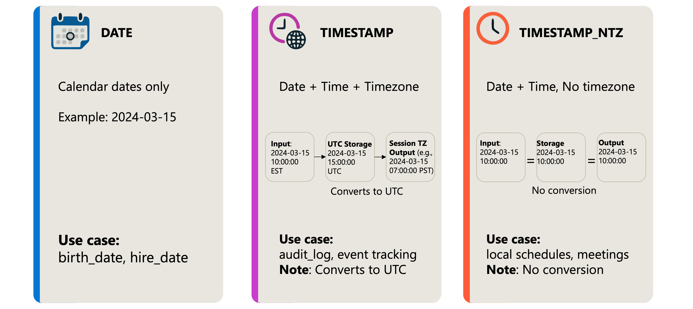
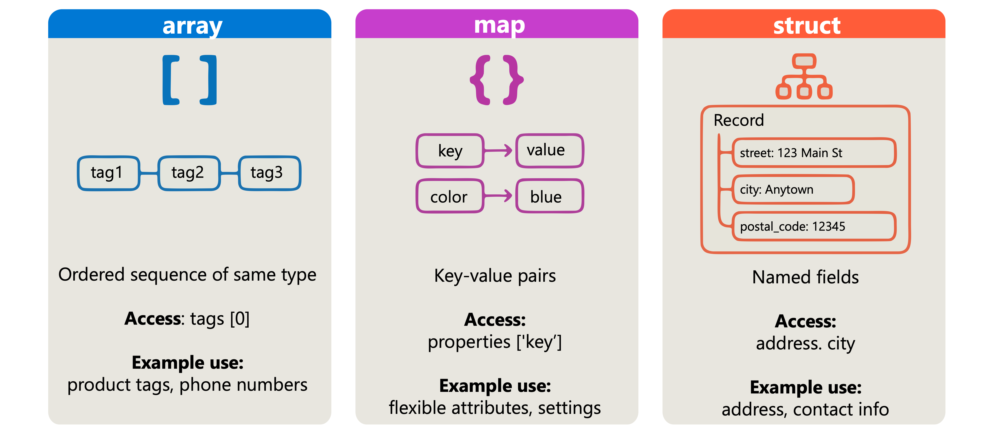
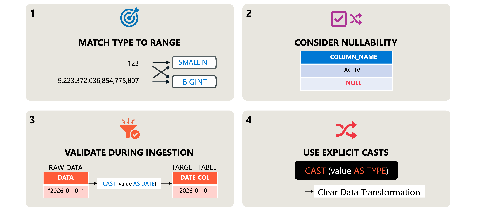

Choosing the right data type for each column directly affects your data quality, storage efficiency, and query performance. When you select an inappropriate type, you risk losing precision, wasting storage space, or blocking operations that require specific type characteristics. In this unit, you learn how to evaluate your data and select the most appropriate column types in Azure Databricks.

## Understand data type categories

Azure Databricks organizes data types into categories based on their characteristics and use cases. Understanding these categories helps you narrow down your options when choosing a type for a specific column.

**Numeric types** handle mathematical values and calculations. You have several options:

| Type category  | Types                                  | Use case                                   |
| -------------- | -------------------------------------- | ------------------------------------------ |
| Integral       | `TINYINT`, `SMALLINT`, `INT`, `BIGINT` | Whole numbers of varying sizes             |
| Decimal        | `DECIMAL(p,s)`                         | Exact precision for financial data         |
| Floating point | `FLOAT`, `DOUBLE`                      | Scientific calculations with approximation |

**Date-time types** represent temporal data:

| Type            | Description                            |
| --------------- | -------------------------------------- |
| `DATE`          | Calendar dates without time components |
| `TIMESTAMP`     | Date and time with session timezone    |
| `TIMESTAMP_NTZ` | Date and time without timezone         |

**Text and binary types** store character and byte sequences:

- `STRING` for variable-length text
- `BINARY` for raw byte sequences

**Complex types** organize nested or repeated data:

- `ARRAY` for ordered sequences of elements
- `MAP` for key-value pairs
- `STRUCT` for records with named fields

## Select the right numeric type

Numeric data requires careful type selection because different types have different precision, range, and storage characteristics. Your choice affects both data integrity and performance.

For whole numbers, match the type to your value range:

| Type       | Range                               | Storage | Common use cases             |
| ---------- | ----------------------------------- | ------- | ---------------------------- |
| `TINYINT`  | -128 to 127                         | 1 byte  | Status codes, small counters |
| `SMALLINT` | -32,768 to 32,767                   | 2 bytes | Year values, limited ranges  |
| `INT`      | -2.1 billion to 2.1 billion         | 4 bytes | Most identifiers, counts     |
| `BIGINT`   | -9.2 quintillion to 9.2 quintillion | 8 bytes | Large IDs, row counts        |

When creating tables, specify the appropriate type for each column:

```sql
CREATE TABLE orders (
    order_id INT,
    status_code TINYINT,
    total_items SMALLINT,
    transaction_id BIGINT
);
```

For decimal numbers, the choice between `DECIMAL` and floating point types depends on your precision requirements:

```sql
-- DECIMAL(p,s): exact precision for financial calculations
-- p = total digits, s = digits after decimal point
CREATE TABLE transactions (
    transaction_id INT,
    amount DECIMAL(10,2),         -- Exact: up to 99,999,999.99
    tax_rate DECIMAL(5,4)         -- Exact: up to 9.9999
);

-- DOUBLE: approximate, suitable for scientific calculations
CREATE TABLE measurements (
    sensor_id INT,
    temperature DOUBLE,           -- Approximate, large range
    pressure DOUBLE
);
```

> [!IMPORTANT]
> Use `DECIMAL` for financial data where exact precision matters. Floating point types (`FLOAT`, `DOUBLE`) use binary representation and can introduce rounding errors with base-10 values like currency.

## Choose temporal types correctly

Temporal data type selection depends on whether you need timezone awareness and what level of precision your application requires.

Use `DATE` when you only need calendar dates without time components:

```sql
CREATE TABLE employees (
    employee_id INT,
    hire_date DATE,
    birth_date DATE
);
```

For timestamps, choose between timezone-aware and timezone-naive types:

```sql
-- TIMESTAMP: normalizes to UTC internally, applies session timezone on read
-- Use when tracking events across time zones
CREATE TABLE audit_log (
    log_id BIGINT,
    event_time TIMESTAMP,
    user_id INT
);

-- TIMESTAMP_NTZ: no timezone conversion
-- Use when the time should remain as entered
CREATE TABLE schedules (
    schedule_id INT,
    local_meeting_time TIMESTAMP_NTZ
);
```

The `TIMESTAMP` type converts values to UTC for storage and applies the session timezone when retrieving values. This behavior ensures consistent ordering across time zones but can cause confusion if you expect values to remain unchanged.

[](../media/3-choose-temporal-types-correctly.png#lightbox)

## Work with complex types

Complex types let you store structured, nested, or repeated data within a single column. They're useful when your data doesn't fit a flat relational model.

[](../media/3-work-with-complex-types.png#lightbox)

Use `ARRAY` when you have multiple values of the same type:

```sql
-- Store a list of tags for each product
CREATE TABLE products (
    product_id INT,
    name STRING,
    tags ARRAY<STRING>
);

-- Query array elements
SELECT product_id, tags[0] AS primary_tag FROM products;
```

Use `MAP` for key-value pairs with dynamic keys:

```sql
-- Store flexible attributes as key-value pairs
CREATE TABLE devices (
    device_id INT,
    properties MAP<STRING, STRING>
);

-- Access map values by key
SELECT device_id, properties['firmware_version'] AS firmware FROM devices;
```

Use `STRUCT` when you have a fixed set of named fields:

```sql
-- Store address as a structured type
CREATE TABLE customers (
    customer_id INT,
    address STRUCT<street: STRING, city: STRING, postal_code: STRING>
);

-- Access struct fields
SELECT customer_id, address.city FROM customers;
```

> [!TIP]
> Complex types reduce the need for additional tables and joins, but they also make some operations more difficult. Consider your query patterns before choosing between normalized tables and complex types.

## Apply type selection best practices

When evaluating data for type selection, consider these practical guidelines:

[](../media/3-apply-type-selection-best-practices.png#lightbox)

**Match the type to the data's nature and range.** Don't use `BIGINT` for values that never exceed a few thousand. The extra bytes multiply across millions of rows.

**Consider nullability.** If a column should never contain null values, document this constraint. While data types don't enforce nullability by default, you can add `NOT NULL` constraints to table definitions.

**Validate types during ingestion.** Cast incoming data to the target type early in your pipeline to catch type mismatches before they propagate:

```sql
-- Cast during data loading
INSERT INTO target_table
SELECT 
    CAST(raw_id AS INT) AS id,
    CAST(raw_amount AS DECIMAL(10,2)) AS amount,
    CAST(raw_date AS DATE) AS transaction_date
FROM staging_table;
```

**Use explicit casts when converting types.** Implicit conversions can succeed silently even when data is lost. Explicit casts make your intentions clear and help identify problems during testing.

These practices help you build pipelines where data types serve as a form of documentation and validation, catching errors early rather than letting them affect downstream analytics.
