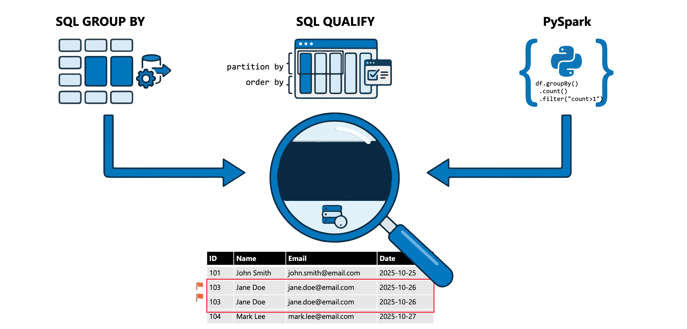
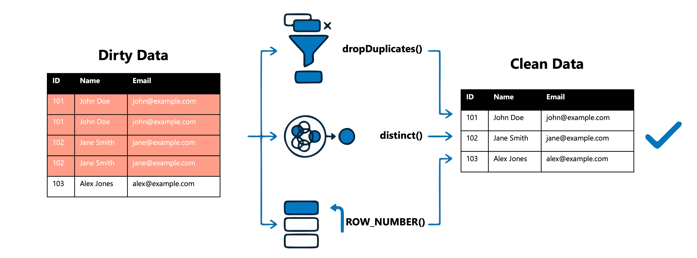
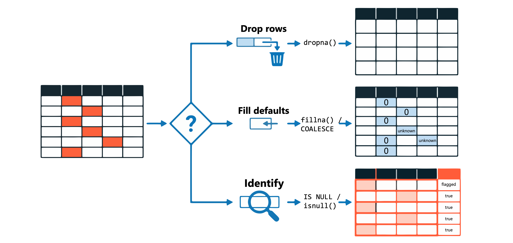

Data quality issues like duplicate records and null values can compromise your analytics and downstream processes. Whether duplicates arise from concurrent data loads or nulls appear due to incomplete source data, addressing these issues is a core responsibility for data engineers working in Azure Databricks.

In this unit, you learn how to identify and resolve duplicate, missing, and null values using both SQL and PySpark approaches.

## Identify duplicate records

Before you can remove duplicates, you need to find them. Duplicates typically occur when the same record appears multiple times in a table, often due to data integration issues, repeated ingestion, or concurrent write operations.

[](../media/4-identify-duplicate-records.png#lightbox)

### Use GROUP BY and HAVING to find duplicates

The most straightforward way to identify duplicates is by grouping records and counting occurrences. The `HAVING` clause filters the grouped results to show only values that appear more than once.

```sql
SELECT 
    customer_id, 
    email, 
    COUNT(*) AS occurrence_count
FROM sales.customers
GROUP BY customer_id, email
HAVING COUNT(*) > 1
ORDER BY occurrence_count DESC;
```

This query returns all combinations of `customer_id` and `email` that appear multiple times in the table, helping you understand the scope of duplication.

### Use QUALIFY with window functions

The `QUALIFY` clause provides a more elegant approach by filtering the results of window functions directly, without requiring subqueries. This approach is particularly useful when you need to see the actual duplicate rows, not just counts.

```sql
SELECT *
FROM sales.customers
QUALIFY COUNT(*) OVER (PARTITION BY customer_id, email) > 1;
```

This query might return results like:

| customer_id | email            | name         | created_at | status  |
| ----------- | ---------------- | ------------ | ---------- | ------- |
| 1001        | jane@contoso.com | Jane Doe     | 2024-01-15 | Active  |
| 1001        | jane@contoso.com | Jane D.      | 2024-03-20 | Active  |
| 1002        | bob@fabrikam.com | Bob Smith    | 2024-02-10 | Pending |
| 1002        | bob@fabrikam.com | Robert Smith | 2024-02-11 | Active  |

With this pattern, you get all columns from the duplicate rows, making it easier to investigate the source of duplication.

### Find duplicates using PySpark

In PySpark, you can use window functions combined with filtering to identify duplicate records:

```python
from pyspark.sql.functions import count
from pyspark.sql.window import Window

window_spec = Window.partitionBy("customer_id", "email")

duplicates_df = (
    df.withColumn("row_count", count("*").over(window_spec))
    .filter("row_count > 1")
    .drop("row_count")
)

display(duplicates_df)
```

Alternatively, use the `exceptAll()` method to compare the original DataFrame against a deduplicated version:

```python
df_duplicates = df.exceptAll(df.dropDuplicates(["customer_id", "email"]))
display(df_duplicates)
```

The `exceptAll()` method performs a set difference that preserves duplicates. It returns all rows from the first DataFrame that aren't in the second DataFrame, keeping duplicate occurrences. Here's how it works:

1. `df.dropDuplicates(["customer_id", "email"])` creates a DataFrame with one row per unique combination
2. `exceptAll()` compares the original DataFrame against this deduplicated version
3. For each unique combination, one occurrence is "matched" and removed, leaving only the extra duplicates

For example, if customer 1001 appears three times in the original DataFrame and once in the deduplicated version, `exceptAll()` returns two rows (the extra occurrences).

> [!NOTE]
> Unlike `except()`, which removes all matching rows and returns distinct results, `exceptAll()` preserves the duplicate structure. If you have three identical rows in the original and one in the deduplicated set, `exceptAll()` returns exactly two rows.

## Remove duplicate records

Once you've identified duplicates, you can choose a resolution strategy based on your data requirements.

[](../media/4-remove-duplicate-records.png#lightbox)

### Remove duplicates in PySpark

The `dropDuplicates()` method removes duplicate rows based on specified columns, keeping only the first occurrence:

```python
df_clean = df.dropDuplicates(["customer_id", "email"])
```

For complete row deduplication across all columns, use `distinct()`:

```python
df_unique = df.distinct()
```

### Keep specific rows using ROW_NUMBER

When you need control over which duplicate to keep, use `ROW_NUMBER()` with `QUALIFY` to select records based on criteria like the most recent update:

```sql
SELECT *
FROM sales.customers
QUALIFY ROW_NUMBER() OVER (
    PARTITION BY customer_id 
    ORDER BY updated_at DESC
) = 1;
```

This query partitions records by `customer_id`, orders them by `updated_at` in descending order, and keeps only the most recently updated record for each customer.

## Handle null and missing values

Null values represent missing or unknown data. Depending on your analysis requirements, you might need to remove rows with nulls, replace them with default values, or use statistical imputation.

[](../media/4-handle-null-and-missing-values.png#lightbox)

### Identify null values

Use the `isnull()` function or `IS NULL` operator to find records with missing values:

```sql
SELECT *
FROM sales.transactions
WHERE amount IS NULL 
   OR customer_id IS NULL;
```

To count null occurrences per column:

```sql
SELECT 
    COUNT(*) AS total_rows,
    COUNT(*) - COUNT(amount) AS null_amount_count,
    COUNT(*) - COUNT(customer_id) AS null_customer_count
FROM sales.transactions;
```

### Drop rows with null values

In PySpark, the `dropna()` method removes rows containing null values:

```python
# Drop rows where any column is null
df_clean = df.dropna()

# Drop rows where all columns are null
df_clean = df.dropna(how="all")

# Drop rows where specific columns are null
df_clean = df.dropna(subset=["customer_id", "amount"])
```

The `how` parameter controls the behavior: `"any"` drops rows with at least one null (default), while `"all"` drops rows only when all specified columns are null.

### Fill null values with defaults

The `fillna()` method replaces null values with specified defaults:

```python
# Fill all null values with a single value
df_filled = df.fillna(0)

# Fill specific columns with different values
df_filled = df.fillna({
    "amount": 0,
    "status": "Unknown",
    "quantity": 1
})
```

In SQL, use the `COALESCE` function to provide default values:

```sql
SELECT 
    customer_id,
    COALESCE(amount, 0) AS amount,
    COALESCE(status, 'Unknown') AS status
FROM sales.transactions;
```

### Choose the right strategy

The appropriate null handling strategy depends on your data context:

| Scenario                                  | Recommended approach                   |
| ----------------------------------------- | -------------------------------------- |
| Nulls in required fields like identifiers | Drop the rows                          |
| Nulls in numeric fields for aggregation   | Fill with zero or mean                 |
| Nulls in optional categorical fields      | Fill with placeholder like "Unknown"   |
| Nulls that would skew analysis            | Drop or fill based on domain knowledge |

> [!TIP]
> Document your null handling decisions. Future analysts need to understand why certain values were replaced or removed to correctly interpret query results.

Understanding how to identify and resolve these data quality issues prepares you to build more reliable data pipelines. With clean data, your downstream transformations and analytics produce trustworthy results.
