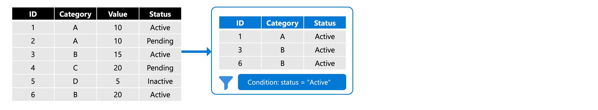
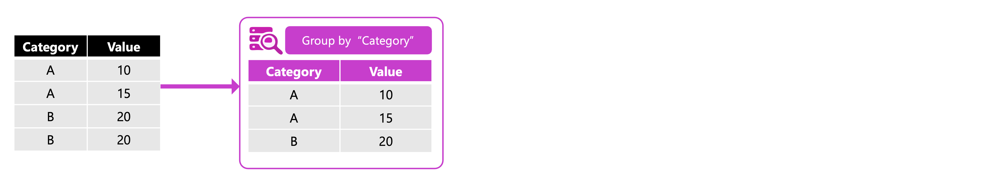
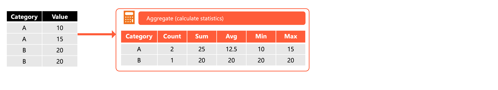

Data transformation turns raw data into formats suitable for analysis and reporting. **Filtering**, **grouping**, and **aggregating** are fundamental operations you use to shape data—selecting relevant records, organizing them into meaningful categories, and calculating summary statistics. These operations form the foundation of most data engineering pipelines.

In this unit, you learn how to filter rows based on conditions, group data by one or more columns, and apply aggregate functions to calculate summary values.

## Filter data to select relevant rows

Filtering removes rows that don't meet your criteria, reducing dataset size and focusing on the data that matters. In Azure Databricks, you can filter data using PySpark's DataFrame API or SQL.



### Filter with PySpark

The `filter()` and `where()` methods work identically—use whichever you prefer for readability. The `col()` function references column names in your expressions.

```python
from pyspark.sql.functions import col

# Filter customers with account balance greater than 1000
df_filtered = df_customer.filter(col("c_acctbal") > 1000)
display(df_filtered)
```

For multiple conditions, combine them with logical operators. Use `&` for AND and `|` for OR, wrapping each condition in parentheses:

```python
# Filter customers in nation 20 with balance over 1000
df_filtered = df_customer.filter(
    (col("c_nationkey") == 20) & (col("c_acctbal") > 1000)
)

# Filter customers matching either of two IDs
df_filtered = df_customer.filter(
    (col("c_custkey") == 412446) | (col("c_custkey") == 412447)
)
```

### Filter with SQL

SQL's `WHERE` clause provides the same filtering capability with familiar syntax:

```sql
-- Filter orders with status 'F' and total price above 50000
SELECT *
FROM orders
WHERE o_orderstatus = 'F'
  AND o_totalprice > 50000;
```

You can filter directly when reading from a table in PySpark using `spark.sql()`:

```python
df_filtered = spark.sql("""
    SELECT *
    FROM sales.transactions
    WHERE amount > 100
      AND transaction_date >= '2024-01-01'
""")
```

### Filter null values

Filtering null values requires special handling in Spark DataFrames. Use the `isNull()` and `isNotNull()` functions to identify or exclude null values:

```python
# Filter rows where order_amount is not null
df_valid_orders = df.filter(col("order_amount").isNotNull())

# Filter rows where order_amount is null
df_null_orders = df.filter(col("order_amount").isNull())

# Alternative syntax using column object directly
df_valid_orders = df.filter(df.order_amount.isNotNull())
```

> [!IMPORTANT]
> Using Python's `None` with inequality operators like `!= None` doesn't reliably filter null values in Spark DataFrames. Null comparisons in SQL semantics don't evaluate to true or false—they return null. Always use `isNull()` or `isNotNull()` for correct null handling.

In SQL, use the `IS NULL` or `IS NOT NULL` operators:

```sql
-- Filter orders with non-null amounts
SELECT *
FROM orders
WHERE order_amount IS NOT NULL;
```

For comprehensive null handling that removes entire rows containing null values, use the `dropna()` method covered in the unit on resolving duplicate and missing values:

```python
# Remove rows where order_amount is null
df_clean = df.dropna(subset=["order_amount"])
```

## Group data to organize records

Grouping organizes rows that share common values into categories. This prepares data for aggregation—once grouped, you can calculate statistics for each category.



### Group with PySpark

Use the `groupBy()` method to specify one or more columns for grouping:

```python
# Group by a single column
df_grouped = df_customer.groupBy("c_mktsegment")

# Group by multiple columns
df_grouped = df_customer.groupBy("c_mktsegment", "c_nationkey")
```

Grouping alone returns a `GroupedData` object. To see results, you must apply an aggregation.

### Group with SQL

SQL uses the `GROUP BY` clause to organize rows:

```sql
-- Group sales by region
SELECT region, COUNT(*) as order_count
FROM sales
GROUP BY region;
```

When grouping, every column in your `SELECT` statement must either appear in the `GROUP BY` clause or be wrapped in an aggregate function.

## Aggregate data to calculate summary statistics

Aggregation calculates summary values—counts, sums, averages, and extremes—for each group. Common aggregate functions include:

| Function | Description | Example use case |
| -------- | ----------- | ---------------- |
| `count()` | Counts rows in each group | Number of orders per customer |
| `sum()` | Adds values in a column | Total revenue by product |
| `avg()` | Calculates the mean | Average order value by region |
| `min()` | Finds the smallest value | Earliest order date per customer |
| `max()` | Finds the largest value | Highest transaction amount |



### Aggregate with PySpark

Use the `agg()` method to apply aggregate functions after grouping. Import functions from `pyspark.sql.functions`:

```python
from pyspark.sql.functions import avg, sum, count, min, max

# Calculate average balance by market segment
df_segment_avg = df_customer.groupBy("c_mktsegment").agg(
    avg("c_acctbal").alias("avg_balance")
)
display(df_segment_avg)
```

Apply multiple aggregations in a single statement:

```python
# Multiple aggregations per group
df_order_stats = df_order.groupBy("o_orderpriority").agg(
    count("o_orderkey").alias("order_count"),
    sum("o_totalprice").alias("total_revenue"),
    avg("o_totalprice").alias("avg_order_value"),
    max("o_totalprice").alias("max_order")
)
display(df_order_stats)
```

### Aggregate with SQL

SQL aggregations work directly in `SELECT` statements:

```sql
-- Calculate statistics by dealership
SELECT id,
       COUNT(*) AS total_orders,
       SUM(quantity) AS total_quantity,
       AVG(quantity) AS avg_quantity,
       MAX(quantity) AS max_quantity
FROM dealer
GROUP BY id
ORDER BY total_quantity DESC;
```

Use `HAVING` to filter groups after aggregation:

```sql
-- Find high-volume dealers only
SELECT id, SUM(quantity) AS total_quantity
FROM dealer
GROUP BY id
HAVING SUM(quantity) > 20;
```

## Chain transformations for readable pipelines

Spark's lazy evaluation lets you chain multiple transformations into a single, readable pipeline. The operations execute only when you call an action like `display()` or `show()`.

```python
from pyspark.sql.functions import col, count

# Chain filter, group, aggregate, and sort
df_result = (
    df_order
    .filter(col("o_orderstatus") == "F")
    .groupBy("o_orderpriority")
    .agg(count("o_orderkey").alias("n_orders"))
    .sort(col("n_orders").desc())
)
display(df_result)
```

This approach improves readability and lets Spark optimize the entire operation sequence before execution. Each transformation builds on the previous one, creating a clear data flow from source to result.

> [!TIP]
> When chaining transformations, place filters early in the pipeline to reduce the data volume that subsequent operations must process.

Understanding filtering, grouping, and aggregating prepares you to build efficient transformation pipelines. These operations combine naturally with joins and other transformations to create comprehensive data processing workflows.
