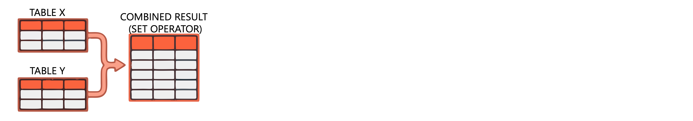

Data engineering workflows often require combining information from multiple datasets. **Joins** combine tables horizontally by matching rows on related columns, while **set operators** combine tables vertically by appending, intersecting, or excluding rows. Understanding when to use each approach helps you build efficient transformation pipelines.

In this unit, you learn how to join tables based on relationships and apply set operators to combine datasets with matching schemas.

## Combine tables with joins

Joins merge rows from two tables based on a related column. The join type determines which rows appear in the result and how unmatched rows are handled.


### Understand join types

Each join type serves a specific purpose in data transformation:


| Join type | Description | Use case |
| --------- | ----------- | -------- |
| `INNER` | Returns only matching rows from both tables | Link orders with valid customers |
| `LEFT` | Returns all left table rows; adds NULLs for right table when no match | Include all customers, even without orders |
| `RIGHT` | Returns all right table rows; adds NULLs for left table when no match | Include all departments, even without employees |
| `FULL` | Returns all rows from both tables; adds NULLs for non-matches | Combine datasets to find gaps on either side |
| `SEMI` | Returns left table rows that have matches in the right table | Filter customers who placed orders |
| `ANTI` | Returns left table rows that have no match in the right table | Find customers who never placed orders |
| `CROSS` | Returns Cartesian product of all rows | Generate all possible combinations |

### Join tables with SQL

The `JOIN` clause combines tables based on a condition specified with `ON` or `USING`. Consider employee and department tables where you want to match employees to their departments:

```sql
-- Inner join: only employees with matching departments
SELECT e.id, e.name, e.deptno, d.deptname
FROM employee e
INNER JOIN department d ON e.deptno = d.deptno;
```

An inner join returns only three rows—employees whose department numbers exist in the department table. Employees in departments 4, 5, and 6 don't appear because those departments aren't in the department table.

When you need to include all employees regardless of department matches, use a left join:

```sql
-- Left join: all employees, NULL for missing departments
SELECT e.id, e.name, e.deptno, d.deptname
FROM employee e
LEFT JOIN department d ON e.deptno = d.deptno;
```

This returns all six employees. Those without matching departments show NULL in the `deptname` column.

### Join DataFrames with PySpark

PySpark's `join()` method provides the same functionality. The `how` parameter specifies the join type:

```python
df_employee = spark.table("employee")
df_department = spark.table("department")

# Inner join
df_inner = df_employee.join(
    df_department,
    on=df_employee.deptno == df_department.deptno,
    how="inner"
)
display(df_inner)
```

For left, right, or full outer joins, change the `how` parameter:

```python
# Left join: keep all employees
df_left = df_employee.join(
    df_department,
    on="deptno",
    how="left"
)

# Full outer join: keep all rows from both tables
df_full = df_employee.join(
    df_department,
    on="deptno",
    how="full"
)
```

When the join column has the same name in both DataFrames, pass the column name as a string. This approach avoids duplicate columns in the result.

### Filter data with semi and anti joins

Semi and anti joins are powerful for filtering data based on existence in another table. A semi join returns rows from the left table that have matches, without including columns from the right table:

```sql
-- Find employees who belong to listed departments
SELECT *
FROM employee
LEFT SEMI JOIN department ON employee.deptno = department.deptno;
```

An anti join returns the opposite—rows without matches:

```sql
-- Find employees in departments not listed
SELECT *
FROM employee
LEFT ANTI JOIN department ON employee.deptno = department.deptno;
```

In PySpark, use `how="semi"` or `how="anti"`:

```python
# Employees with matching departments
df_semi = df_employee.join(df_department, on="deptno", how="semi")

# Employees without matching departments
df_anti = df_employee.join(df_department, on="deptno", how="anti")
```

## Combine rows with set operators

Set operators work vertically, combining rows from queries with the same column structure. Unlike joins, set operators don't match on conditions—they stack or compare entire result sets.



### Understand set operators

Azure Databricks supports three set operators:

| Operator | Description | Behavior |
| -------- | ----------- | -------- |
| `UNION` | Combines rows from both queries | Removes duplicates by default; use `ALL` to keep them |
| `INTERSECT` | Returns rows that exist in both queries | Only matching rows appear |
| `EXCEPT` | Returns rows from the first query not in the second | Removes duplicates by default |

Both queries must have the same number of columns with compatible data types.

### Merge datasets with UNION

`UNION` appends rows from one query to another. By default, it removes duplicates:

```sql
-- Combine active and archived customers (no duplicates)
SELECT customer_id, name, email FROM active_customers
UNION
SELECT customer_id, name, email FROM archived_customers;
```

To preserve all rows including duplicates, use `UNION ALL`:

```sql
-- Combine all rows, keeping duplicates
SELECT customer_id, name, email FROM active_customers
UNION ALL
SELECT customer_id, name, email FROM archived_customers;
```

Use `UNION ALL` when you know there are no duplicates or when duplicates are meaningful. It performs better because it skips the deduplication step.

In PySpark, use `union()` for combining DataFrames. Note that PySpark's `union()` behaves like `UNION ALL`—it keeps duplicates:

```python
df_active = spark.table("active_customers")
df_archived = spark.table("archived_customers")

# Combine both tables (keeps duplicates)
df_combined = df_active.union(df_archived)

# Remove duplicates if needed
df_distinct = df_active.union(df_archived).distinct()
```

### Find common rows with INTERSECT

`INTERSECT` returns only rows that appear in both queries. This helps identify overlapping data:

```sql
-- Find customers in both active and archived tables
SELECT customer_id FROM active_customers
INTERSECT
SELECT customer_id FROM archived_customers;
```

This query identifies customers who somehow appear in both tables—useful for data quality checks or identifying records that need reconciliation.

### Exclude rows with EXCEPT

`EXCEPT` returns rows from the first query that don't exist in the second. This helps identify gaps or unique records:

```sql
-- Find active customers not in the archived table
SELECT customer_id FROM active_customers
EXCEPT
SELECT customer_id FROM archived_customers;
```

You can also use `MINUS` as a synonym for `EXCEPT`:

```sql
-- Same result using MINUS syntax
SELECT customer_id FROM active_customers
MINUS
SELECT customer_id FROM archived_customers;
```

Like `UNION`, both `INTERSECT` and `EXCEPT` remove duplicates by default. Add `ALL` to preserve duplicates when needed.

> [!TIP]
> When chaining set operations, remember that `INTERSECT` has higher precedence than `UNION` and `EXCEPT`. Use parentheses to control evaluation order.

## Choose between joins and set operators

The choice between joins and set operators depends on your transformation goal. Joins combine columns from related tables horizontally, while set operators combine rows vertically.

Use **joins** when you need to:
- Enrich records by adding columns from related tables
- Match records based on key relationships
- Filter data based on existence in another table (semi/anti joins)

Use **set operators** when you need to:
- Append records from multiple sources with identical schemas
- Find common records across datasets
- Identify records unique to one dataset

Both approaches form the foundation of effective data transformation pipelines. In the next unit, you explore how to load transformed data into target tables within Unity Catalog.
