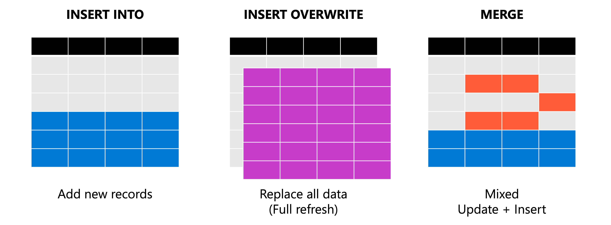

After you transform and cleanse data, the final step in your pipeline is loading it into target tables. Azure Databricks provides three core loading strategies: **append**, **overwrite**, and **merge**. Each strategy serves different use cases, and choosing the right one depends on how your source data relates to existing records.



In this unit, you learn how to append new rows with INSERT, replace data with overwrite operations, and synchronize changes using MERGE for upsert scenarios.

## Append data with INSERT INTO

The most straightforward loading operation adds new rows to an existing table without modifying current data. Use INSERT INTO when you're loading fresh batches of data that don't overlap with existing records—such as daily transaction logs, new event streams, or incremental data extracts.

INSERT INTO works with both SQL and PySpark. The following examples show how to add rows to a sales table.

```sql
-- Append new records using VALUES
INSERT INTO sales.transactions (transaction_id, amount, transaction_date)
VALUES 
    ('TXN001', 150.00, '2026-01-15'),
    ('TXN002', 275.50, '2026-01-15');

-- Append from a staging table or query
INSERT INTO sales.transactions
SELECT * FROM staging.daily_transactions
WHERE transaction_date = current_date();
```

In PySpark, you append data by writing a DataFrame with `append` mode:

```python
# Append DataFrame to existing table
df_new_transactions.write.mode("append").saveAsTable("sales.transactions")

# Or use insertInto for existing tables
df_new_transactions.write.insertInto("sales.transactions")
```

> [!TIP]
> When appending data, ensure your source data is deduplicated before loading. INSERT INTO doesn't check for duplicates—if you load the same batch twice, you get duplicate rows.

## Replace data with INSERT OVERWRITE

Sometimes you need to replace existing data rather than add to it. INSERT OVERWRITE truncates the target table or partition before inserting new rows. This approach works well for reprocessing failed batches, refreshing lookup tables, or rebuilding aggregations.

```sql
-- Replace entire table contents
INSERT OVERWRITE sales.daily_summary
SELECT 
    region,
    SUM(amount) as total_sales,
    COUNT(*) as transaction_count
FROM sales.transactions
WHERE transaction_date = current_date()
GROUP BY region;
```

For partitioned tables, you can overwrite specific partitions while leaving others intact:

```sql
-- Replace only January 2026 partition
INSERT OVERWRITE sales.monthly_report
PARTITION (report_month = '2026-01')
SELECT region, product_category, SUM(amount) as revenue
FROM sales.transactions
WHERE transaction_date BETWEEN '2026-01-01' AND '2026-01-31'
GROUP BY region, product_category;
```

Delta Lake also supports selective overwrites with the `REPLACE WHERE` clause, which deletes rows matching a condition before inserting:

```sql
-- Replace transactions for a specific date range
INSERT INTO sales.transactions
REPLACE WHERE transaction_date BETWEEN '2026-01-01' AND '2026-01-07'
SELECT * FROM staging.corrected_transactions;
```

In PySpark, use `overwrite` mode for full table replacement:

```python
# Overwrite entire table
df_refreshed.write.mode("overwrite").saveAsTable("sales.daily_summary")

# Overwrite specific partition
df_january.write.mode("overwrite").partitionBy("report_month").saveAsTable("sales.monthly_report")
```

## Merge data for upsert operations

Real-world data pipelines often need to update existing records while inserting new ones. The MERGE statement handles this pattern—commonly called an "upsert"—by matching source rows to target rows and applying different actions based on whether a match exists.

MERGE is essential for slowly changing dimensions, synchronizing data from source systems, and processing change data capture (CDC) feeds.

```sql
MERGE INTO customers AS target
USING customer_updates AS source
ON target.customer_id = source.customer_id
WHEN MATCHED THEN
    UPDATE SET 
        target.email = source.email,
        target.phone = source.phone,
        target.last_updated = current_timestamp()
WHEN NOT MATCHED THEN
    INSERT (customer_id, name, email, phone, created_date, last_updated)
    VALUES (source.customer_id, source.name, source.email, source.phone, 
            current_timestamp(), current_timestamp());
```

This query updates email and phone for existing customers while inserting entirely new customer records. The ON clause defines the matching key—typically a primary key or business identifier.

### Merge with conditional logic

Add conditions to WHEN clauses to handle more complex scenarios. For example, you might only update records that have actually changed:

```sql
MERGE INTO products AS target
USING product_feed AS source
ON target.sku = source.sku
WHEN MATCHED AND source.price <> target.price THEN
    UPDATE SET target.price = source.price, target.updated_at = current_timestamp()
WHEN MATCHED AND source.discontinued = true THEN
    DELETE
WHEN NOT MATCHED THEN
    INSERT *;
```

The `INSERT *` syntax inserts all columns from the source when they match the target schema.

### Merge with PySpark

For programmatic control, use the Delta Lake Python API:

```python
from delta.tables import DeltaTable

target_table = DeltaTable.forName(spark, "customers")

target_table.alias("target").merge(
    source_df.alias("source"),
    "target.customer_id = source.customer_id"
).whenMatchedUpdate(set={
    "email": "source.email",
    "phone": "source.phone",
    "last_updated": "current_timestamp()"
}).whenNotMatchedInsert(values={
    "customer_id": "source.customer_id",
    "name": "source.name",
    "email": "source.email",
    "phone": "source.phone",
    "created_date": "current_timestamp()",
    "last_updated": "current_timestamp()"
}).execute()
```

For simpler cases where source and target schemas match, use the convenience methods:

```python
target_table.alias("target").merge(
    source_df.alias("source"),
    "target.customer_id = source.customer_id"
).whenMatchedUpdateAll(
).whenNotMatchedInsertAll(
).execute()
```

## Choose the right loading strategy

Your choice of loading operation depends on the relationship between source and target data:

| Scenario | Operation | When to use |
|----------|-----------|-------------|
| New records only | INSERT INTO / append | Daily logs, event streams, incremental extracts |
| Full refresh | INSERT OVERWRITE | Lookup tables, aggregations, failed batch reprocessing |
| Mixed updates and inserts | MERGE | CDC feeds, dimension tables, data synchronization |
| Selective replacement | REPLACE WHERE | Correcting specific date ranges or partitions |

> [!IMPORTANT]
> MERGE operations require a unique match between source and target rows. If multiple source rows match the same target row, the operation fails. Deduplicate your source data before merging.

Understanding these loading patterns prepares you to build reliable data pipelines that maintain data integrity while efficiently processing both new and changed records.
