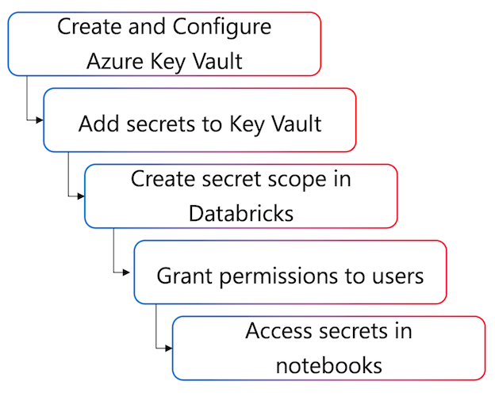

When you work with Azure Databricks, you often need to connect to external data sources, APIs, or services that require authentication credentials. Storing passwords, connection strings, or API keys directly in notebooks creates security risks and makes credential management difficult. Azure Key Vault integration solves this challenge by providing a secure, centralized way to manage secrets in your Databricks workflows.

>[!VIDEO https://learn-video.azurefd.net/vod/player?id=08]

As a data engineer working in Azure, you typically use Azure Key Vault rather than Databricks-backed secret scopes. This approach aligns with enterprise security practices and provides better integration with other Azure services. You can reference secrets stored in Azure Key Vault from your notebooks, jobs, and cluster configurations without exposing sensitive values.

## Understanding secret scopes in Azure Databricks

Azure Databricks uses secret scopes to organize and control access to secrets. A secret scope is a named collection of secrets that you reference in your code. Each scope can contain multiple secrets, and you assign permissions at the scope level.

The following diagram shows the overall workflow for using Azure Key Vault-backed secret scopes in Databricks:



Azure Databricks supports two types of secret scopes:

- **Databricks-backed scopes** store secrets in an encrypted database managed by Azure Databricks. You create and manage these secrets using the Databricks CLI or API. 
  
- **Azure Key Vault-backed scopes** provide a read-only interface to secrets stored in an Azure Key Vault instance. You manage the actual secrets in Azure Key Vault, while the scope in Azure Databricks provides controlled access.

For production workloads, Azure Key Vault-backed scopes offer several advantages. They integrate with your organization's existing Azure security infrastructure. They support network restrictions that Databricks-backed scopes cannot. They eliminate the need to synchronize secrets across multiple systems. When you update a secret in Key Vault, all Azure Databricks workspaces that reference that scope automatically use the updated value after you restart your clusters.

> [!IMPORTANT]
> Permissions on Azure Key Vault-backed scopes apply to all secrets in the linked Key Vault instance. If you need to restrict access to specific secrets, create separate Key Vault instances and link them to different secret scopes.

## Creating an Azure Key Vault-backed secret scope

Before you create an Azure Key Vault-backed scope, you need an Azure Key Vault instance configured correctly. Your Key Vault must use the **Vault access policy** permission model rather than Azure role-based access control. Under the Key Vault's networking settings, you must allow trusted Microsoft services to bypass the firewall, even if you restrict access to specific virtual networks.

You create the secret scope using a special URL in your Azure Databricks workspace. Navigate to `https://<databricks-instance>#secrets/createScope`, replacing `<databricks-instance>` with your workspace URL. This URL is case-sensitive—the `S` in `createScope` must be uppercase.

When you create the scope, you provide a descriptive name and specify who can manage it. The **Manage Principal** setting determines whether only the creator or all workspace users have MANAGE permission on the scope. MANAGE permission allows reading secrets, writing new secrets, and controlling who else can access the scope. Restricting management to the creator requires the Premium plan.

:::image type="content" source="../media/create-secret-scope.png" alt-text="Screenshot of the Azure Databricks Create Secret Scope feature." lightbox="../media/create-secret-scope.png":::

You also need two pieces of information from your Azure Key Vault: the **DNS Name** (for example, `https://databrickskv.vault.azure.net/`) and the **Resource ID** (for example, `/subscriptions/xxxxxxxx-xxxx-xxxx-xxxx-xxxxxxxxxxxx/resourcegroups/databricks-rg/providers/Microsoft.KeyVault/vaults/databricksKV`). You can find both values in the **Properties** section of your Key Vault in the Azure portal.

When you create the scope, Databricks automatically grants the Azure Databricks service principal the **Get** and **List** permissions on your Key Vault. This allows the service to retrieve secret values on behalf of authorized users. Your account must have the Key Vault Contributor, Contributor, or Owner role to complete this configuration.

> [!NOTE]
> After creating the scope, you manage the actual secrets in Azure Key Vault, not in Databricks. You use the Azure portal or Azure CLI to add, update, or delete secrets in the Key Vault instance.

## Retrieving secrets in notebooks and jobs

Once you create a secret scope, you access secrets in your notebooks using the `dbutils.secrets.get()` function. This function takes two parameters: the scope name and the secret key name. The function returns the secret value, which Azure Databricks automatically redacts in notebook outputs.

```python
username = dbutils.secrets.get(scope="jdbc", key="username")
password = dbutils.secrets.get(scope="jdbc", key="password")

df = (spark.read
  .format("jdbc")
  .option("url", "jdbc:sqlserver://server.database.windows.net:1433")
  .option("dbtable", "customers")
  .option("user", username)
  .option("password", password)
  .load()
)
```

In this example, you retrieve database credentials from a secret scope named `jdbc`. The `username` and `password` variables contain the actual secret values, but if you print these variables or display them in notebook output, Azure Databricks replaces the values with `[REDACTED]`.

This redaction provides protection against accidental exposure, but it doesn't prevent intentional access by authorized users. Any user with permission to run code on the cluster can access secret values programmatically. You control access to secrets by managing permissions on the secret scope and the cluster.

You can also list the secrets available in a scope to discover what keys exist:

```python
dbutils.secrets.list("jdbc")
```

This returns metadata about the secrets, including their key names, but not the actual values. This helps you verify that the secrets you need exist in the scope before you reference them.

> [!TIP]
> Name your secrets descriptively so that their purpose is clear when you list them. For example, use `database-username` instead of `user1`, or `storage-account-key` instead of `key`.

## Using the secret() function in SQL

In addition to `dbutils.secrets.get()`, you can retrieve secrets directly in SQL queries using the `secret()` function. This function is available in Databricks SQL and Spark SQL, making it convenient when working with SQL notebooks or queries.

```sql
SELECT secret('jdbc', 'username') AS db_username;
```

You can also use the `secret()` function in SQL statements that configure connections or perform operations:

```sql
CREATE TABLE customer_data
USING jdbc
OPTIONS (
  url "jdbc:sqlserver://server.database.windows.net:1433",
  dbtable "customers",
  user secret('jdbc', 'username'),
  password secret('jdbc', 'password')
);
```

The `secret()` function provides the same redaction behavior as `dbutils.secrets.get()`—secret values are replaced with `[REDACTED]` in query outputs. For cases where you want to return `NULL` instead of raising an error when a secret doesn't exist, use the `try_secret()` function.

## Using secrets in Spark configurations

Sometimes you need to reference secrets in cluster configurations rather than in notebook code. This is useful when you want to set Spark properties or environment variables that multiple notebooks on the cluster can access.

You reference a secret in a **Spark configuration property** using double curly braces:

```txt
spark.storage.key {{secrets/storage/account-key}}
```

This syntax tells Databricks to retrieve the secret named `account-key` from the scope named `storage` and assign it to the `spark.storage.key` configuration property. You configure this in the **Advanced Options** section when you create or edit a cluster.

In your notebook, you retrieve the value using:

```python
storage_key = spark.conf.get("spark.storage.key")
```

## Reference secrets in environment variables

You can also reference secrets in environment variables. This is particularly useful for init scripts that run before notebooks execute:

```ini
STORAGE_KEY={{secrets/storage/account-key}}
```

In an init script, you access this environment variable like any other:

```bash
if [ -n "$STORAGE_KEY" ]; then
  echo "Configuring storage with key"
fi
```

Keep in mind that any user with CAN ATTACH TO permissions on the cluster can read environment variables and Spark configuration properties. This means they can access secrets even if they don't have direct permission to read from the secret scope. Use this approach only when the secrets need to be available to all cluster users.

When you update a secret in Azure Key Vault, you must restart your cluster for Azure Databricks to fetch the new value. The cluster caches secret values when it starts, and it doesn't automatically detect changes in Key Vault.

## Managing secret scope permissions

Access to secrets is controlled through permissions on the secret scope. When you create a scope, you receive MANAGE permission by default. This allows you to read secrets, add new secrets (in Databricks-backed scopes), and control who else can access the scope.

You assign permissions using the Databricks CLI. Three permission levels exist: **READ** allows retrieving secret values, **WRITE** allows adding or updating secrets (only for Databricks-backed scopes, not Key Vault-backed scopes), and **MANAGE** allows reading secrets and controlling permissions.

> [!IMPORTANT]
> For Azure Key Vault-backed scopes, you can only manage who has access to the scope through Databricks ACLs. You cannot add or update secrets through Databricks—secrets must be managed directly in Azure Key Vault. The WRITE permission is not applicable to Key Vault-backed scopes.

To grant the READ permission to a group:

```bash
databricks secrets put-acl jdbc data-engineers READ
```

This command grants the `data-engineers` group permission to retrieve secrets from the `jdbc` scope. You can grant permissions to individual users by using their email addresses or to service principals using their application IDs.

You can view all permissions on a scope:

```bash
databricks secrets list-acls jdbc
```

This shows which principals have access and their permission levels. You can also check the permissions for a specific principal:

```bash
databricks secrets get-acl jdbc data-engineers
```

To remove a principal's access to a scope:

```bash
databricks secrets delete-acl jdbc data-engineers
```

> [!NOTE]
> The ability to restrict MANAGE permission to only the creator (rather than all workspace users) requires the Premium plan. On the Standard plan, you must grant MANAGE permission to all workspace users when creating an Azure Key Vault-backed secret scope.

With these capabilities, you can securely access Azure Key Vault secrets in your Databricks workflows while maintaining control over who can use those secrets. This integration strengthens your security posture and aligns with enterprise governance requirements.
