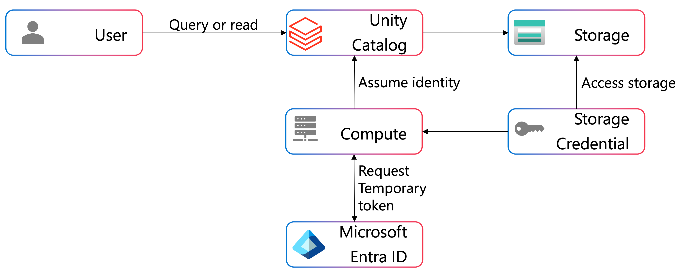

As a data engineer working with Azure Databricks, you often need to access data stored in Azure Data Lake Storage or other cloud storage services. Service principals provide a secure, automated way to authenticate these data access requests without using personal credentials.

## Understanding service principals for data access

A service principal is an identity created for applications and services to access Azure resources. Think of it as an automated user account specifically designed for applications rather than humans.

When your Databricks notebooks or jobs need to read data from Azure storage, they can authenticate using a service principal. This approach offers several advantages over using personal credentials. The authentication happens automatically without manual login, works consistently across different users and environments, and allows precise control over which storage locations the principal can access.

A service principal consists of three key components you'll work with:

* **Application (client) ID**: A unique identifier for the service principal
* **Directory (tenant) ID**: The Microsoft Entra ID tenant where the service principal exists
* **Client secret**: A password-like credential that proves the identity of the service principal

> [!NOTE]
> While service principals remain a valid authentication method, Microsoft recommends using **managed identities** for Unity Catalog storage credentials when possible. Managed identities eliminate the need to manage and rotate secrets and can access storage accounts protected by network rules. However, service principals are still useful in scenarios where managed identities aren't available or when you need more explicit control over credentials.
>
> We will cover managed identities in the next unit.

## Using service principals with Unity Catalog

Unity Catalog provides a centralized way to manage data access using service principals through storage credentials and external locations.

A **storage credential** in Unity Catalog encapsulates a service principal's authentication details. Instead of embedding credentials directly in your code, you reference the storage credential by name. Unity Catalog handles the authentication behind the scenes, generating temporary tokens that allow your queries to access the underlying storage.

Here's how the workflow operates in practice:

When you query a table or read from an external location governed by Unity Catalog, the system checks which storage credential is associated with that location. Unity Catalog assumes the service principal identity, requests a temporary access token from Microsoft Entra ID, and provides that token to your compute resources. Your cluster or SQL warehouse then uses the token to access the storage directly.



This approach offers important benefits. Your sensitive credentials never appear in notebook code or job configurations. Unity Catalog audit logs record which principal accessed which data and when. You can grant and revoke access to storage locations through Unity Catalog permissions without changing any code.

> [!IMPORTANT]
> As a data engineer, you typically won't create the storage credential itself—that's an administrative task. You'll work with existing storage credentials that have been configured by your workspace administrators or metastore admins. Your role focuses on using these credentials through external locations and tables.

To access data through a Unity Catalog-managed external location, you simply query the table or reference the external location path. Unity Catalog handles the authentication automatically:

```sql
-- Query a table in an external location secured by a service principal
SELECT * FROM catalog_name.schema_name.external_table;
```

No explicit credential configuration is needed in your code. The table's metadata includes the external location reference, which points to a storage credential containing the service principal details.

## Using service principals in notebooks

You might encounter scenarios where you need to configure service principal authentication directly in your notebook code. This pattern is common when working with storage that isn't registered in Unity Catalog or when using legacy configurations.

To authenticate to Azure Data Lake Storage using a service principal, you configure Spark session properties. The service principal's client secret should always come from a secure secret store, never hardcoded in your notebook.

Here's how you retrieve a secret and configure Spark to use service principal authentication:

```python
# Retrieve the client secret from Databricks secrets
service_credential = dbutils.secrets.get(scope="storage-secrets", key="sp-client-secret")

# Configure Spark to authenticate using the service principal
spark.conf.set("fs.azure.account.auth.type.<storage-account>.dfs.core.windows.net", "OAuth")
spark.conf.set("fs.azure.account.oauth.provider.type.<storage-account>.dfs.core.windows.net", 
               "org.apache.hadoop.fs.azurebfs.oauth2.ClientCredsTokenProvider")
spark.conf.set("fs.azure.account.oauth2.client.id.<storage-account>.dfs.core.windows.net", 
               "<application-id>")
spark.conf.set("fs.azure.account.oauth2.client.secret.<storage-account>.dfs.core.windows.net", 
               service_credential)
spark.conf.set("fs.azure.account.oauth2.client.endpoint.<storage-account>.dfs.core.windows.net", 
               "https://login.microsoftonline.com/<directory-id>/oauth2/token")
```

With these configurations in place, you can read data using the standard ABFS (Azure Blob File System) protocol:

```python
# Read data from ADLS Gen2 using the service principal for authentication
df = spark.read.parquet("abfss://<container>@<storage-account>.dfs.core.windows.net/path/to/data")
```

The authentication happens transparently. Spark uses the OAuth 2.0 client credentials flow to obtain an access token from Microsoft Entra ID, then presents that token when accessing the storage account.

## Security considerations and best practices

When working with service principals for data access, several security practices help protect your credentials and data.

**Never hardcode secrets in notebooks or code**. Client secrets are sensitive credentials that grant access to your data. Always retrieve them from a secure secret store like Azure Key Vault or Databricks secrets. This practice prevents accidental exposure if you share notebooks or commit code to version control.

**Understand that secrets require rotation**. Unlike managed identities, service principal client secrets have expiration dates and must be rotated periodically. As a data engineer, you should be aware that if a secret expires, your data access will fail. Work with your administrators to understand the rotation schedule and know who to contact if authentication suddenly stops working.

**Recognize the limitations of service principals with network-protected storage**. Service principals can't access storage accounts that are protected by virtual network rules or storage firewalls. If your organization uses network isolation for storage, you'll need to use managed identities instead. This limitation is one reason why Microsoft recommends managed identities for Unity Catalog storage credentials.

**Apply the principle of least privilege**. Each service principal should have access only to the specific storage locations and data it needs. If a service principal is compromised, limited permissions reduce the potential impact. When requesting access, specify exactly which storage accounts and containers you need rather than requesting broad permissions.

As you move forward in your work with Unity Catalog, you'll discover that managed identities offer a more streamlined approach to authenticating data access. In the next unit, we'll explore how managed identities eliminate many of the challenges associated with service principals while providing enhanced security and simplified operations.
