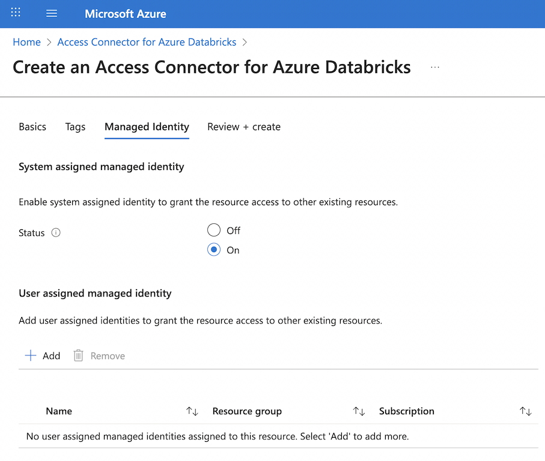
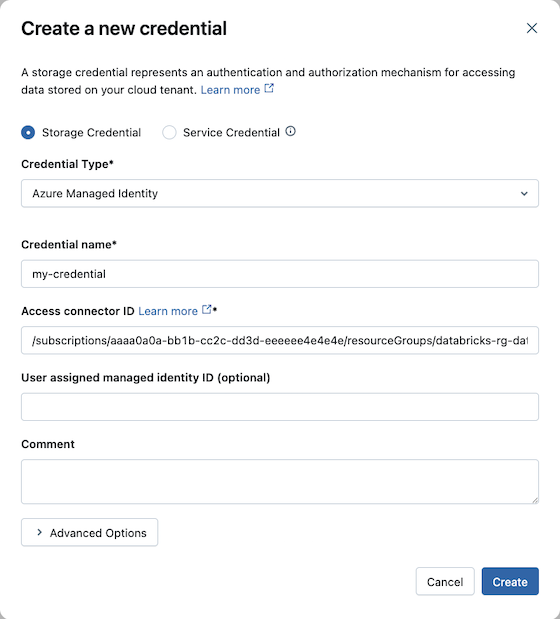

Managed identities provide a secure, automated way to authenticate your Unity Catalog workspaces to storage resources without managing credentials in your code or configuration files.

As a data engineer, you use managed identities to create **storage credentials** in Unity Catalog. These credentials form the foundation for accessing external data through external tables or reading files directly from cloud storage. Unlike traditional authentication methods that require you to create, store, and rotate secrets, managed identities eliminate credential management overhead while providing enterprise-grade security.

## Understanding managed identities for Unity Catalog

Managed identities are Azure resources that provide an identity for your applications when connecting to services that support Microsoft Entra ID authentication. Azure manages the lifecycle of these identities automatically, removing the burden of credential rotation and secret management from your team.

With Unity Catalog, you use managed identities through an **Azure Databricks access connector**. This first-party Azure resource acts as a bridge between your managed identity and your Azure Databricks account. The access connector can contain either a **system-assigned managed identity** that Azure creates automatically, or one or more **user-assigned managed identities** that you create and manage separately.

Managed identities offer significant advantages for data engineering workflows. They allow Unity Catalog to access storage accounts protected by **network rules and firewalls**, which isn't possible with other authentication methods. When your organization uses **VNet injection** for your Azure Databricks workspace, managed identities integrate seamlessly with your network security architecture. They also support **serverless SQL warehouses**, which run in the Azure Databricks subscription rather than your own subscription.

Two primary use cases exist for managed identities in Unity Catalog. First, you use them to connect to the metastore's root storage account where Unity Catalog stores managed tables. Second, you use them to access external storage accounts for reading files or creating external tables. Both scenarios use the same configuration approach but serve different purposes in your data architecture.

> [!NOTE]
> System-assigned managed identities are tied to the lifecycle of the access connector. If you delete the access connector, Azure automatically deletes the system-assigned managed identity. User-assigned managed identities persist independently and can be attached to multiple access connectors.

## Creating storage credentials with managed identities

Storage credentials in Unity Catalog encapsulate the authentication information needed to access cloud storage. When you create a storage credential using a managed identity, you establish a secure connection pathway that Unity Catalog can use to access data on behalf of authorized users.

The process begins in the Azure portal where you create an access connector for Azure Databricks. You select the same Azure region as your storage account to minimize latency and avoid cross-region data transfer costs. During creation, you choose whether to enable a system-assigned managed identity or attach user-assigned managed identities. The resource receives a unique identifier in the format `/subscriptions/{subscription-id}/resourceGroups/{resource-group}/providers/Microsoft.Databricks/accessConnectors/{connector-name}`.




After creating the access connector, you grant the managed identity permissions on your Azure Data Lake Storage account. The **Storage Blob Data Contributor** role provides read and write access to blob data, which is typically what you need for Unity Catalog operations. You assign this role at either the storage account level for broad access or at the container level for more granular control.

For optimal performance, you should also grant the **Storage Queue Data Contributor** role to enable file event notifications. This configuration allows Azure Databricks to subscribe to change notifications from your storage account, making file processing operations more efficient. When files are added or modified in your storage containers, Unity Catalog receives immediate notifications rather than scanning for changes.

With the Azure configuration complete, you create the storage credential in Unity Catalog. In Catalog Explorer, you navigate to the Credentials tab and create a new storage credential. You select **Azure Managed Identity** as the credential type and provide the access connector's resource ID. If you're using a user-assigned managed identity, you also include its resource ID. The storage credential receives a unique name that you reference when creating external locations.



> [!IMPORTANT]
> To create storage credentials, you need the **CREATE STORAGE CREDENTIAL** privilege on the Unity Catalog metastore. Account admins and metastore admins have this privilege by default. Without this privilege, you can't create new storage credentials but can still use existing ones that you have permissions to access.

## Accessing external storage through storage credentials

Storage credentials work together with **external locations** to provide governed access to your cloud storage. An external location combines a storage credential with a specific cloud storage path, creating a managed access point that you can grant permissions on.

When you create an external location, you specify a path in your Azure Data Lake Storage account using the `abfss://` protocol. For example, `abfss://data@mystorageaccount.dfs.core.windows.net/raw/` points to the raw folder in the data container. You associate this path with your storage credential, which provides the authentication mechanism. Users who have privileges on the external location can read from or write to that path, depending on their specific permissions.

This architecture provides several benefits for data engineering teams. You can create multiple external locations that use the same storage credential but point to different paths, allowing you to organize access to different datasets or environments. You can grant different sets of users access to different external locations, even when they all use the same underlying storage account. You can mark storage credentials as read-only, which prevents creation of external locations that allow write access.

External locations also support **workspace binding**, which restricts access to specific workspaces in your metastore. This feature is valuable when you use workspaces to separate production and development environments. An external location pointing to production data can be bound to only the production workspace, ensuring that development workspaces can't accidentally access or modify production data. You can also bind storage credentials themselves to specific workspaces, controlling which workspaces can use those credentials to create new external locations.

```python
# Create an external table using a managed identity-backed external location
CREATE EXTERNAL TABLE sales_data
USING DELTA
LOCATION 'abfss://data@mystorageaccount.dfs.core.windows.net/sales/';

# Query the external table
SELECT * FROM sales_data WHERE sale_date >= '2024-01-01';
```

When your Unity Catalog workspace accesses data through a storage credential, the managed identity authenticates to Azure Data Lake Storage. The workspace doesn't need to know the actual credentials—it simply presents the managed identity. Azure verifies the identity and checks whether the assigned roles allow the requested operation. This happens transparently in the background, requiring no additional code or configuration in your notebooks.

> [!TIP]
> When you work with network-restricted storage accounts, ensure your workspace's virtual network can reach the storage account. Managed identities handle authentication, but network connectivity must already be established through private endpoints or service endpoints.
