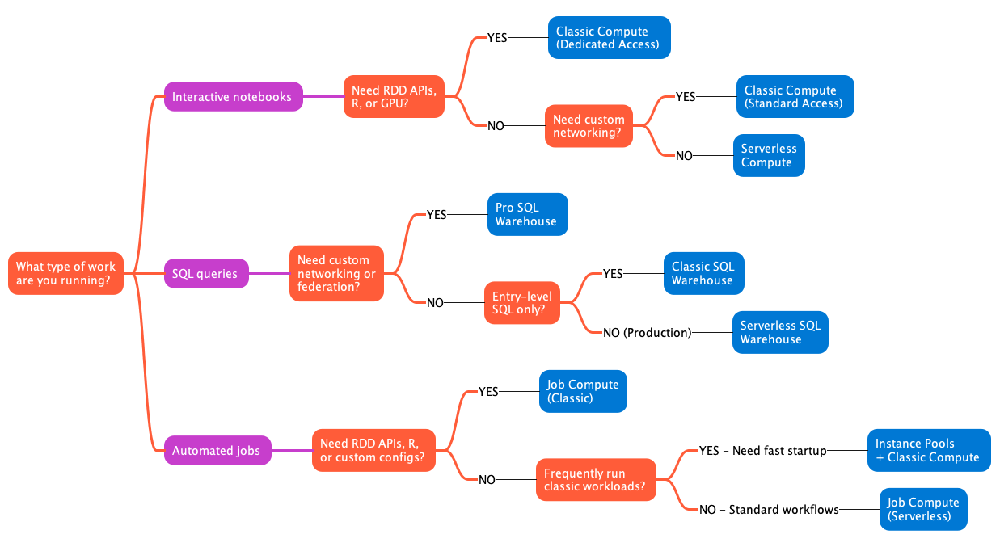

When you work with Azure Databricks, selecting the right **compute type** directly affects your costs, performance, and operational complexity. Each compute option serves different workload patterns and comes with distinct tradeoffs in startup time, scalability, and management overhead.

Understanding these options helps you match compute resources to your specific needs. You can optimize for fast development cycles, minimize costs for production jobs, or balance both for analytics workloads.

## Serverless compute

>[!VIDEO https://learn-video.azurefd.net/vod/player?id=5a6895d9-b264-4f25-a054-e533c73cd9d1]

**Serverless compute** is managed entirely by Azure Databricks. You don't provision or configure infrastructure—Azure Databricks automatically allocates and scales resources based on your workload demands. These resources run in **Databricks' Azure subscription, not yours**, which means no virtual machines or networking components appear in your subscription.

With serverless compute, startup typically takes 2-6 seconds. The platform scales up rapidly when query volume increases and scales down during idle periods to minimize costs. This eliminates the need to estimate capacity or manage cluster configurations.

Serverless compute requires **Unity Catalog** and is available for:

- **Notebooks**: Interactive Python and SQL development with automatic resource allocation
- **Jobs**: Automated workflows that run without infrastructure setup
- **Pipelines**: Lakeflow Spark Declarative Pipelines with on-demand scaling
- **SQL warehouses**: Optimized SQL query execution with intelligent workload management

Serverless works best for exploratory analysis, ETL pipelines, business intelligence workloads, and scenarios where startup latency matters. The versionless runtime means Azure Databricks automatically applies upgrades, so you always run on the latest features without migration effort.

However, serverless has limitations. You can't use **RDD APIs** (Resilient Distributed Dataset), **R language**, **JAR libraries** in notebooks, or custom Spark configurations. If your workload requires these capabilities, consider classic compute instead.

## Classic compute

>[!VIDEO https://learn-video.azurefd.net/vod/player?id=8dca13af-6084-412b-ac4d-7c391769c661]

**Classic compute** gives you full control over cluster configuration. You create, size, and manage compute resources that run directly in **your Azure subscription**, giving you visibility and control over the underlying infrastructure.

Classic compute supports two access modes that determine how users interact with the cluster:

**Standard access mode** enables multiple users to share a single cluster concurrently. Lakeguard provides isolation between user code, preventing one user's work from interfering with another's. This mode works well for collaborative data engineering, shared analytics, and cost optimization through resource pooling.

**Dedicated access mode** assigns the cluster exclusively to a single user or group. With dedicated access, you get full machine-level privileges, which you need for RDD APIs, GPU workloads, R language support, or custom container environments.

Beyond access modes, classic compute offers different **cluster modes** that determine the cluster architecture:

**Multi-node clusters** consist of one driver node and one or more worker nodes. The driver coordinates execution while workers perform distributed computations in parallel. This architecture enables horizontal scaling—you can add worker nodes to process larger datasets or increase parallelism. Multi-node clusters work well for production workloads that process large volumes of data or require high throughput.

**Single-node clusters** contain only a driver node with no worker nodes. All computation happens on the driver, which means workloads can't distribute across multiple machines. Single-node clusters suit specific scenarios like lightweight exploration, small dataset analysis, or machine learning experimentation where shuffle overhead would exceed the benefits of distribution. They're particularly useful for ML workflows with frameworks like scikit-learn that don't inherently distribute across nodes, or when testing notebooks with small data samples.

Keep in mind that single-node clusters have architectural limitations. They can't scale horizontally to handle increased load, and all processing relies on the resources of a single machine. For workloads requiring distributed processing, parallel task execution across large datasets, or fault tolerance through redundancy, use multi-node clusters instead.

Classic compute offers flexibility but requires more management. You configure instance types, autoscaling rules, and runtime versions. Startup time typically ranges from 3-7 minutes depending on cluster size. Unlike serverless, you select and manage the Databricks Runtime version yourself—choosing when to upgrade from one version to another (for example, from Runtime 13.3 LTS to 14.3 LTS). While underlying OS and security updates can be automated, runtime version changes require manual selection.

This compute type fits workloads that need features unavailable in serverless, require precise control over infrastructure, or have compliance requirements for resource isolation.

## SQL warehouses

>[!VIDEO https://learn-video.azurefd.net/vod/player?id=e3c301e1-13bc-4c84-a9b2-e82c1571ac15]

**SQL warehouses** are compute resources optimized specifically for SQL queries, analytics, and business intelligence. They come in three types, each with different performance characteristics.

**Serverless SQL warehouses** offer optimal performance and cost efficiency. They start in 2-6 seconds, use Intelligent Workload Management to predict query resource needs, and scale clusters dynamically based on demand. Photon and Predictive IO accelerate query execution. Choose serverless SQL warehouses for most SQL workloads—BI dashboards, ETL jobs, and ad hoc analysis.

**Pro SQL warehouses** support Photon and Predictive IO but lack Intelligent Workload Management. They take approximately 4 minutes to start and scale less dynamically than serverless. You use pro warehouses when you need custom networking configurations—for example, connecting to on-premises databases through federation or integrating with services in your virtual network.

**Classic SQL warehouses** offer entry-level SQL performance with Photon support only. They start in about 4 minutes and include basic autoscaling. Choose classic warehouses only when serverless and pro options aren't available or for basic interactive exploration with minimal performance requirements.

All SQL warehouse types optimize for SQL execution patterns, but serverless offers the most responsive scaling and lowest operational overhead.

## Instance pools

>[!VIDEO https://learn-video.azurefd.net/vod/player?id=3404841b-a2f1-440d-8f94-abe101227b73]

**Instance pools** maintain a set of idle virtual machine instances ready for immediate use. When you create a cluster from a pool, startup time decreases because Databricks allocates instances from the pool instead of requesting new ones from Azure.

Pools reduce startup time from minutes to under a minute in many cases. You configure the minimum number of idle instances to keep warm and the maximum pool capacity. When clusters release instances, those instances return to the pool for reuse.

You pay for virtual machine costs while instances sit idle in the pool, but not for Azure Databricks compute units. This makes pools cost-effective when you run workloads frequently enough that the reduced startup time justifies the idle infrastructure cost.

With serverless compute available, pools matter less for most scenarios. Serverless starts faster and scales more efficiently without requiring you to maintain idle capacity. However, pools remain useful when you need classic compute features and want to optimize startup time for frequently run workloads.

Configure pools with spot instances for worker nodes to reduce costs, but use on-demand instances for driver nodes to maintain reliability.

## Job compute

>[!VIDEO https://learn-video.azurefd.net/vod/player?id=051cb3b1-3282-4c0a-b5f7-5eb583f401fe]

**Job compute** refers to clusters optimized for automated workflows rather than interactive development. You configure job compute through cluster policies that enforce best practices for production workloads.

Job clusters terminate automatically after completing their tasks, preventing unnecessary costs from idle resources. When you configure a job, you choose between serverless and classic job compute. 

- **Serverless job compute** offers faster startup, automatic infrastructure management, and lower costs for most automated workloads. 
- **Classic job compute** provides more configuration options for workloads that need features serverless doesn't support.

With classic job compute, you can use optimized settings like autoscaling and **spot instances**. **Spot instances** (also called Azure Spot VMs) use Azure's excess capacity at significantly reduced costs—often up to 90% cheaper than regular on-demand instances. Azure can reclaim these instances with only 30 seconds notice when it needs the capacity back. Spark's built-in fault tolerance automatically handles these interruptions by retrying failed tasks on other available nodes, which makes spot instances a viable cost-saving option for many batch processing and ETL workloads.

The Job Compute policy in Azure Databricks offers a template for creating production-ready job clusters with sensible defaults. It enforces the latest LTS (Long Term Support) runtime version and other reliability settings.

## Compare compute types

>[!VIDEO https://learn-video.azurefd.net/vod/player?id=b0f5251c-2ebe-4dfc-942f-5e3e4252990c]

Different compute types suit different scenarios. The following table compares key characteristics to help you make informed decisions:

| Compute type                | Recommended for                                        | Startup time  | Management overhead                          | Cost efficiency                                       | Key limitation                        |
| --------------------------- | ------------------------------------------------------ | ------------- | -------------------------------------------- | ----------------------------------------------------- | ------------------------------------- |
| Serverless compute          | Interactive development, ETL jobs, BI workloads        | ⚡ 2-6 seconds | 👌 Minimal - fully managed                    | 🟢 High - scales to zero, pay only for usage           | No RDD APIs, R, or JAR libraries      |
| Classic compute (Standard)  | Collaborative data engineering, shared analytics       | ⏱️ 3-7 minutes | 🔧 Moderate - configure and monitor           | 🟡 Moderate - multi-user sharing reduces per-user cost | Requires Unity Catalog for governance |
| Classic compute (Dedicated) | RDD workloads, GPU jobs, R language, custom containers | ⏱️ 3-7 minutes | 🔧 Moderate - configure and monitor           | 🔴 Lower - single user/group only                      | Higher cost than shared resources     |
| Instance pools              | Frequently run classic workloads needing fast startup  | 🚀 <1 minute   | ⚠️ Higher - maintain idle capacity            | 🔄 Variable - justify idle cost with usage frequency   | Pay for idle instances                |
| SQL warehouse (Serverless)  | SQL analytics, BI dashboards, reporting                | ⚡ 2-6 seconds | 👌 Minimal - intelligent workload management  | 🟢 High - dynamic scaling with Photon + Predictive IO  | SQL workloads only                    |
| SQL warehouse (Pro)         | SQL with custom networking, federation                 | ⏱️ ~4 minutes  | 🔧 Moderate - manual scaling configuration    | 🟡 Moderate - Photon + Predictive IO                   | Slower scaling than serverless        |
| SQL warehouse (Classic)     | Entry-level SQL exploration                            | ⏱️ ~4 minutes  | 🔧 Moderate - manual scaling configuration    | 🔴 Lower - basic Photon only                           | Limited performance features          |
| Job compute (Serverless)    | Automated workflows, production ETL                    | ⚡ 2-6 seconds | 👌 Minimal - auto-terminated after completion | 🟢 High - no idle costs                                | Same as serverless compute            |
| Job compute (Classic)       | Jobs requiring custom configurations                   | ⏱️ 3-7 minutes | 🔧 Moderate - configure policies              | 🟡 Moderate - auto-termination prevents idle waste     | Requires infrastructure management    |

## Choose the right compute type

Start your decision-making process by identifying your workload characteristics. The following diagram illustrates a decision flow to help you select the appropriate compute type:

Consider these questions:

**What type of work are you running?**
If you're writing interactive notebooks, serverless compute offers the fastest iteration cycle. For SQL queries and BI dashboards, serverless SQL warehouses deliver optimal performance. Automated production jobs work well with serverless job compute unless you need custom configurations.

**Does your code use specific APIs or languages?**
**RDD APIs**, **R language**, or **GPU acceleration** require classic compute with dedicated access mode. Python, SQL, and Scala workloads run on either serverless or standard classic compute.

**How frequently does this workload run?**
Infrequent workloads benefit most from serverless because you pay only during execution. Recurring workloads might justify instance pools if you use classic compute, though serverless often still provides better economics.

**Do you need custom networking or specific infrastructure?**
Custom virtual networks, on-premises connectivity, or specific instance types require classic compute or pro SQL warehouses. Serverless operates in the Databricks-managed subscription without custom network integration, so resources don't appear in your Azure subscription.

**What are your performance requirements?**
For latency-sensitive workloads, serverless compute starts 2-4x faster than classic options. For predictable performance at scale, both serverless and classic can meet requirements, but serverless adapts more dynamically to load variations.

For most scenarios, start with serverless options. They minimize operational overhead, optimize costs through automatic scaling, and provide the fastest development experience. Switch to classic compute only when you encounter a specific limitation that serverless doesn't support.