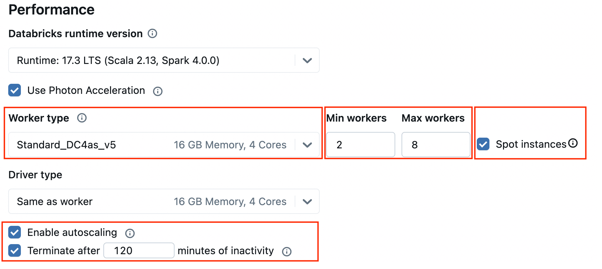
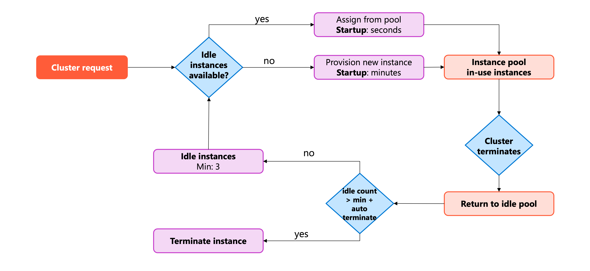
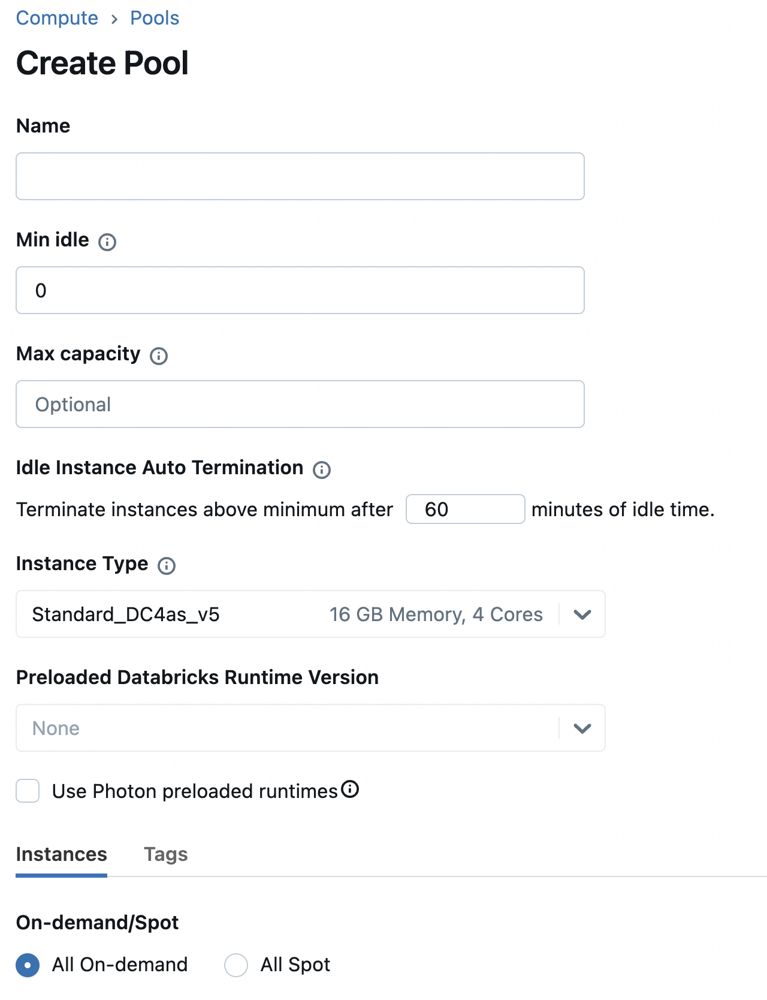

Configuring compute resources involves balancing performance requirements with cost considerations. Over-provisioning leads to unnecessary expenses, while under-provisioning can cause stability issues and slow query execution. Understanding how to configure compute settings helps you optimize resources for your workload.

## Understand compute resource components

>[!VIDEO https://learn-video.azurefd.net/vod/player?id=e0c7ff8f-9e08-49dd-8645-140490098a21]

Compute performance depends on three key factors working together. Each factor influences how efficiently your workload runs and how much it costs.

**Total executor cores** determine the maximum parallelism available for processing data. More cores allow Spark to process more tasks simultaneously. A cluster with 8 workers, each having 4 cores, provides 32 cores total for parallel processing.

**Total executor memory** affects how much data can be processed in memory before spilling to disk. Memory-intensive operations like joins and aggregations benefit from larger memory configurations. When memory runs out, Spark writes data to disk, which significantly slows performance.

**Local storage** provides temporary space for shuffle operations and caching. During shuffle operations, Spark writes intermediate data to local disks on worker nodes. Fast local storage reduces the time spent on these operations.

With this understanding of compute components, you can make informed decisions about node types and cluster size.

## Configure node types and cluster size

>[!VIDEO https://learn-video.azurefd.net/vod/player?id=670b0dcd-299f-459c-8a17-6c21f00a8d80]

Node type selection directly impacts both performance and cost. Different instance families serve different workload characteristics.

**Memory-optimized instances** work well for workloads with large **joins**, **aggregations**, or data that needs to stay in memory. These instances provide more RAM per core, reducing the likelihood of spilling data to disk. Examples include **E-series** VMs, which offer high memory-to-core ratios ideal for in-memory analytics.

**Compute-optimized instances** suit workloads that perform complex **calculations** but don't require large amounts of memory. ETL jobs with straightforward transformations often run efficiently on these instances. Examples include **F-series** VMs, which provide high CPU performance with lower memory ratios.

**Storage-optimized instances** benefit workloads that repeatedly read the same data or require fast **local disk access**. Data analysis workloads with caching enabled perform better with these instances. Examples include **L-series** VMs, which offer fast local **NVMe storage** for high I/O workloads.

**GPU-accelerated instances** provide graphics processing units designed for computationally intensive workloads like **machine learning**, **deep learning**, and **image processing**. These instances can accelerate model training by 10-100x compared to CPU-only clusters. Examples include **NC-series** and **ND-series** VMs with NVIDIA GPUs. GPU instances require **Databricks Runtime ML** and work best for tasks like training neural networks, fine-tuning large language models, or running inference on complex models.

The balance between number of workers and instance size affects performance differently depending on your workload. Two workers with 16 cores and 128 GB RAM each provide the same total compute and memory as eight workers with 4 cores and 32 GB RAM each. However, the configuration with **fewer, larger workers** reduces network traffic during shuffle operations, while **more smaller workers** can provide better parallelism for highly distributed workloads.

For analytical workloads with many shuffle operations, **fewer larger workers** typically perform better. For simple batch processing that benefits from high parallelism, **more smaller workers** might be more cost-effective.

## Configure autoscaling

Autoscaling adjusts the number of workers based on workload demands, helping you maintain performance while controlling costs.

When you enable autoscaling, you set minimum and maximum worker counts. Azure Databricks monitors workload requirements and adds workers when needed, up to the maximum you specified. When demand decreases, workers are removed down to the minimum.

Azure Databricks uses **optimized autoscaling** by default when you enable autoscaling. Optimized autoscaling scales up quickly in two steps from minimum to maximum. It can scale down even when the cluster isn't idle by monitoring shuffle file state. For **job compute**, it evaluates utilization every 40 seconds. For **all-purpose compute**, it checks every 150 seconds.

Consider autoscaling for workloads with variable resource needs throughout execution. Data exploration sessions often start with small data samples and later process larger datasets. Autoscaling adds workers when you process the larger datasets and removes them when you return to smaller samples.

For predictable workloads that maintain consistent resource usage, a fixed number of workers often provides more stable performance and simpler capacity planning. The overhead of scaling decisions can slightly impact performance for steady-state workloads.

Autoscaling works particularly well with instance pools. Set your minimum workers equal to or less than the minimum idle instances in the pool. This ensures quick scaling because the instances are already provisioned and ready.

## Configure termination settings

Automatic termination prevents idle compute resources from accumulating unnecessary costs while maintaining availability for scheduled workloads.

>[!VIDEO https://learn-video.azurefd.net/vod/player?id=58a7d7b4-1091-4b23-8fa7-07dc711f1f12]

When you configure automatic termination, you specify an inactivity period in minutes. If no commands run on the cluster for longer than this period, Azure Databricks terminates the cluster. The cluster configuration remains available for restart when needed.

For interactive workloads like data analysis, set the termination period based on typical session patterns. A 45-minute timeout works well for most use cases, giving data engineers time to review results between queries without leaving clusters idle for hours.

For job compute, automatic termination happens after the job completes. The cluster starts automatically when the next scheduled run begins, so you don't need to manage startup manually.

**Spot instances** reduce costs but come with availability trade-offs. Azure can reclaim spot instances when capacity is needed elsewhere. For **worker nodes**, spot instances work well because Azure Databricks/Spark can handle worker failures. However, always use **on-demand instances** for **driver nodes**. If the driver is reclaimed, the entire cluster fails.

Enable **decommissioning** when using spot instances to reduce task failures. When a spot instance receives a preemption notice, decommissioning migrates shuffle and cached data to healthy workers before the instance terminates. This reduces the need to recompute lost data.

## Use instance pools

Instance pools maintain a set of idle instances ready for immediate use, reducing cluster startup time from minutes to seconds.

Configure the **minimum idle instances** to match your typical concurrent cluster needs. If you regularly run three notebooks simultaneously, maintain at least three idle instances. These instances remain available even when not in use, providing instant cluster startup.

Set **maximum capacity** to control costs and prevent one workload from consuming all available resources. When multiple teams share a workspace, pools with maximum capacity settings ensure fair resource distribution. For example, with a 100-instance quota, you might create two pools each with a 50-instance maximum for two teams.

The **idle instance auto termination** setting removes instances that exceed your minimum idle count after the specified period. If you set minimum idle to 3 and auto termination to 30 minutes, a pool that scales up to 8 instances will reduce back to 3 instances after 30 minutes of inactivity.

**Preloading a Databricks Runtime version** on pool instances accelerates cluster launches even further. When creating a cluster, if you select the preloaded runtime, the cluster starts almost immediately because the runtime is already installed on idle instances.

Pools work best for workloads with frequent cluster creation and termination cycles. Development teams creating and destroying clusters throughout the day see significant time savings. Production jobs that run on dedicated long-running clusters don't benefit as much from pools.

## Balance cost and performance

Achieving the right balance between cost and performance requires understanding your workload characteristics and adjusting configurations accordingly.

Start with conservative settings and monitor performance. If you see frequent spilling to disk or slow query execution, increase memory or core count. If utilization remains low, reduce cluster size or enable autoscaling.

> [!NOTE]
> Use the **Spark UI** to identify performance issues. Check the **Jobs Timeline** to find long-running stages, and view the **stage details page** for spill statistics showing **Shuffle Spill (Memory)** and **Shuffle Spill (Disk)**. Compare stage durations to identify bottlenecks and slow queries.

Use serverless compute when your workload supports it. Serverless eliminates configuration decisions and automatically scales based on demand, often providing the best cost-performance balance without manual tuning.

Regular monitoring helps you identify optimization opportunities. Review cluster metrics to see actual utilization compared to provisioned capacity. Adjust node types, worker counts, or scaling settings based on observed patterns rather than assumptions.

> [!NOTE]
> Monitoring and observability are covered in detail in a later module.
