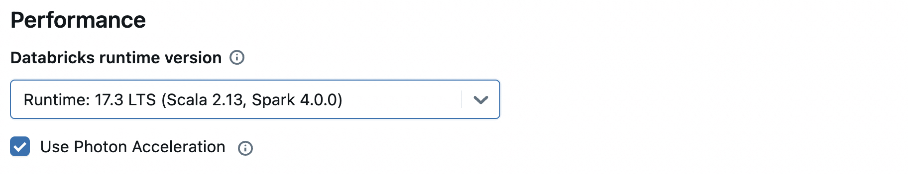
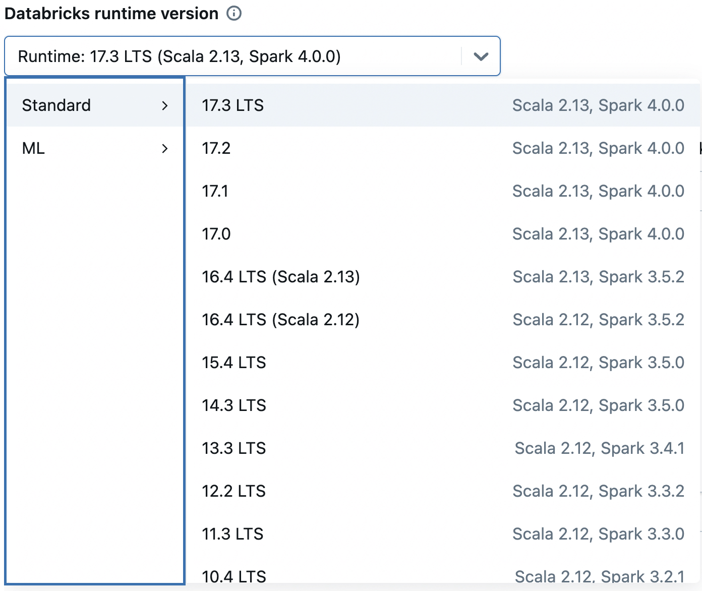
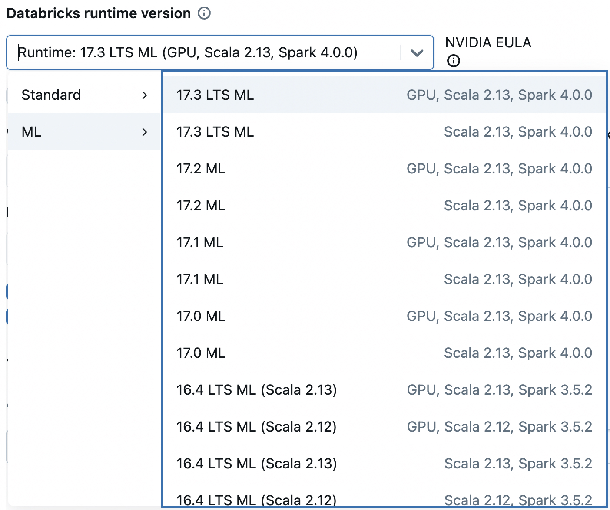

Compute features determine the functional capabilities available to your workloads. Unlike performance settings that tune resource allocation, feature settings enable specific technologies and runtime environments. Selecting appropriate features ensures your compute resource supports your workload requirements while maximizing efficiency.

## Enable Photon acceleration

>[!VIDEO https://learn-video.azurefd.net/vod/player?id=b0d7b320-44d9-43cd-b7fd-f56b2bdf17fd]

**Photon** is a query execution engine that replaces traditional Spark components with optimized native code. When you enable Photon, your compute resource uses this accelerated engine for SQL queries and DataFrame operations.

With Photon enabled, queries that involve **complex transformations** run faster. Operations like **joins**, **aggregations**, and **scans** across large tables benefit most from Photon's optimization. Workloads that frequently access disk, process wide tables, or repeatedly transform data also see significant performance gains. For example, a data analyst running hourly aggregation queries across millions of rows will experience faster query completion times with Photon enabled.

Without Photon, the same workloads rely on standard Spark execution, which may suffice for simple transformations but lacks the performance optimizations Photon provides. Simple batch ETL jobs that process small datasets or complete in under two seconds typically see minimal benefit from Photon. In these cases, the overhead of enabling Photon may not justify the additional compute cost.

Photon is enabled by default on Databricks Runtime 9.1 LTS and above. You can verify or change this setting during compute creation under the Performance section. Keep in mind that **Photon isn't supported on GPU-enabled clusters**. If your workload requires GPU instances for machine learning or deep learning tasks, you must disable Photon.

## Select Databricks Runtime and Spark version

**Databricks Runtime** provides the core components that run on your compute resource, including Apache Spark and additional optimizations. The runtime version you select determines which features are available and how your code interacts with preloaded packages.

Runtime selection impacts your workload in different ways depending on your use case. For **all-purpose compute** used in interactive development, the most current runtime version ensures you have the latest optimizations and compatibility with modern packages. This approach works well when you're actively developing notebooks and exploring data, as you benefit from continuous improvements.

For **job compute** running operational workloads, stability becomes more important than having the newest features. **Long Term Support (LTS)** runtime versions provide extended compatibility, allowing you to thoroughly test your workload before upgrading. A data engineering pipeline that runs daily transformations benefits from this stability, as unexpected runtime changes won't disrupt production processes.

The **Spark version** is tied to your selected runtime, so choosing a runtime automatically determines which version of Spark you're using. Newer runtimes include more recent Spark versions with additional features and bug fixes. Older runtimes provide stability but may lack features introduced in recent Spark releases. When planning upgrades, consider testing your workload on the new runtime version in a development environment before applying changes to production compute resources.

## Configure machine learning environments

Machine learning workloads require specialized runtime environments and hardware configurations. **Databricks Runtime ML** includes pre-installed machine learning libraries, GPU drivers, and frameworks like CUDA that support deep learning tasks.

When you configure compute for machine learning, start by selecting a **Databricks Runtime ML** version instead of the standard runtime. This runtime comes with popular libraries already installed, reducing setup time and ensuring compatibility between packages. For initial model experimentation, a **single-node** compute resource with a large instance type provides sufficient resources while minimizing shuffle overhead.

**GPU instances** enable training of deep learning models that would be impractical on CPU-only compute. Models involving image recognition, natural language processing, or neural networks benefit significantly from GPU acceleration. With GPU-enabled instances, operations that would take hours on CPUs complete in minutes. Keep in mind that **Photon must be disabled when using GPU instances**, as these features aren't compatible.