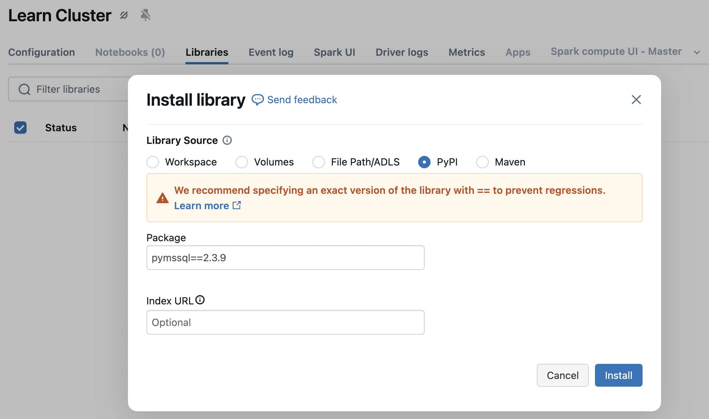
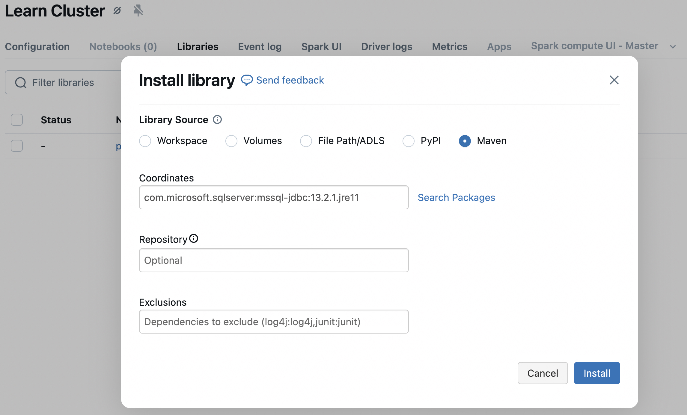
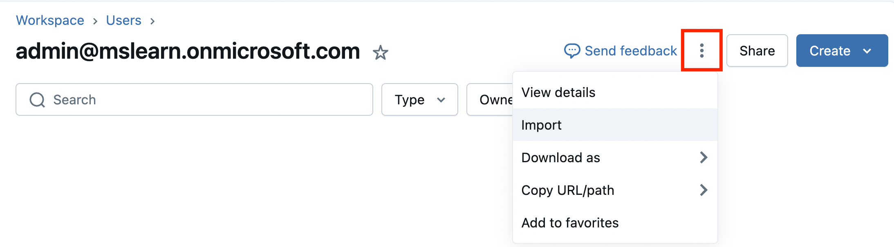
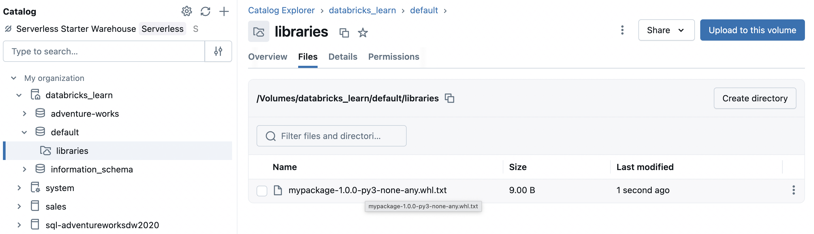
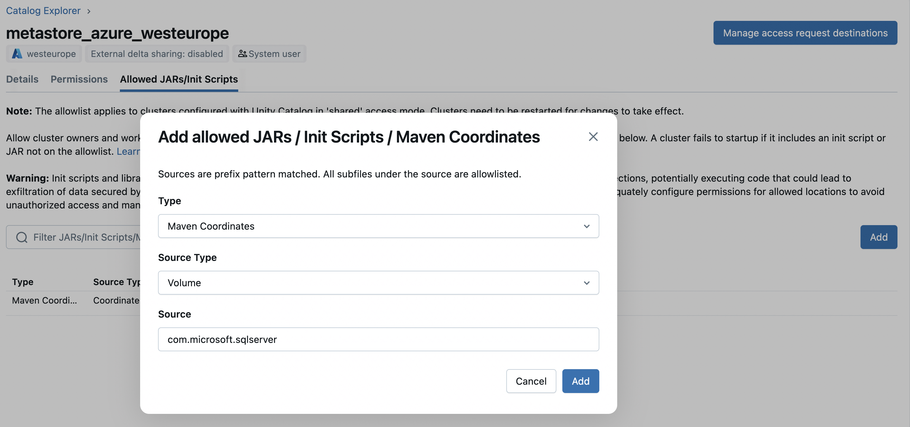
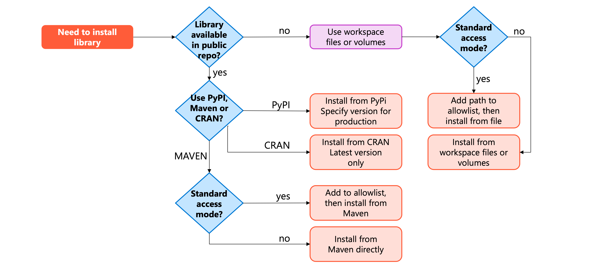

When you run notebooks and jobs on Azure Databricks compute, you often need third-party packages or custom code that isn't included in the default runtime. Installing **libraries** at the **cluster level** ensures that every notebook and job using that compute has access to the same dependencies, creating a consistent execution environment.

Understanding how to install libraries effectively becomes critical as your data engineering workflows grow in complexity. You need to know which installation method to use, where to store library files, and how access modes affect your options.

## Understand compute-scoped libraries

**Compute-scoped libraries** install on a cluster and become available to all notebooks and jobs that run on that cluster. Unlike **notebook-scoped libraries** that install only for a specific notebook session, compute-scoped libraries persist across cluster restarts and provide a shared environment for all users.

When you install a library at the cluster level, Azure Databricks automatically reinstalls it every time the cluster starts. This behavior ensures consistency—you don't need to manually reinstall dependencies after stopping and restarting a cluster. All notebooks attached to the cluster can import and use the installed packages immediately.

Compute-scoped libraries support **Python wheels**, **Java JAR files**, and **R packages**. You can install them from package repositories like **PyPI** and **Maven**, or from files stored in **workspace files**, **Unity Catalog volumes**, or cloud object storage. The installation method you choose depends on your library type, cluster access mode, and organizational security requirements.

However, compute-scoped libraries have an important limitation: any library you install affects every notebook on the cluster. If different teams need conflicting versions of the same library, you'll need separate clusters or notebook-scoped installations to avoid conflicts.

## Install libraries from package repositories

**Package repositories** provide the most common way to install libraries. PyPI hosts Python packages, Maven hosts Java and Scala libraries, and **CRAN** hosts R packages. These repositories automatically handle **dependency resolution** and version management.

To install a library from PyPI, select **PyPI** as the library source and enter the package name. For production workloads, specify an exact version to ensure reproducibility: `pymssql==2.3.9`. Without a version number, Azure Databricks installs the latest available version, which might change between installations and potentially break your code.

Maven libraries require **coordinates** in the format `groupId:artifactId:version`. For example, to install the Microsoft JDBC Driver for SQL Server library, you would use `com.microsoft.sqlserver:mssql-jdbc:13.2.1.jre11`. You can search for packages directly in the installation dialog if you don't know the exact coordinates. Maven also supports excluding specific transitive dependencies that might conflict with other installed libraries.

For R packages from CRAN, provide the package name. Unlike Python and Java libraries, CRAN installations always pull the latest version from the configured mirror. To pin specific R package versions, you need to store the package files in workspace files or volumes instead of installing from CRAN.

With clusters configured in **standard access mode**, Maven coordinates and JAR file paths require **allowlist approval** before installation. This security measure ensures admins review and approve libraries that run on shared compute resources.

> [!NOTE]
> To learn more about configuring and managing allowlists for libraries, see the [documentation](/azure/databricks/data-governance/unity-catalog/manage-privileges/allowlist).

## Install libraries from files

Storing library files in **workspace files** or **Unity Catalog volumes** gives you precise control over which library versions your clusters use. This approach works well when you need libraries not available in public repositories, custom packages you've built internally, or specific versions no longer available from package repositories.

Using workspace files and Unity Catalog volumes for library installation maintains centralized management rather than bypassing security controls with ad-hoc installations like direct pip3 commands or unmanaged custom scripts executed from notebooks. Unity Catalog volumes provide enhanced governance through Unity Catalog's access control model, ensuring that all library installations are tracked with audit logs and protected by fine-grained permissions.

Workspace files provide a convenient location for library storage with a 500 MB file size limit. To install a library from workspace files, upload your wheel, JAR, or requirements.txt file through the workspace Import dialog, then reference it during library installation using a path like `/Workspace/Users/you@example.com/libraries/mypackage-1.0.0-py3-none-any.whl`.

Unity Catalog volumes offer enhanced security and governance for library storage. You control access through Unity Catalog permissions, ensuring only authorized users can read or modify library files. Upload files to a volume through Catalog Explorer, then install them using a path like `/Volumes/main/engineering/libraries/mypackage-1.0.0-py3-none-any.whl`. The identity used for installation must have **READ VOLUME permission** on the specified volume.

Python **requirements.txt files** work with both workspace files and volumes in Databricks Runtime 15.0 and above. These files let you define multiple package dependencies in a single file, making it easier to maintain consistent environments across clusters. Upload the requirements.txt file and install it just like any other library—Azure Databricks automatically installs all listed packages.

For clusters with standard access mode, you must add library file paths to the allowlist before installation. This applies to both workspace files and volumes, ensuring admins approve the libraries used on shared compute.

## Use init scripts for advanced configuration

**Init scripts** run shell commands during **cluster startup**, before the Spark driver and executors start. While Databricks **doesn't recommend** using init scripts for library installation—cluster-scoped libraries provide a better approach—init scripts prove useful for system-level **configuration** that libraries can't handle.

You might use init scripts to install system packages with `apt-get`, configure environment variables, or set up monitoring agents. For example, an init script could install a specialized database driver that requires system libraries, then configure connection parameters through environment variables. The script runs every time the cluster starts, ensuring your configuration persists across restarts.

Store init scripts in Unity Catalog volumes for clusters running Databricks Runtime 13.3 LTS and above. Create a shell script file, upload it to a volume, then configure the cluster to run the script by specifying its path like `/Volumes/main/engineering/scripts/setup.sh`. For standard access mode, add the init script path to the allowlist before configuring the cluster.

Init scripts execute sequentially in the order you specify. If any script returns a non-zero exit code, the cluster fails to start. This failure protection prevents clusters from running with incomplete or incorrect configuration. You can troubleshoot failed init scripts by configuring cluster log delivery and examining the init script logs.

Consider init scripts as a last resort for configuration needs that cluster-scoped libraries and cluster policies can't address. Using cluster policies to set environment variables and Spark configurations often provides a simpler, more maintainable solution than init scripts.

## Configure libraries for standard access mode

Clusters configured with **standard access mode** provide the strongest security and isolation in Azure Databricks. This mode requires explicit approval for libraries and init scripts to prevent unauthorized code execution on shared compute resources.

Before installing Maven libraries or JAR files on standard access mode clusters, a **metastore admin** must add them to the allowlist. Maven coordinates go on the allowlist using the format `groupId:artifactId:version`. You can allowlist all versions of a library with `groupId:artifactId`, or all artifacts in a group with just `groupId`. For JAR files stored in volumes or object storage, allowlist the file path or directory path.

Init scripts require separate allowlist entries even if stored in the same location as JAR files. When allowlisting a path, Azure Databricks uses prefix matching—adding `/Volumes/prod-libraries/` to the allowlist permits all files and subdirectories within that location. Include a trailing slash to prevent unintended prefix matches at the directory level.

The allowlist only grants permission to use a path for library or init script installation. You still need appropriate data access permissions. For volumes, the installer identity must have `READ VOLUME` permission. For standard access mode, the cluster owner's identity validates these permissions during library installation.

To configure the allowlist, metastore admins use Catalog Explorer, selecting the metastore settings and navigating to the **Allowed JARs/Init Scripts** section. This centralized control ensures that security teams can review and approve all libraries used across the organization's compute resources, maintaining governance without blocking productivity.

## Choose the right installation method

Different library installation methods suit different scenarios. The following diagram illustrates a decision flow to help you select the appropriate installation approach:

