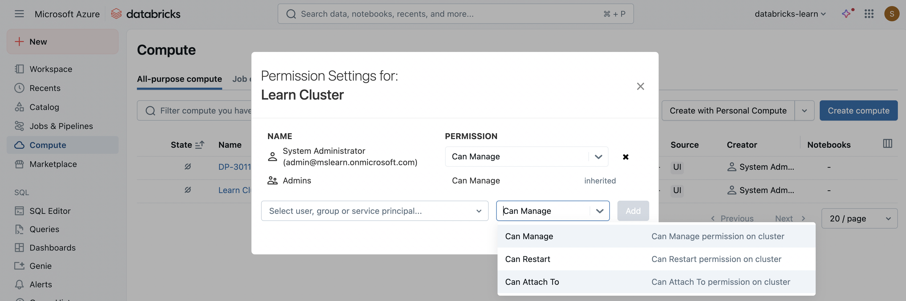
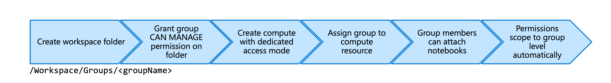
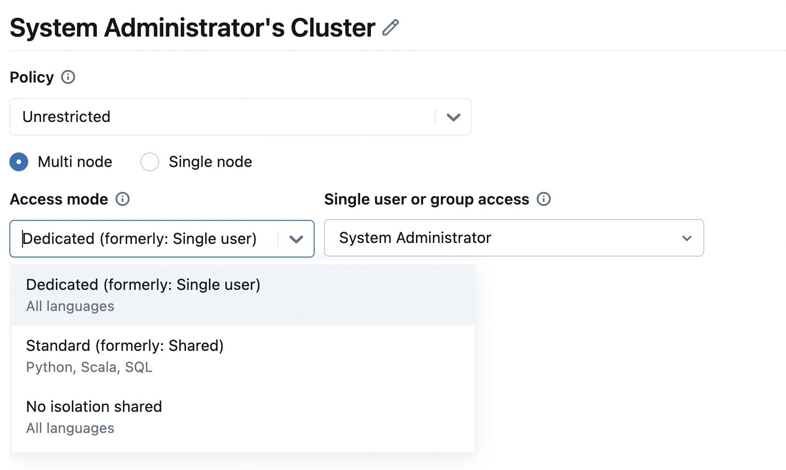

Managing access to compute resources protects sensitive data while enabling collaboration across your data engineering teams. You control who can attach notebooks, restart clusters, or modify compute configurations through **permission levels** assigned in the Azure Databricks workspace.

Proper access configuration prevents unauthorized users from viewing driver logs containing secrets, controls who can consume compute resources, and ensures teams work efficiently without conflicting infrastructure changes. With **Unity Catalog** enabled, you can assign compute resources to entire groups with automatic permission scoping.

## Understand compute permission levels

Azure Databricks offers **four permission levels** for compute resources, each granting progressively more capabilities. These permissions operate within your workspace and are distinct from Azure subscription-level access controls.

The following diagram shows the hierarchy of compute permissions and the capabilities each level provides:

**NO PERMISSIONS** prevents any interaction with the compute resource. Users can't see the compute in their workspace, attach notebooks to it, or view metrics or logs. This default state ensures compute resources remain private until you explicitly grant access.

**CAN ATTACH TO** enables basic compute usage. Users with this permission can attach their notebooks to the compute, view the Spark UI to monitor job execution, and access compute metrics for performance analysis. However, they can't control the compute lifecycle—no starting, stopping, or restarting. This permission level works well for analysts who need to run queries but shouldn't manage infrastructure.

With this permission level, users on compute configured with **No isolation shared access mode** can view service account keys in log4j files. Because of this security consideration, No isolation shared access mode is legacy and should be avoided. **Standard** or **Dedicated** access modes provide better isolation.

**CAN RESTART** includes everything from `CAN ATTACH TO` plus lifecycle management capabilities. Users can terminate, start, and restart the compute resource. This permission suits team leads or senior engineers who need to manage compute availability without full administrative control. You might grant `CAN RESTART` to someone who needs to restart a misbehaving cluster but shouldn't change its configuration.

**CAN MANAGE** provides complete control over the compute resource. Beyond all `CAN RESTART` capabilities, users can edit compute configuration, attach libraries, resize the cluster, and modify permissions for other users. Workspace admins automatically receive `CAN MANAGE` permission on all compute resources. Users who create a compute resource become its owner with `CAN MANAGE` rights.

By default, only users with `CAN MANAGE` permission can view **driver logs** on job clusters, dedicated access mode clusters, and standard access mode clusters. This restriction exists because driver logs expose secrets through stdout and stderr streams. You can adjust this behavior using the Spark configuration property `spark.databricks.acl.needAdminPermissionToViewLogs`, though changing it may create security risks.

## Configure permissions in the workspace

You set compute permissions through the Azure Databricks workspace UI, not the Azure portal. This workspace-level configuration operates independently from Azure subscription permissions, though users still need workspace access to benefit from compute permissions.

To configure permissions on a compute resource, select **Compute** from the workspace sidebar. Locate the compute resource you want to manage and select the **Permissions** option from its actions menu. The permissions dialog shows current access grants and allows you to add or modify permissions.

Select **Add** to grant new permissions. Search for **users** or **groups** by name or email address. Choose the appropriate permission level from the dropdown menu—`CAN ATTACH TO`, `CAN RESTART`, or `CAN MANAGE`. Multiple users and groups can have different permission levels on the same compute resource, giving you flexibility in access control.

When you modify permissions, changes take effect immediately. Users gain or lose access without requiring a compute restart. This immediate application means you can quickly respond to team changes, onboard new members, or revoke access when someone leaves a project.

Consider granting permissions to **groups** rather than individual users when possible. Group-based permissions simplify management as team membership changes. When someone joins the data engineering team, adding them to the appropriate group automatically grants the correct compute access. Similarly, removing someone from the group revokes their permissions without manual cleanup.

## Dedicated group access mode

**Standard access mode** allows multiple users to share compute resources securely, with Lakeguard providing isolation between user workloads. **Dedicated access mode** takes a different approach by assigning the entire compute resource to a single user or group, with user permissions automatically scoping down to match the assigned entity's permissions.

This **permission scoping** enables secure group collaboration on workloads that standard access mode doesn't support, including **Databricks Runtime for ML**, **RDD APIs**, and **R language** execution. When a user connects to a group cluster, their individual permissions temporarily reduce to only what the group possesses, preventing privilege escalation while maintaining necessary functionality.

The following diagram illustrates how to set up dedicated group access:

To create a compute resource dedicated to a group, you must enable Unity Catalog on your workspace and use Databricks Runtime 15.4 or above. The assigned group needs `CAN MANAGE` permission on a workspace folder where members can store notebooks, MLflow experiments, and other workspace artifacts used on the group cluster.

When creating the compute, expand the **Advanced** section and select **Dedicated (formerly: Single-user)** under **Access mode**. In the **Single user or group** field, choose the group that should own this resource. Only members of the selected group can attach notebooks to this compute resource.

For effective group cluster management, create a dedicated **workspace folder** at `/Workspace/Groups/<groupName>` for each group using this pattern. Grant the group `CAN MANAGE` permission on this folder. All notebooks, experiments, and workspace assets the group uses should reside in this folder to avoid permission errors.

Group clusters introduce specific behavior changes you should understand. When you create data objects using the group cluster, the group becomes the object's owner, not the individual user. For example, if you run `CREATE SCHEMA human_resources` on a group cluster, the group owns that schema. Individual user permissions aren't enforced because all group members access shared Spark APIs and the same compute environment.

## Best practices for compute access

Apply the **principle of least privilege** when granting compute permissions. Start with the minimum permission level users need to accomplish their work. Grant `CAN ATTACH TO` for analysts running queries, `CAN RESTART` for engineers managing cluster availability, and reserve `CAN MANAGE` for administrators and resource owners.

Use **groups** instead of individual user assignments whenever possible. Create groups that mirror your organizational structure—data engineering teams, analytics teams, or project-specific groups. Grant permissions to these groups, then manage membership through the groups themselves. This approach scales better as your organization grows and reduces the likelihood of orphaned permissions when people change roles.

For production workloads, create **dedicated compute resources with restricted access**. Production clusters shouldn't be widely accessible to development users. Limit `CAN MANAGE` permissions to the specific team responsible for that workload, and grant `CAN ATTACH TO` only when users have legitimate business needs to run production queries.

Pay attention to **driver log access**, especially when debugging applications that use secrets. The default configuration restricts log viewing to users with `CAN MANAGE` permissions, protecting secrets from exposure. If you must grant broader log access by setting `spark.databricks.acl.needAdminPermissionToViewLogs` to `false`, ensure secrets are managed through Databricks secret scopes with appropriate access controls rather than being hardcoded.

When using **group clusters**, establish clear folder structures and permission patterns before deployment. Create the group workspace folders, assign appropriate permissions, and document the expected usage patterns. Ensure MLflow tracking URIs point to group folders and that AutoML runs specify group-accessible experiment directories. This upfront organization prevents permission errors and simplifies troubleshooting.

Monitor compute access through **audit logs** regularly. Review who has `CAN MANAGE` permissions on critical resources, verify that former team members no longer have access, and ensure permission grants align with current organizational needs. The `system.access.audit` table provides detailed access history for compliance and security reviews.

**Avoid using No isolation shared access mode** entirely. This legacy mode exposes service account keys to users with `CAN ATTACH TO` permissions and lacks the security guarantees of standard or dedicated access modes. If you encounter existing No isolation shared clusters, migrate them to standard or dedicated access mode to improve security posture.
