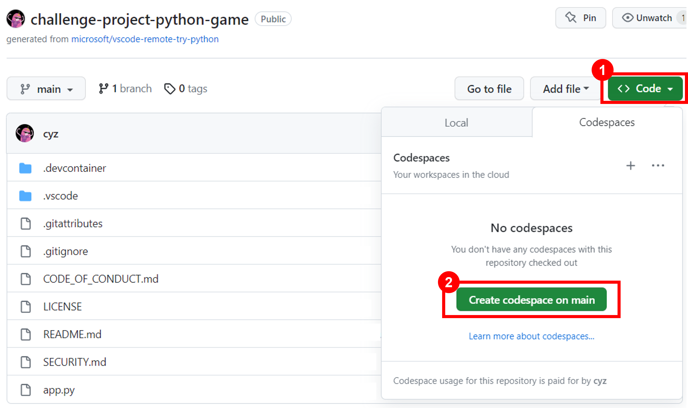
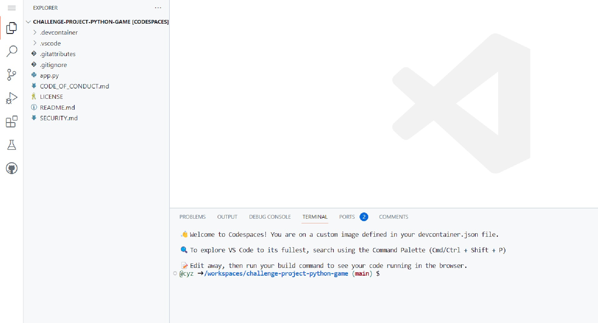

In this project, you can use GitHub Codespaces to develop the minigame application. GitHub Codespaces is a hosted development environment that allows you to quickly create a complete development environment for your project. You can use Codespaces to develop console applications in Python without having to install Python or any other tools on your local computer.

1. To get started, you need a GitHub account. If you don't have an account, create one for free at [github.com](https://github.com/).

> [!NOTE]
> Students can claim the GitHub Student Developer Pack at [GitHub Student Developer Pack - GitHub Education](https://education.github.com/pack). This offer includes access to Codespaces, GitHub Copilot, and Azure for Students and other benefits.

2. Enable the [GitHub Codespaces](https://docs.github.com/en/codespaces) service in your GitHub account. Codespaces offers 60 hours of free use per month.

3. You need to make a copy of the [template repository](https://github.com/microsoft/vscode-remote-try-python) in your GitHub account using the `Fork` function. At the end of the repository fork, you have a copy of the template repository in your GitHub account. You use this repository to develop the minigame application.
   

4. On the repository page that was created, click the `Code` button and, in the Codespaces tab, click `Create codespace on main`. In a few moments, Codespaces  create a development environment for you.

5. When Codespaces finishes creating the development environment, you see a Visual Studio Code window in the browser. You can use Visual Studio Code in the browser to develop the minigame application.

