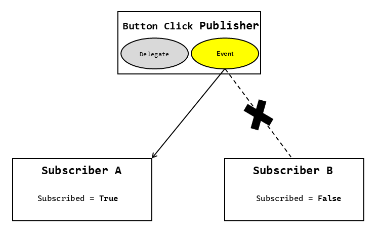

As you continue developing the retail store application, your team is eager to improve the way the app responds to user actions like button and menu selections. After setting up basic functionality for actions for adding items to a cart and completing a purchase, it's time to explore how events in C# can streamline these processes.

Events allow different parts of your application to communicate effectively. When users select a button or menu item, events ensure tasks like updating inventory or applying discounts happen smoothly. The use of events not only keeps your code organized but also makes it easier to adapt and expand your application as new features are added. By understanding how events work and their relationship with delegates, you're able to build a more flexible and maintainable application.

## Understand events

Events let one part of a program inform other parts when something important occurs. The part that sends out the event is called the **publisher**, and the parts that respond to the event are called **subscribers**. For instance, events are often used in programs with graphical user interfaces to react to things like button or menu selections.

The following diagram illustrates the relationship between a publisher and subscribers in an event-driven model:



- The **publisher** raises an event when a specific action occurs, such as the selection of a button.
- The **subscribers** handle the event by executing their respective event handler methods.

This model ensures that the publisher and subscribers remain loosely coupled, allowing for greater flexibility and maintainability.

**Key properties of events**

- Publishers determine when an event is raised, and subscribers decide what action to take in response.
- An event can have multiple subscribers, and a subscriber can handle multiple events.
- Events without subscribers are never raised.

**Example: A simple button click event**

```csharp
public class Button
{
    public event EventHandler? Selected; // Nullable to indicate no subscribers initially

    public void OnClick()
    {
        // If subscribers exist, ?.Invoke syntax triggers an event
        Selected?.Invoke(this, EventArgs.Empty);
    }
}

// Subscribing to the event
Button button = new Button();
button.Selected += (sender, e) => Console.WriteLine("Button Selected!");

// Triggering the event
button.OnClick(); // Output: "Button Selected!"
```

In this example, the `Selected` event is declared as `EventHandler?`, using a nullable reference type which explicitly indicates that the event might not have any subscribers, ensuring that the code handles such scenarios gracefully. The `?.Invoke` syntax further ensures that the event is only raised if there are subscribers, preventing potential `NullReferenceException` errors.

Lambda expressions (`=>`) are used in the subscription to define the event handler inline. Lambda expressions provide a concise and readable way to define event handlers, especially when the logic is simple and doesn't require a separate method.

## Delegates: The foundation of events

Delegates are type-safe function pointers that allow methods to be passed as parameters and invoked dynamically. Events in C# are built on the foundation of delegates, which define the method signature for event handlers.

**How delegates relate to events:**

- Delegates define the method signature that event handlers must match.
- Events use delegates to notify subscribers when something significant occurs.

**Example: Delegate behind an event**

```csharp
// Define a delegate
public delegate void ButtonClickedHandler(object sender, EventArgs e);

// Use the delegate in an event
public class Button
{
    public event ButtonClickedHandler Clicked;

    public void OnClick()
    {
        Clicked?.Invoke(this, EventArgs.Empty); 
    }
}
```

> [!NOTE]
> Delegates provide the type-safe mechanism that events rely on to notify subscribers.

## Events design

The design of events in C# aims to facilitate minimal coupling between components while ensuring flexibility and ease of use.

**Goals of event design**

- **Minimal coupling:** Events enable interaction between an event source and an event sink without requiring tight dependencies. Minimal coupling, using events, is especially useful when components developed by different teams or updated independently.
- **Ease of subscription and unsubscription:** The syntax for subscribing (`+=`) and unsubscribing (`-=`) is straightforward.
- **Support for multiple subscribers:** Events can have zero, one, or multiple subscribers, making them versatile for various scenarios.

Events are often used in scenarios where user actions or system changes need to be communicated across components. For example, a `Closing` event might allow subscribers to cancel the close operation or modify its behavior.
