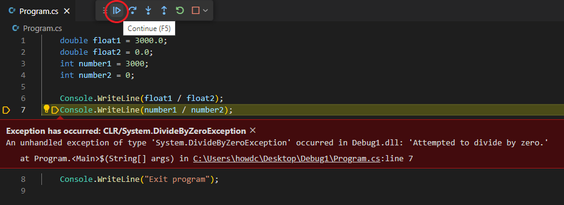
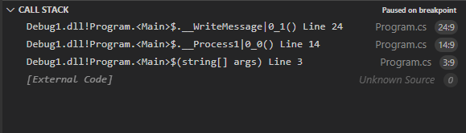

The `try-catch` pattern consists of a `try` block followed by one or more `catch` clauses. Each `catch` clause specifies the handler for a different exception type.

When an exception is thrown, the common language runtime (CLR) searches for a `catch` clause that can handle the exception. If the currently executing method doesn't contain a `catch` clause that can handle the exception type thrown, the CLR searches the method that called the current method. The search continues down through the call stack until a suitable `catch` clause is found. If no `catch` clause is found to handle the exception, the CLR displays an unhandled exception message to the user and stops the execution of the program.

In this exercise, you'll implement a basic `try-catch` pattern.

## Create a new code project

Your first step is to create a code project that you use during this module.

1. Open a new instance of Visual Studio Code.

1. On the **File** menu, select **Open Folder**.

1. On the **Open Folder** dialog, navigate to your Windows **Desktop** folder.

1. On the **Open Folder** dialog, select **New folder**.

1. Name the new folder **Exceptions101**, and then select **Select Folder**.

1. On the **Terminal** menu, select **New Terminal**.

    You will use a .NET CLI command to create a new console app.

1. At the TERMINAL panel command prompt, enter the following command:

    ```dotnetcli
    dotnet new console
    ```

1. Close the TERMINAL panel.

## Implement a simple try-catch

1. Use the Visual Studio Code EXPLORER view to open the Program.cs file.

1. After a few seconds, notice that a dialog box is displayed asking if you want to load the assets required for building and debugging.

    Visual Studio Code recognizes the C# file extension, `.cs`, and recognizes that your "Exceptions101" project is missing the required assets.

1. To load the required assets, select **Yes**.

1. Replace the content of the Program.cs file with the following code:

    ```csharp
    double float1 = 3000.0;
    double float2 = 0.0;
    int number1 = 3000;
    int number2 = 0;
    
    Console.WriteLine(float1 / float2);
    Console.WriteLine(number1 / number2);
    Console.WriteLine("Exit program");
    ```

1. Take a minute to examine the code.

    Notice that the application uses two numeric variable types, `double` and `int`. The code performs a division calculation using both numeric types.

    Developers use a `double` type variable for calculations when precise fractional values are important.

1. On the **Run** menu, select **Start Debugging**.

    Notice that a `DivideByZeroException` exception occurs when dividing the integer values.

    > [!NOTE]
    > You may have noticed that the equation using variables of type `double` is able to complete without causing an error. A division-by-zero calculation using `double` type variables returns a result equal to infinity, -infinity, or "not a number". This doesn't mean that you should always use `double` type variables instead of `int` or `decimal` types. The correct approach is to use variables of the appropriate type and implement exception handling to catch any errors that might occur.

1. On the **Debug toolbar**, select **Continue**.

    

1. Take a minute to examine the message output for your application.

    ```output
    ∞
    Unhandled exception. System.DivideByZeroException: Attempted to divide by zero.
       at Program.<Main>$(String[] args) in C:\Users\msuser\Desktop\Exceptions101\Program.cs:line 7
    ```

    Notice that the unhandled exception has caused your application to shut down after the first `Console.WriteLine()` statement has completed.

    > [!NOTE]
    > By default, Visual Studio Code uses a different color text to display messages generated by the debugger. This helps the developer to differentiate between application output and debugger messages. If you want a cleaner view of your application's output, you can configure the launch.json file to use a different console. For example, set `console` to `integratedTerminal` to use the TERMINAL panel for application output. Debugger messages are always displayed in the DEBUG CONSOLE panel.

1. Enclose the two calculations within the code block of a `try` statement as follows:

    ```csharp
    double float1 = 3000.0;
    double float2 = 0.0;
    int number1 = 3000;
    int number2 = 0;
    
    try
    {
        Console.WriteLine(float1 / float2);
        Console.WriteLine(number1 / number2);
    }

    Console.WriteLine("Exit program");
    ```

1. Notice the red squiggly line under the closing bracket of the `try` block.

    C# syntax requires a `catch` or `finally` clause when you use a `try` statement.

1. Construct a `catch` code block below the `try` code block as follows:

    ```csharp
    try
    {
        Console.WriteLine(float1 / float2);
        Console.WriteLine(number1 / number2);
    }
    catch
    {
        Console.WriteLine("An exception has been caught");
    }
    ```
  
1. On the Visual Studio Code **File** menu, select **Save**.

1. On the **Run** menu, select **Start Debugging**.

1. Take a minute to examine the output that your application produced.

    ```output
    ∞
    An exception has been caught
    Exit program
    ```

1. Notice that although the exception still occurs, your application is now able finish executing the remaining code lines before closing.

    Exception handling enables you to control code execution when exceptions occur. Exception handling helps to ensure that your code is stable and produces the expected results.

## Catch exceptions thrown in called methods

In many cases, an exception is caught at a level of the call stack that's below the level where it was thrown.

When an exception is thrown and the current method doesn't catch the exception, the common language runtime will unwind the stack, looking for a method that contains a `catch` clause that can handle the exception. The first `catch` clause found that can handle the exception will be executed. If no appropriate `catch` clause is found anywhere in the call stack, the common language runtime will terminate the process and display an error message to the user.

1. Replace the code in your Program.cs file with the following code:

    ```csharp
    try
    {
        Process1();
    }
    catch
    {
        Console.WriteLine("An exception has occurred");
    }
    
    Console.WriteLine("Exit program");
    
    static void Process1()
    {
        WriteMessage();
    }
    
    static void WriteMessage()
    {
        double float1 = 3000.0;
        double float2 = 0.0;
        int number1 = 3000;
        int number2 = 0;
    
        Console.WriteLine(float1 / float2);
        Console.WriteLine(number1 / number2);
    }
    ```

1. Take a minute to review the updated code.

    - The top-level statements include the `try` code block that calls the `Process1()` method.
    - The `Process1()` method calls the `WriteMessage()` method.
    - The `WriteMessage()` method contains the code where the `DivideByZeroException` exception will be thrown.

    Notice that the exception will be generated in a method that's two call stack levels above the `try` and `catch` code blocks.

    

    Top-level statements are represented as a method named `Main` in the call stack.

1. On the Visual Studio Code **File** menu, select **Save**.

1. On the **Run** menu, select **Start Debugging**.

1. Take a minute to examine the output that your application produced.

    ```output
    ∞
    An exception has occurred
    Exit program
    ```

1. Notice that even though the exception is thrown two levels up in the call stack, it's still handled successfully.

## Recap

Here are a few important things to remember from this unit:

- Implement a `try-catch` pattern to `try` specified code lines within your application and `catch` exceptions that occur within the scope of the `try` code block.
- Use a `catch` clause to catch an exception thrown at the same level of the call stack.
- Use a `catch` clause to catch an exception thrown at a higher level of the call stack.
