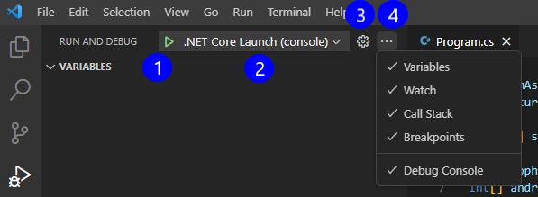

The Visual Studio Code user interface provides several ways to configure debug options and launch debug sessions.

## Debug features in the Visual Studio Code user interface

Visual Studio Code includes several user interface features that will help you to configure, start, and manage debug sessions:

- Configure and launch the debugger: The **Run** menu and RUN AND DEBUG view can both be used to configure and launch debug sessions.
- Examine application state: The RUN AND DEBUG view includes a robust interface that exposes various aspects of your application state during a debug session.
- Runtime execution control: The **Debug toolbar** provides high-level runtime controls during code execution.

> [!NOTE]
> This Unit introduces you to a lot of debugging tools and terminology. Please keep in mind that this is your first look at these tools, not your last. You'll have an opportunity to complete hands-on activities with most of these tools during this module. Try not to feel overwhelmed by the volume of information that's presented.

## Run menu options

The Visual Studio Code **Run** menu provides easy access to some common run and debug commands.

The **Run** menu provides menu options that are grouped into six sections.

1. Start and stop applications. This section of the menu includes options for starting and stopping code execution, with and without the debugger attached.

1. Launch configurations. This section of the menu provides access to examine or create launch configurations.

1. Runtime control. This section of the menu enables the developer to control how they want to advance through the code. Controls are enabled when execution has paused during a debug session.

1. Set Breakpoints. This section of the menu enables the developer to set breakpoints on code lines. Code execution pauses on Breakpoints during a debug session.

1. Manage Breakpoints. This section of the menu enables the developer to manage breakpoints in bulk rather than individually.

1. Install Debuggers. This section of the menu opens the Visual Studio Code EXTENSIONS view filtered for code debuggers.  

## Run and Debug view user interface

The RUN AND DEBUG view provides access to runtime tools that can be invaluable during the debug process.

1. Run and Debug controls panel. Used to configure and start a debug session.

1. VARIABLES section. Used to view and manage variable state during a debug session.

1. WATCH section. Used to monitor variables or expressions. For example, you could configure an expression using one or more variables and watch it to see when a particular condition is met.

1. CALL STACK section. Used to keep track of the current point of execution within the running application, starting with the initial point of entry into the application. The call stack shows which method is currently being executed, as well as the method or methods in the execution path that led to the current point of execution (current line of code).

1. BREAKPOINTS section. Displays the current breakpoint settings.

1. Debug toolbar. Used to control code execution during the debug process. This toolbar is only displayed while the application is running.

1. Current execution step. Used to identify the current execution step by highlighting it in the Editor. In this case, the current execution step is a breakpoint (breakpoints are marked with a red dot to the left of the line number).

1. DEBUG CONSOLE. Used to display messages from the debugger. The DEBUG CONSOLE panel is the default console for console applications and is able to display output from `Console.WriteLine()` and related `Console` output methods.

### Controls panel for the Run and Debug view

At the top of the RUN AND DEBUG view, you can find the launch controls:

1. Start debugging. This button (a green arrow) is used to start a debug session.

1. Launch configurations. This dropdown menu provides access to launch configurations. The selected option is displayed.

1. Open 'launch.json'. This button (a gear shape) can be used to open the `launch.json` file, where you can edit the launch configuration if needed.

1. Views and More Actions. This button (an ellipsis) enables you to show/hide sections of the debug panel as well as the DEBUG CONSOLE panel.

## Debug toolbar

The **Debug toolbar** provides execution controls while your application is running.

1. Pause/Continue. This button can be used to pause execution when the code is running and Continue when code execution has been paused.

1. Step Over. This button can be used to execute the next method as a single command without inspecting or following its component steps.

1. Step Into. This button can be used to enter the next method or code line and observe line-by-line execution steps.

1. Step Out. When inside a method, this button can be used to return to the earlier execution context by completing all remaining lines of the current method as though they were a single command.

1. Restart. This button can be used to terminate the current program execution and start debugging again using the current configuration.

1. Stop. This button can be used to terminate the current program execution.

In addition to six execution controls, the **Debug toolbar** provides a "handle" on the left side that enables the developer to reposition the toolbar, and a "More" dropdown on the right side that enables the developer to disconnect the debugger.

> [!NOTE]
> You can use the setting `debug.toolBarLocation` to control the location of the debug toolbar. It can be floating (the default), docked to the RUN AND DEBUG view, or hidden. A floating debug toolbar can be dragged horizontally and down to the Editor area.

## Recap

Here are a few important things to remember from this unit:

- The Visual Studio Code user interface can be used to configure, start, and manage debug sessions. The `launch.json` file contains the launch configurations for your application.
- The **Run** menu provides easy access to common run and debug commands grouped into six sections.
- The RUN AND DEBUG view provides access to runtime tools, including the Run and Debug controls panel. The sections of the RUN AND DEBUG view are VARIABLES, WATCH, CALL STACK, and BREAKPOINTS.
- The Debug toolbar provides execution controls while your application is running such as pause/continue, step over, step into, step out, restart and stop.
- The DEBUG CONSOLE is used to display messages from the debugger. The DEBUG CONSOLE can also display console output from your application.