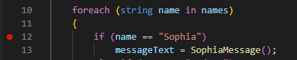
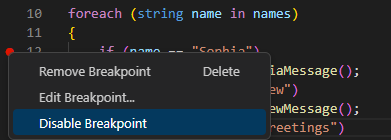
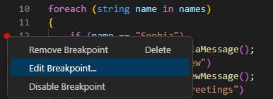
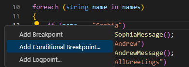
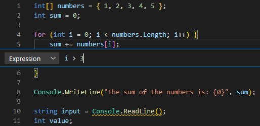
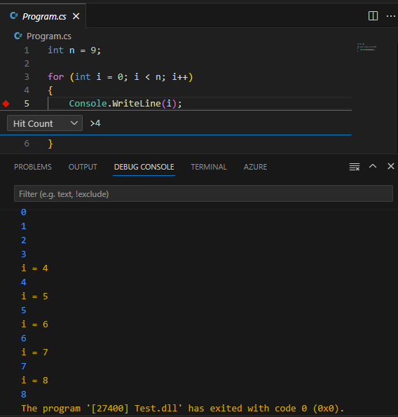

Debuggers are used to help you to analyze your code and can be used to control your program's runtime execution. When you start the Visual Studio Code debugger, it immediately begins executing your code. Because your code executes in micro-seconds, effective code debugging depends on your ability to pause the program on any statement within your code. Breakpoints are used to specify where code execution pauses.

## Set breakpoints

Visual Studio Code provides several ways to configure breakpoints in your code. For example:

- Code Editor: You can set a breakpoint in the Visual Studio Code Editor by clicking in the column to the left of a line number.
- Run menu: You can toggle a breakpoint on/off from the **Run** menu. The current code line in the Editor specifies where the **Toggle Breakpoint** action is applied.

When a breakpoint is set, a red circle is displayed to the left of the line number in the Editor. When you run your code in the debugger, execution pauses at the breakpoint.

## Remove, disable, and enable breakpoints

After setting breakpoints in your application and using them to isolate an issue, you may want to remove or disable the breakpoints.

To remove a breakpoint, repeat the action used to set a breakpoint. For example, click the red circle to the left of the line number or use the toggle breakpoint option on the **Run** menu.

What if you want to keep a breakpoint location, but you don't want it to trigger during your next debug session? Visual Studio Code enables you to "disable" a breakpoint rather than removing it altogether. To disable an active breakpoint, right-click the red dot to the left of the line number, and then select **Disable Breakpoint** from the context menu.

When you disable a breakpoint, the red dot to the left of the line number is changed to a grey dot.

> [!NOTE]
> The context menu that appears when you right-click a breakpoint also includes the options to **Remove Breakpoint (Delete)** and **Edit Breakpoint**. The **Edit Breakpoint** option is examined in the **Conditional breakpoints and Logpoints** section later in this unit.

In addition to managing individual breakpoints in the Editor, the **Run** menu provides options for performing bulk operations that act on all breakpoints:

- **Enable All Breakpoints**: Use this option to enable all disabled breakpoints.
- **Disable All Breakpoints**: Use this option to disable all breakpoints.  
- **Remove All Breakpoints**: Use this option to remove all breakpoints (both enabled and disabled breakpoints are removed).

## Conditional breakpoints

A conditional breakpoint is a special type of breakpoint that only triggers when a specified condition is met. For example, you can create a conditional breakpoint that pauses execution when a variable named `numItems` is greater than 5.

You've already seen that right-clicking a breakpoint opens a context menu that includes the **Edit Breakpoint** option. Selecting **Edit Breakpoint** enables you to change a standard breakpoint into a conditional breakpoint.

In addition to editing an existing breakpoint, you can also set a conditional breakpoint directly. If you right-click (rather than left-click) to set a new breakpoint, you can choose to create a conditional breakpoint.

When you create a conditional breakpoint, you need to specify an expression that represents the condition.

Each time the debugger encounters the conditional breakpoint, it evaluates the expression. If the expression evaluates as `true`, the breakpoint is triggered and execution pauses. If the expression evaluates as `false`, execution continues as if there was no breakpoint.

For example, suppose you need to debug some code that's inside the code block of a `for` loop. You've noticed that the issue you're debugging only occurs after the loop has completed several iterations. You decide that you want the breakpoint to trigger once the loop's iteration control variable, `i`, is greater than three. You create a conditional breakpoint and specify the expression `i > 3`.

When you run your code in the debugger, it skips over your breakpoint until the iteration when `i > 3` evaluates as `true`. When `i = 4`, execution pauses on your conditional breakpoint.

## Support for `Hit Count` breakpoints and `Logpoints`

The C# debugger for Visual Studio Code also supports `Hit Count` breakpoints and `Logpoints`.

A 'hit count' breakpoint can be used to specify the number of times that a breakpoint must be encountered before it will 'break' execution. You can specify a hit count value when creating a new breakpoint (with the Add Conditional Breakpoint action) or when modifying an existing one (with the Edit Condition action). In both cases, an inline text box with a dropdown menu opens where you can enter the hit count value.

A 'Logpoint' is a variant of a breakpoint that does not "break" into the debugger but instead logs a message to the console. Logpoints are especially useful for injecting logging while debugging production environments that cannot be paused or stopped. A Logpoint is represented by a "diamond" shaped icon rather than a filled circle. Log messages are plain text but can include expressions to be evaluated within curly braces ('{}').

Logpoints can include a conditional 'expression' and/or 'hit count' to further control when logging messages are generated. For example, you can combine a Logpoint message of `i = {i}` with Hit Count condition `>4`to generate log messages as follows:

## Recap

Here are a few important things to remember from this unit:

- Visual Studio Code enables setting breakpoints in the code editor or from the **Run** menu. Breakpoint code lines are marked with a red dot to the left of the line number.
- Breakpoints can be removed or disabled using the same options used to set them. Bulk operations that affect all breakpoints are available on the **Run** menu.
- Conditional breakpoints can be used to pause execution when a specified condition is met or when a 'hit count' is reached.
- Logpoints can be used to log information to the terminal without pausing execution or inserting code.