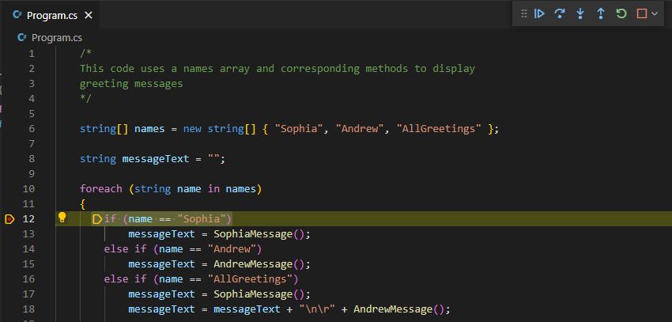

Breakpoints are used during the debug process pause execution. This enables you to track variables and examine the sequence in which your code is executed. Breakpoints are a great way to start your debug process.

## Set a breakpoint

Earlier in this module you completed an exercise where you ran an application in the debugger. The application displayed "greeting messages" in the DEBUG CONSOLE panel. At the end of the exercise, you noticed that the code repeats Andrew's greeting in an unexpected way.

In this exercise, you'll use a breakpoint to help you identify the issue.

1. Ensure that your Program.cs file contains the following code sample:

    ```csharp
    /* 
    This code uses a names array and corresponding methods to display
    greeting messages
    */
    
    string[] names = new string[] { "Sophia", "Andrew", "AllGreetings" };
    
    string messageText = "";
    
    foreach (string name in names)
    {
        if (name == "Sophia")
            messageText = SophiaMessage();
        else if (name == "Andrew")
            messageText = AndrewMessage();
        else if (name == "AllGreetings")
            messageText = SophiaMessage();
            messageText = messageText + "\n\r" + AndrewMessage();
        
        Console.WriteLine(messageText + "\n\r");
    }
    
    bool pauseCode = true;
    while (pauseCode == true);
    
    static string SophiaMessage()
    {
        return "Hello, my name is Sophia.";
    }
    
    static string AndrewMessage()
    {
        return "Hi, my name is Andrew. Good to meet you.";
    }
    ```

1. Use the Visual Studio Code debugger tools to set a breakpoint on the first code line inside the `foreach` loop.

    

    > [!TIP]
    > One easy option for toggling on/off a breakpoint is to select (left-click) the area to the left of the line number. Breakpoints can also be set by using the `Run` menu and by using keyboard shortcuts.

1. On the **Run** menu, select **Start Debugging**.

1. Notice that code execution pauses at the breakpoint, and that the current code line is highlighted in the Editor.

    

1. On the **Debug controls** toolbar, select **Step Into**.

    You can hover the mouse pointer over the buttons on the **Debug controls** toolbar to display the button labels.

1. Notice that code execution advances to the following code line and pauses:

    ```csharp
    messageText = SophiaMessage();
    ```

    This code line assigns the return value of the `SophiaMessage` method to the string variable `messageText`.

1. Take a moment to consider why selecting **Step Into** produced this result.

    - The **Step Into** button is used to advance to the next executable statement.
    - Since the first element in the `names` array is `Sophia` and the `if` statement is checking for the name `Sophia`, the expression evaluates to `true` and code execution moves into the code block of the `if` statement.
  
1. On the **Debug controls** toolbar, select **Step Into**.

1. Notice that code execution advances to the `SophiaMessage` method and pauses.

    The **Step Into** button has advanced to the next executable code line. The next executable code line isn't the next line number in the file, it's the next statement in the execution path. In this case, the next executable statement is the entry point to the `SophiaMessage` method.

1. On the **Debug controls** toolbar, select **Step Out**.

1. Notice that code execution returns to the code line that called the `SophiaMessage` method and pauses.

1. Take a moment to consider why selecting **Step Out** produced this result.

    When inside a method, the **Step Out** button completes the remaining lines of the current method and then returns to the execution context that invoked the method.

1. On the **Debug controls** toolbar, select **Step Into**.

1. Notice that code execution advances to the following code line and pauses:

    ```csharp
    messageText = messageText + "\n\r" + AndrewMessage();
    ```

1. Take a moment to consider why execution advanced to this code line.

    Although the code indentation implies that this code line is part of the code block for the `else if` statement, it isn't. Using curly braces `{}` to define the code blocks for this `if - else if` structure would have helped to avoid this bug. As the code is written, Andrew's message will be added to `messageText` each time the loop iterates.

## Verify your code updates

Once you've isolated an issue in your code, you should update your code and then verify that the issue has been fixed.

1. On the **Debug controls** toolbar, select **Stop**.

1. Take a minute to fix your code logic.

    You have a few options for fixing the identified issue in your code. For example:

    - You could keep the existing code lines and add curly braces `{}` to the `if` structure for each code block.
    - You could merge the two code lines that follow the final `else if` statement, forming a single statement as follows:

        ```csharp
        else if (name == "AllGreetings")
            messageText = SophiaMessage() + "\n\r" + AndrewMessage();
        ```

    Either way, your updated code must include the call to `AndrewMessage` within the code block when `name == "AllGreetings"`.

1. On the **File** menu, select **Save**.

1. Use the debugger UI tools to clear the breakpoint that you set earlier.

1. On the **Run** menu, select **Start Debugging**.

1. Verify that your code now produces the expected results.

    ```output
    Hello, my name is Sophia.
    
    Hi, my name is Andrew. Good to meet you.
    
    Hello, my name is Sophia.
    Hi, my name is Andrew. Good to meet you.
    ```

1. On the **Debug controls** toolbar, select **Stop**.

Congratulations! You've successfully used the Visual Studio Code debugger to help you isolate and correct a logic issue.

## Recap

Here are a few important things to remember from this unit:

- Use breakpoints to pause code execution during a debug session.
- Use **Step Into** from the **Debug controls** toolbar to observe the next executable code line.
- Use **Step Out** from the **Debug controls** toolbar to advance through the current method and back to the code line that called the method.
