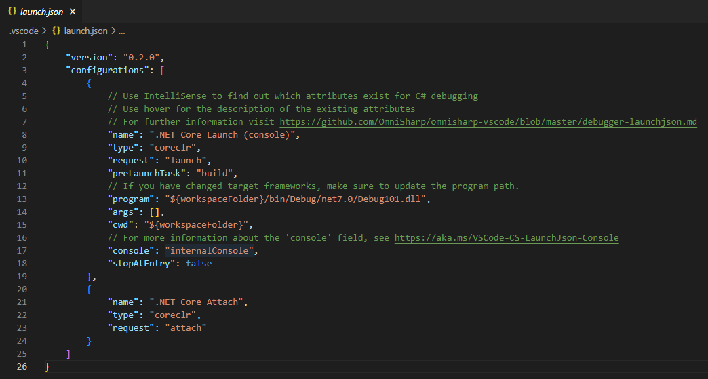
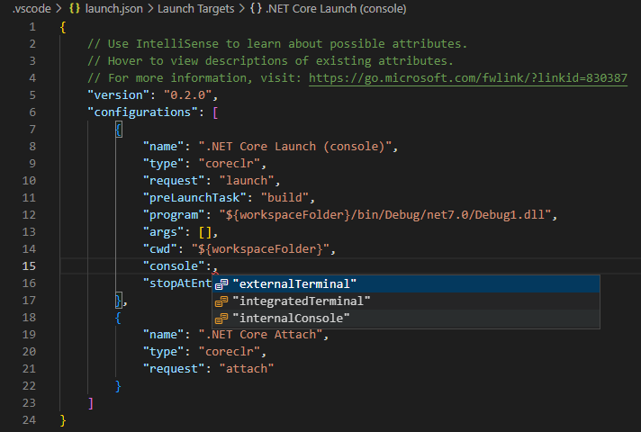
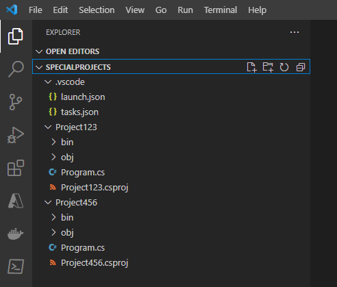

You've already seen that Visual Studio Code uses the launch.json file to configure the debugger. If you're creating a simple C# console application, it's likely that Visual Studio Code generates a launch.json file that has all of the information you need to successfully debug your code. However, there are cases when you need to modify a launch configuration, so it's important to understand the attributes of a launch configuration.

## Attributes of a launch configuration

The launch.json file includes one or more launch configurations in the `configurations` list. The launch configurations use attributes to support different debugging scenarios. The following attributes are mandatory for every launch configuration:

- `name`: The reader-friendly name assigned to the launch configuration.
- `type`: The type of debugger to use for the launch configuration.
- `request`: The request type of the launch configuration.



This section defines some of the attributes you may encounter.

### Name

The `name` attribute specifies the display name for the launch configuration. The value assigned to `name` appears in the launch configurations dropdown (on the controls panel at the top of the RUN AND DEBUG view).

### Type

The `type` attribute specifies the type of debugger to use for the launch configuration. A value of `codeclr` specifies the debugger type for .NET 5+ and .NET Core applications (including C# applications).

### Request

The `request` attribute specifies the request type for the launch configuration. Currently, the values `launch` and `attach` are supported.

### PreLaunchTask

The `preLaunchTask` attribute specifies a task to run before debugging your program. The task itself can be found in the tasks.json file, which is in the `.vscode` folder along with the launch.json file. Specifying a prelaunch task of `build` runs a `dotnet build` command before launching the application.

### Program

The `program` attribute is set to the path of the application dll or .NET Core host executable to launch.

This property normally takes the form: `${workspaceFolder}/bin/Debug/<target-framework>/<project-name.dll>`.

Where:

- `<target-framework>` is the framework that the debug project is being built for. This value is normally found in the project file as the 'TargetFramework' property.
- `<project-name.dll>` is the name of debugged project's build output dll. This property is normally the same as the project file name but with a '.dll' extension.

For example: `${workspaceFolder}/bin/Debug/net7.0/Debug101.dll`

> [!NOTE]
> The **.dll** extension indicates that this file is a dynamic link library (dll) file. If your project is named Debug101, a file named **Debug101.dll** is created when a build task compiles your program using the Program.cs and Debug101.csproj files. You can find the **Debug101.dll** file in the EXPLORER view by expanding the "bin" and "Debug" folders, and then opening a folder that represents the .NET framework used by your code project, such as "net7.0". The .NET Framework version is specified in your .csproj file.

### Cwd

The `cwd` attribute specifies the working directory of the target process.

### Args

The `args` attribute specifies the arguments that are passed to your program at launch. There are no arguments by default.

### Console

The `console` attribute specifies the type of console that's used when the application is launched. The options are `internalConsole`, `integratedTerminal`, and `externalTerminal`. The default setting is `internalConsole`. The console types are defined as:

- The `internalConsole` setting corresponds to the DEBUG CONSOLE panel in the Panels area below the Visual Studio Code Editor.
- The `integratedTerminal` setting corresponds to the OUTPUT panel in the Panels area below the Visual Studio Code Editor.
- The `externalTerminal` setting corresponds to an external terminal window. The Command Prompt application that comes with Windows is an example of a terminal window.

> [!IMPORTANT]
> The DEBUG CONSOLE panel doesn't support console input. For example, the DEBUG CONSOLE can't be used if the application includes a `Console.ReadLine()` statement. When you're working on a C# console application that reads user input, the `console` setting must be set to either `integratedTerminal` or `externalTerminal`. Console applications that write to the console, but don't read input from the console, can use any of the three `console` settings.

### Stop at Entry

If you need to stop at the entry point of the target, you can optionally set `stopAtEntry` to be `true`.

## Edit a launch configuration

There are lots of scenarios when you might need to customize the launch configuration file. Many of those scenarios involve advanced or complex project scenarios. This module focuses on two simple scenarios when updating the launch configuration file is required:

- Your C# console application reads input from the console.
- Your project workspace includes more than one application.

### Update the launch configuration to accommodate console input

As you read earlier, the DEBUG CONSOLE panel doesn't support console input. If you're debugging a console application that relies on user input, you need to update the `console` attribute in the associated launch configuration.

To edit the `console` attribute:

1. Open the launch.json file in the Visual Studio Code Editor.

1. Locate the **console** attribute.

1. Select the colon and assigned value, and then enter a colon character.

1. Notice that when you overwrite the existing information with a colon, Visual Studio Code IntelliSense displays the three options in a dropdown list.

   

1. Select either **integratedTerminal** or **externalTerminal**.

1. Save the launch.json file.

### Update the launch configuration to accommodate multiple applications

If your workspace has only one launchable project, the C# extension will automatically generate the launch.json file. If you have more than one launchable project, then you need to modify your launch.json file manually. Visual Studio Code generates a launch.json file using the basic template that you can update. In this scenario, you create separate configurations for each application that you want to debug. Prelaunch tasks, such as a build task, can be created in the tasks.json file.

Suppose that you're working on a coding project that includes several console applications. The root project folder, **SpecialProjects**, is the workspace folder that you open in Visual Studio Code when you work on your code. You have two applications that you're developing, Project123 and Project456. You use the RUN AND DEBUG view to debug the applications. You want to select the application that you're debugging from the user interface. You also want any saved code updates to be compiled prior to attaching the debugger to your application.

You can achieve the requirements for this scenario by updating the launch.json and tasks.json files.

The following screenshot shows the EXPLORER view and the folder structure containing Project123 and Project456.



Notice that the `.vscode` folder containing the launch.json and tasks.json files is associated with the workspace folder, **SpecialProjects**, not the individual project folders.

The following screenshot shows how you could configure the launch.json file to include configurations for both the "Project123" and "Project456" applications.

```json
"version": "0.2.0",
"configurations": [
    {
        "name": "Launch Project123",
        "type": "coreclr",
        "request": "launch",
        "preLaunchTask": "buildProject123",
        "program": "${workspaceFolder}/Project123/bin/Debug/net7.0/Project123.dll",
        "args": [],
        "cwd": "${workspaceFolder}/Project123",
        "console": "internalConsole",
        "stopAtEntry": false
    },
    {
        "name": "Launch Project456",
        "type": "coreclr",
        "request": "launch",
        "preLaunchTask": "buildProject456",
        "program": "${workspaceFolder}/Project456/bin/Debug/net7.0/Project456.dll",
        "args": [],
        "cwd": "${workspaceFolder}/Project456",
        "console": "internalConsole",
        "stopAtEntry": false
    }
]
```

Notice that the **name**, **preLaunchTask**, and **program** fields are all configured for a specific application.

The **name** attribute specifies the selectable launch option that's displayed in the RUN AND DEBUG view user interface, the **program** attribute specifies the path to your application. The **preLaunchTask** attribute is used to specify the name of the task that's performed prior to launching the debugger. The **tasks.json** file contains the named tasks and the information required to complete the task.

The following screenshot shows how you could configure the tasks.json file. In this case, the named tasks specify build operations that are specific to the "Project123" and "Project456" applications. The build task ensures that any saved edits are compiled and represented in the corresponding .dll file that's attached to the debugger.

```json
"version": "2.0.0",
"tasks": [
    {
        "label": "buildProject123",
        "command": "dotnet",
        "type": "process",
        "args": [
            "build",
            "${workspaceFolder}/Project123/Project123.csproj",
            "/property:GenerateFullPaths=true",
            "/consoleloggerparameters:NoSummary"
        ],
        "problemMatcher": "$msCompile"
    },
    {
        "label": "buildProject456",
        "command": "dotnet",
        "type": "process",
        "args": [
            "build",
            "${workspaceFolder}/Project456/Project456.csproj",
            "/property:GenerateFullPaths=true",
            "/consoleloggerparameters:NoSummary"
        ],
        "problemMatcher": "$msCompile"
    }
]
```

With your updates to the launch.json and tasks.json files in place, the RUN AND DEBUG view displays launch options for debugging either the Project123 or Project456 application. The following screenshot shows the names of the launch configurations displayed in the launch configuration dropdown:


## Recap

Here are two important things to remember from this unit:

- Launch configurations are used to specify attributes such as `name`, `type`, `request`, `preLaunchTask`, `program`, and `console`.
- Developers can edit a launch configuration to accommodate project requirements.