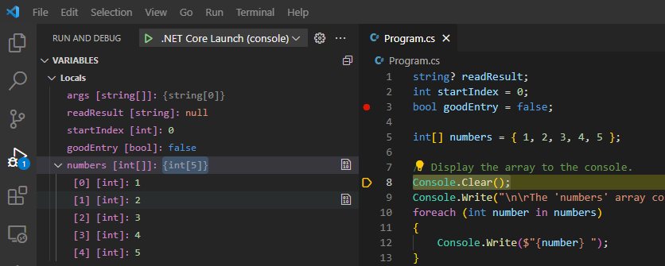
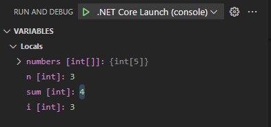
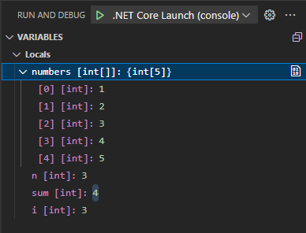

The RUN AND DEBUG view provides developers with an easy way to monitor variables and expressions, observe execution flow, and manage breakpoints during the debug process.  

## Examine the sections of the Run and Debug view

Each section of the RUN AND DEBUG view provides unique capabilities. Using a combination of these sections during the debug process is often helpful.  

### VARIABLES section

Monitoring variable state is an important aspect of code debugging. Unexpected changes in variable state will often help to identify logic errors in your code.

The VARIABLES section organizes your variables by scope. The `Locals` scope displays the variables in the current scope (the current method).

> [!NOTE]
> The top-level statements section of a console application is considered its own method. A method named `Main`.

You can unfold (expand) the displayed scopes by selecting the arrow to the left of the scope name. You can also unfold variables and objects. The following screenshot shows the `numbers` array unfolded under the `Locals` scope.



It's also possible to change the value of a variable at runtime using the VARIABLES section. You can double-click the variable name and then enter a new value.

### WATCH section

What if you want to track a variable state across time or different methods? It can be tedious to search for the variable every time. That's where the WATCH section comes in handy.

You can select the **Add Expression** button (appears as a plus sign: **+**) to enter a variable name or an expression to watch. As an alternative, you can right-click a variable in the VARIABLES section and select `Add to watch`.

All expressions inside the WATCH section will be updated automatically as your code runs.

### CALL STACK section

Every time your code enters a method from another method, a call layer is added to the application's call stack. When your application becomes complex and you have a long list of methods called by other methods, the call stack represents the trail of method calls.

The CALL STACK section is useful when you're trying to find the source location for an exception or WATCH expression. If your application throws an unexpected exception, you'll often see a message in the console that resembles the following:

```output
Exception has occurred: CLR/System.DivideByZeroException
An unhandled exception of type 'System.DivideByZeroException' occurred in Debug1.dll: 'Attempted to divide by zero.'
    at Program.<<Main>$>g__WriteMessage|0_1() in C:\Users\howdc\Desktop\Debug1\Program.cs:line 27
    at Program.<<Main>$>g__Process1|0_0() in C:\Users\howdc\Desktop\Debug1\Program.cs:line 16
    at Program.<Main>$(String[] args) in C:\Users\howdc\Desktop\Debug1\Program.cs:line 10
```

The indented group of `at Program ...` lines under the error message is called a stack trace. The stack trace lists the name and origin of every method that was called leading up to the exception. The information can be a bit difficult to decipher though, because it can also include information from the .NET runtime. In this example, the stack trace is pretty clean and you can see that exception occurred in a method named `WriteMessage`. The stack originates in a method named `Main`, which is the top-level statements section of the console application.

The CALL STACK section can help you to avoid the difficulty of deciphering a stack trace that's cluttered with .NET runtime information. It filters out unwanted information to show you only the relevant methods from your own code by default. You can manually unwind the call stack to find out where the exception originated.

### BREAKPOINTS section

The BREAKPOINTS section displays the current breakpoint settings and can be used to enable or disable specific breakpoints during a debug session.

## Configure your application and launch configuration

When you're working on a console application that reads user input, you'll probably need to update launch configuration file.

1. Update the code in your Program.cs file as follows:

    ```csharp
    string? readResult;
    int startIndex = 0;
    bool goodEntry = false;
    
    int[] numbers = { 1, 2, 3, 4, 5 };
    
    // Display the array to the console.
    Console.Clear();
    Console.Write("\n\rThe 'numbers' array contains: { ");
    foreach (int number in numbers)
    {
        Console.Write($"{number} ");
    }
    
    // To calculate a sum of array elements, 
    //  prompt the user for the starting element number.
    Console.WriteLine($"}}\n\r\n\rTo sum values 'n' through 5, enter a value for 'n':");
    while (goodEntry == false)
    {
        readResult = Console.ReadLine();
        goodEntry = int.TryParse(readResult, out startIndex);
    
        if (startIndex > 5)
        {
            goodEntry = false;
            Console.WriteLine("\n\rEnter an integer value between 1 and 5");
        }
    }
    
    // Display the sum and then pause.
    Console.WriteLine($"\n\rThe sum of numbers {startIndex} through {numbers.Length} is: {SumValues(numbers, startIndex)}");
    
    Console.WriteLine("press Enter to exit");
    readResult = Console.ReadLine();
    
    // This method returns the sum of elements n through 5
    static int SumValues(int[] numbers, int n)
    {
        int sum = 0;
        for (int i = n; i < numbers.Length; i++)
        {
            sum += numbers[i];
        }
        return sum;
    }
    ```

1. Take a minute to review the code.

    Notice the following:

    - The code specifies an integer array containing five numbers.
    - The code displays output in the console.
    - The code prompts the user to enter a starting element number `n` that it uses to sum array elements `n` through `5`.
    - The code calculates the sum in a method, displays the results in the console, and then pauses.

    > [!NOTE]
    > The DEBUG CONSOLE panel does not support user input from the console.

1. On the Visual Studio Code **File** menu, select **Save**.

1. On the **Run** menu, select **Remove All Breakpoints**.

    This removes any breakpoints left over from the previous exercise.

1. On the RUN AND DEBUG view, select **Start Debugging**.

1. Notice that an error occurs when the `Console.Clear();` code line is executed.

1. On the **Debug toolbar**, select **Stop**.

1. Switch to the EXPLORER view, and then open the launch.json file in the Editor.

1. Update the value of the **`console`** attribute as follows:

    ```json
    "console":"integratedTerminal",
    ```

1. On the Visual Studio Code **File** menu, select **Save**, and then close the launch.json file.

## Review application output and identify issues

Reviewing the output of your application can reveal logic issues that you've overlooked when writing your code.

1. Switch back to the RUN AND DEBUG view.

1. On the RUN AND DEBUG view, select **Start Debugging**.

    The messages displayed to the DEBUG CONSOLE panel show the debugger attaching to the `Debug101.dll` application.

1. Notice that no error messages are displayed.

    Changing the value of the `console` attribute from **internalConsole** to **integratedTerminal** in the launch configuration file has fixed the console error. But now you need to locate the console that contains your output.

1. In the Panels area below the Editor, switch from the DEBUG CONSOLE panel to the TERMINAL panel.

1. Notice that code execution has paused at the message prompting the user to enter a value for `n`.

    The output on the TERMINAL panel should look like the following:

    ```output

    The 'numbers' array contains: { 1 2 3 4 5 }

    To sum values 'n' through 5, enter a value for 'n':
    ```

1. At the TERMINAL command prompt, enter **3**

1. Review the output from the application.

    The output on the TERMINAL panel should look like the following:

    ```output

    The 'numbers' array contains: { 1 2 3 4 5 }

    To sum values 'n' through 5, enter a value for 'n':
    3

    The sum of numbers 3 through 5 is: 9
    press Enter to exit
    ```

1. Take a minute to consider the reported value of `sum` and the values of array elements 3 through 5 displayed at the top of the console.

    The message says: `The sum of numbers 3 through 5 is: 9`. However, array elements 3 through 5 are `3`, `4`, and `5`. Shouldn't the reported sum be 12?

    You can use the VARIABLES section of the RUN AND DEBUG view to investigate the issue.

## Monitor variable state

In some cases, simply monitoring variable state is enough to identify the logic issue in your application.

1. Set a breakpoint on the following code line:

    ```csharp
    Console.WriteLine($"\n\rThe sum of numbers {startIndex} through {numbers.Length} is: {SumValues(numbers, startIndex)}");
    ```

1. On the RUN AND DEBUG view, select **Start Debugging**.

1. Switch from the DEBUG CONSOLE panel to the TERMINAL panel.

1. At the TERMINAL command prompt, enter **3**

    Code execution will pause at the breakpoint.

1. Take a minute to review the VARIABLES section of the RUN AND DEBUG view.

    Notice that `startIndex` has been assigned the value that you entered, which is `3`.

1. Select **Step Into**.

1. Notice that the VARIABLES and CALL STACK sections are updated.

    The CALL STACK section shows that code execution has moved into the `SumValues` method.

    The VARIABLES section, which lists the local variables, shows the value of the integer `n`. The method parameter `n` is assigned its value from the method call argument `startIndex`. In this case, the change to variable names makes it clear the value has been passed, not a reference pointer.

    > [!NOTE]
    > In this case, you can see most of your code in the Editor, so you might not need the CALL STACK section, but when you're working on larger applications with deeply nested and interconnected method calls, the execution path shown in the CALL STACK section can be extremely useful.  

1. Continue selecting **Step Into** until the value assigned to `sum` is no longer `0`.

1. Take a minute to review the information shown in the VARIABLES section.

    You should see the following:

    

    Notice that the value assigned to `sum` went from `0` to `4`.

1. To expand the `numbers` array, select **numbers [int[]]**.

    

1. Recall that array elements are accessed using zero-based index numbers.

    In this case, the logic error is a discrepancy between the instructions in the user interface and the underlying code. The user interface refers to array items 1-5. However, the code uses the value entered by the user to access the zero-based array elements. The array element that has an index of `3` stores a value of `4`. The code doesn't compensate for zero-based index numbers.

1. To terminate the debug session, select **Stop**.

1. Take a minute to consider how you might fix the issue.

    This issue could be corrected in the user interface by prompting the user to enter a value between 0 and 4. It could also be corrected in code by subtracting 1 from the value that's entered. Generally speaking, your goal should be a clear and easy to follow user interface. In this case it might be better to update the code as follows:

    ```csharp
    Console.WriteLine($"\n\rThe sum of numbers {startIndex} through {numbers.Length} is: {SumValues(numbers, startIndex - 1)}");
    ```

    Running the updated code will produce the following output:

    

1. Update your code using the suggested approach, and then save your Program.cs file.

1. Clear your breakpoint, rerun the application in the debugger, and verify that the intended result is displayed in the TERMINAL.

    You've just used variable state to identify and fix a logic issue! Great job.

## Monitor watch expressions

The WATCH section can be used to monitor expressions that are based on one or more variables.

Suppose you're working on an application that performs numeric calculations on a data set. You believe that your code produces unreliable results when the ratio between two numeric variables is greater than 5. You can use the WATCH section to monitor the calculated ratio.

1. Update the Program.cs file with the following code:

    ```csharp
    bool exit = false;
    var rand = new Random();
    int num1 = 5;
    int num2 = 5;
    
    do
    {
        num1 = rand.Next(1, 11);
        num2 = num1 + rand.Next(1, 51);
    
    } while (exit == false);
    ```

1. Save your Program.cs file.

1. Set a breakpoint on the final code line.

1. Set the following WATCH expression:

    ```csharp
    num2 / num1 > 5
    ```

1. On the RUN AND DEBUG view, select **Start Debugging**.

1. Notice the values displayed in the VARIABLES and WATCH sections.

1. Select **Continue** until you see the WATCH expression evaluate to `true`.

    If the WATCH expression evaluated to `true` on the first iteration, select **Continue** a few more times or until you see `true` a second time.

1. Take a minute to consider how the WATCH section is being used.

    In this scenario, you determined that your code produces unreliable results when the ratio between two numeric variables is greater than 5. You constructed an expression in the WATCH section that represents this condition. You can now use the WATCH section to track that condition.

## Modify the value assigned to a variable in the VARIABLES section

There may be times when you want to create a programmatic condition manually. The VARIABLES section of the RUN AND DEBUG view enables you to do this by changing the state of a variable at runtime.

1. Take a minute to review the code that you're running.

    Notice that the code will never exit out of the `do` loop because `exit` will never be `true`. This isn't a programmatic condition that you'ld need to alter in a real-world application, but it demonstrates the capability.

1. In the VARIABLES section, right-click **`exit [bool]`**, and then select **Set Value**.

    The VARIABLES section enables you to change the value assigned to a variable at runtime. This can be useful when you want to see how your code reacts to a particular condition.

1. To set the value of `exit` to `true`, type **true** and then press Enter.

    In this case, changing the value of `exit` to `true` will cause the application to close when the `while` statement is executed.

1. Select **Continue**.

1. Notice that the DEBUG CONSOLE panel displays a message informing you that the program has exited.

Congratulations! You've successfully used the VARIABLES and WATCH sections of the RUN AND DEBUG view.

## Recap

Here are a few important things to remember from this unit:

- Monitor variable state using the VARIABLES section of the RUN AND DEBUG view.
- Track an expression across time or different methods using the WATCH section of the RUN AND DEBUG view.
- Use the CALL STACK section of the RUN AND DEBUG view to find the source location of an exception or a WATCH expression.
- Use the VARIABLES section to change a variable's assigned value at runtime.
