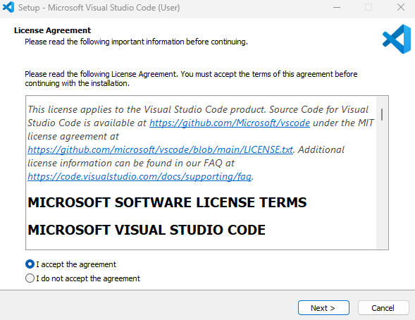

Visual Studio Code is a lightweight but powerful source code editor that runs on your desktop and is available for Windows, macOS and Linux. It comes with built-in support for JavaScript, TypeScript and Node.js and has a rich ecosystem of extensions for other languages and runtimes (such as C++, C#, Java, Python, PHP, Go, .NET).

## Download Visual Studio Code

Getting up and running with Visual Studio Code is quick and easy. It's a small download, so you can install it in a matter of minutes.

1. Open a new browser window, and then navigate to: [https://code.visualstudio.com](https://code.visualstudio.com).

    You can use any browser, such as the Microsoft Edge browser or the Chrome browser.

1. In the browser window, select **Download for Windows**.

    > [!NOTE]
    > The Download page for Visual Studio Code automatically detects your operating system. It displays the version to download for your operating system, such as Linux, macOS, or Windows.
  
1. Wait for the installer file to finish downloading.

    The name of the installer file will be similar to the following (for a Windows PC): VSCodeUserSetup-x64-1.81.0.exe.

    > [!NOTE]
    > The file name depends on the current version of Visual Studio Code and your computer’s operating system.

1. Close your browser window.

## Install Visual Studio Code

Visual Studio Code is lightweight and should run on most available hardware and platform versions. You can review the [System Requirements](https://code.visualstudio.com/docs/supporting/requirements) to check whether your computer configuration is supported.

1. On your PC, open a file explorer application, and then navigate to your computer’s downloads folder.

1. In your file explorer application, select and run the Visual Studio Code installer file.

    On a Windows PC, you can double-click the installer file to begin the install process. For example, double-click **VSCodeUserSetup-x64-1.81.0**

    > [!NOTE]
    > You can install Visual Studio Code using either the User Installer or System Installer. The User Installer installs Visual Studio Code just for the current user, while the System Installer installs Visual Studio Code for all users. The User Installer is the recommended option for most users.

    After a moment, the **Setup - Microsoft Visual Studio Code** dialog window will appear.

    

1. Select **I accept the license agreement**, and then continue following the online instructions to complete the installation.

    Accept the default options during the remainder of the installation.

    For detailed installation instructions, see the following Visual Studio Code documentation page: [https://code.visualstudio.com/docs/setup/windows](https://code.visualstudio.com/docs/setup/windows).

1. If Visual Studio Code opened at the end of the installation, close it now.

    You'll be examining Visual Studio Code a little later in this module.

Congratulations, you've installed Visual Studio Code, the integrated development environment that you'll be using to *write* C# applications. Your next step is to install the .NET runtime, the code library that's required to *run* your C# applications.
