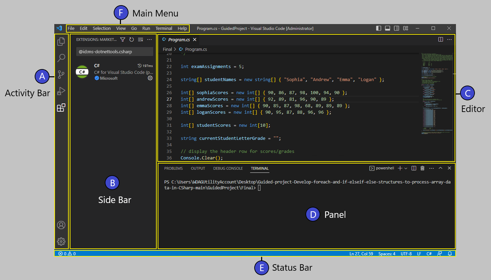

At its heart, Visual Studio Code is a code editor, with a user interface and layout that's similar to many other code editors. On the left side of the interface is a side bar that you'll use to access the files and folders in your code project. On the right side is an editor area that displays the contents of the application files.

## Examine the main areas of the user interface

The following diagram shows the five main work areas included in the Visual Studio Code user interface.

**A** - The **Activity Bar** is the narrow vertical bar located on the far left-hand side of the window. The Activity bar lets you switch between views (such as Explorer or Extensions) and gives you other context-specific indicators.

**B** - The **Side Bar** contains views that provide tools and resources. The Side Bar views (such as EXPLORER) are very helpful when you're working on a code project.

**C** - The **Editor** is the area used to edit your files. You can open as many editors as you like side by side vertically and horizontally.

**D** - The **Panel** area is used to display different panels below the editor region for output or debug information, errors and warnings, or an integrated terminal.

**E** - The **Status Bar** is the horizontal bar along the bottom of the window that displays information about the opened project and the files you edit.

**F** - The **Main Menu** is the menu interface at the top of the application window. The menu options enable you to save, edit, and run your code (and much more).

As you become more proficient with Visual Studio Code, you'll be working in the screen areas described. To start out, however, the most important areas for you to remember are the Activity bar, the Side bar, and the Editor. The Activity bar is where you select the activity you want to perform. The Side bar displays tools and options, and the Editor displays the information that you edit, usually your code.
