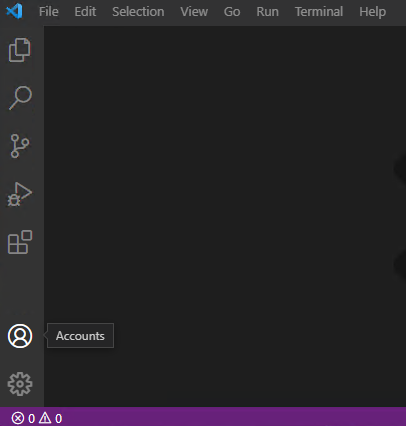

The Visual Studio Code IDE provides tools for developers who are just starting out, but is also extensible and advanced enough for professional developers.

In this exercise, you open Visual Studio Code and complete a quick tour of the IDE.

## Open Visual Studio Code and examine the Get Started page

1. Use the Windows Start menu to open Visual Studio Code.

    If you open the Windows Start menu, you should see Visual Studio Code listed as a recently added application. You can also scroll down to find Visual Studio Code.

    Another option is to type Visual Studio Code in the Windows Search box on the launch tray at the bottom of the screen.

1. Notice that Visual Studio Code opens to a "Welcome" page that includes some links and other information.

    The first time that you open Visual Studio Code, the Welcome page displays some helpful walkthroughs, like the **Get Started with VS Code** content. You can examine this information at your leisure another time.

1. Notice that **Show welcome page on startup** is selected (checked) at the bottom of the page.

    Leave the checkbox selected for now so that you see this information each time Visual Studio Code opens.

1. To close the Welcome page, select **X**.

    The Close button is the "X" located to the right of **Welcome**. If you hover the mouse pointer over the X, the word **Close** appears.

## Examine the Activity bar and Side bar

1. Notice that the **Side bar** to the right of the **Activity bar** is collapsed.

    You may recall that the **Activity bar** is the vertical list of icons on the far left of the Visual Studio Code window. The contents of the **Side bar** are dependent on what is currently selected from the **Activity bar**.

1. Position your mouse pointer over the **Activity bar**, and then hover the mouse pointer over each of the icons to display labels.

    You should see that the two Activity bar buttons at the bottom left are as follows (from top to bottom):

    - Accounts
    - Manage

    

    And you should see that the five Activity bar buttons at the top left are as follows (from top to bottom):

    The Explorer and Extensions buttons are your focus on for now.

1. On the **Activity bar**, select **Explorer**.

    The Side bar should open and show contextual information.

1. Notice that the **Side bar** is now labeled **EXPLORER**.

1. Take a moment to examine the information displayed in the **EXPLORER** Side bar.

1. Notice that **EXPLORER** is used to access/explore project folders and code files.

    Since this is the first time that you've opened Visual Studio Code, you don't have a project folder open. As you begin working on code projects, Visual Studio Code remembers what you were working on and open your project files when it opens.

1. On the **Activity bar**, select **Extensions**.

1. Notice that the **Side bar** is now labeled **EXTENSIONS**.

1. Take a moment to examine the information displayed in the **EXTENSIONS** Side bar.

    Visual Studio Code extensions let you add languages, debuggers, and tools to your installation to support your development workflow. You'll be installing a C# extension later in this module.

1. On the **Activity bar**, to close the **EXTENSIONS** Side bar, select **Extensions**.

## Examine the top menu options

1. To view the File menu options, select **File**.

1. Notice the **New**, **Open**, **Save**, and **Close** options listed on the **File** menu.

1. Take a minute to examine the **Edit** menu options, and then each of the other top level menu items.

1. Notice that several of the menus include options for interacting with your code.

    For example:

    - The Edit menu includes options to find, replace, and toggle code comments, as well as the standard cut, copy, paste, undo, and redo.
    - The Selection menu includes options for selecting and manipulating code lines.
    - The Run menu includes options to run and debug your application.

1. On the **Terminal** menu, select **New Terminal**.

1. Take a moment to examine the contents of the Terminal panel.

    You can switch between the tabs (PROBLEMS, OUTPUT, DEBUG CONSOLE, and TERMINAL) and hover the mouse pointer over the buttons (upper right) to display the button labels.

1. Notice that the Terminal panel includes a command prompt.

    The Terminal panel can be used to run command line interface (CLI) commands. You'll be using CLI commands later in this module.

1. In the upper-right corner of the Terminal panel, select **X** (Close Panel).

1. On the **View** menu, select **Command Palette**

    The command palette can be used to find and run all sorts of useful commands. You don't have the time (or the need) to examine them in detail now, but it's good to know where to find the command palette.

1. At the command palette prompt, type **extensions**

    Notice that the list of commands is filtered based on your entry. 

1. To update the filtered list of commands, change **extensions** to **help** 

1. From the list of command options, select **Help: Interactive Editor Playground**.

    The Editor Playground document that opens in the Editor includes a list of interactive activities.
 
1. From the bulleted list of interactive activities, select **Formatting**.

1. Take a minute to read about the formatting options.

    You'll be using code formatting commands during hands-on activities as you learn more about C# programming.
 
1. Close the Editor Playground document.

That completes your tour of the Visual Studio Code user interface. Once you begin coding, the training materials continue to point out ways that Visual Studio Code can help boost your productivity.
