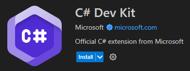

You can extend the capabilities of Visual Studio Code using extensions. The Visual Studio Code community has built hundreds of useful extensions available on the Visual Studio Code Marketplace.

## Configure Visual Studio Code Extensions

Now that you're familiar with the Visual Studio Code user interface, your next step is to configure Visual Studio Code for C# coding.

1. Ensure that you have Visual Studio Code open.

1. On the **Activity bar**, select **Extensions**.

1. In the **Search Extensions in Marketplace** textbox, enter **C#**

    Entering "C#" filters the list of extensions to show only the extensions that have something to do with C# coding.

1. In the filtered list of available extensions, select the extension labeled "**C#** - Base language support for C#" that's published by Microsoft.

    

    There's lots of information about the C# extension that you could read. For now, the important thing to know is that this extension helps you to develop, edit, and debug C# code in Visual Studio Code. You can come back later to read about the extension if you want.

1. To install the extension, select **Install**.

    The Install button changes to Installing. This extension should install quickly.

    > [!NOTE]
    > Keep in mind that it's better to wait until you've determined that you actually need an extension before installing one. Like any Marketplace, many items perform similar functions and some items are quite specialized. You'll want to choose the extensions that provide the greatest benefit for the tasks that you need to complete rather than installing every extension that looks interesting.

1. To use the pre-release version of the extension, select **Switch to Pre-Release Version**.

That's the only extension that you need for now.
