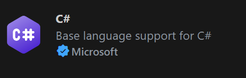

You can extend the capabilities of Visual Studio Code using extensions. Extensions are add-ons that provide additional functionality to Visual Studio Code. There are language extensions, theme extensions, and extensions that add new features to Visual Studio Code. Visual Studio Code supports the development of C# applications using C# language extensions and the .NET Software Development Kit (SDK).

## The .NET SDK and .NET Runtime

.NET is a cross-platform, open-source developer platform that's used to develop different types of applications. It includes the software languages and code libraries used to develop .NET applications. You can write .NET applications in C#, F#, or Visual Basic. The .NET platform is used to develop and run applications on Windows, macOS, and Linux. The .NET platform provides a runtime environment for running applications.

The .NET runtime is the code library that's required to run your C# applications. You may also see the .NET runtime referred to as the Common Language Runtime, or CLR. The .NET runtime isn't required to *write* your C# code, but it's required to actually *run* your C# applications.

Visual Studio Code uses the .NET SDK and C# extensions to provide a development environment for writing, running, and debugging C# applications.

## Configure Visual Studio Code Extensions

To install the C# Dev Kit extension for Visual Studio Code, complete the following steps:

1. Ensure that you have Visual Studio Code open.

1. On the **Activity bar**, select **Extensions**.

1. In the **Search Extensions in Marketplace** textbox, enter **C#**

    Entering "C#" filters the list of extensions to show only the extensions that have something to do with C# coding.

1. In the filtered list of available extensions, select the extension labeled "**C# Dev Kit** - Official C# extension from Microsoft" published by Microsoft.

    

    There's lots of information about the C# extension that you could read. For now, the important thing to know is that this extension helps you to develop, edit, and debug C# code in Visual Studio Code. You can come back later to read about the extension if you want.

1. To install the extension, select **Install**.

    The Install button changes to Installing.

1. Wait for the installation to complete.

    This extension should install in 30-40 seconds. When the installation is complete, the Install button changes to Installed.

    > [!NOTE]
    > You may see notifications appear when installing the C# Dev Kit extension. Ignore the notification asking you to "log in", and close the notification telling you "The .NET Core SDK cannot be located". You install the .NET SDK in the next unit.

1. Close the Get Started with C# Dev Kit page in the Editor.

1. On the **EXTENSIONS** view, clear the text **C#** from the Search textbox.

    The **EXTENSIONS** view refreshes to show the **INSTALLED** extensions at the top of the list. Popular and recommended extensions are listed below the installed extensions. You can "click-and-drag" the top of the **POPULAR** section down to separate it from the list of installed extensions.

    > [!NOTE]
    > There aren't any prizes for installing the most extensions. There are many great extensions for Visual Studio Code, but wait until you need an extension before you install one.

1. Notice that installing the C# Dev Kit installs the following extensions:

    - **.NET Install Tool**. This extension installs and manages different versions of the .NET SDK and Runtime.
    - **C# - Base language support for C#**.
    - **C# Dev Kit - Official C# extension from Microsoft**.

    The final extension you need is named **IntelliCode for C# Dev Kit**. This extension provides AI-assisted development for the C# Dev Kit.

1. In the **Search Extensions in Marketplace** textbox, enter **C#**

1. In the filtered list of available extensions, select the extension labeled **IntelliCode for C# Dev Kit - AI-assisted development for C# Dev Kit** published by Microsoft.

    

1. To install the extension, select **Install**.

    The Install button changes to Installing. The **IntelliCode for C# Dev Kit** extension should install quickly.

1. Close the IntelliCode for C# Dev Kit page in the Editor.

1. To close the **EXTENSIONS** view, select the **Extensions** icon on the Activity bar.

    The **EXTENSIONS** view collapses.

The C# extensions you installed are the only ones that you need for now.

In the next Unit, you install the .NET SDK.
