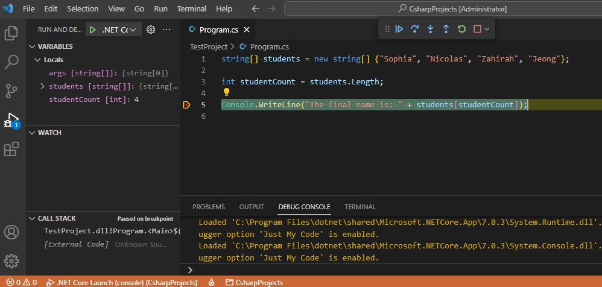

Every developer has to deal with code bugs, it's just a way of life for developers. Sometimes you can spot your bugs quickly. After all, you wrote the code, and besides, it feels good to find and fix an issue quickly. Inevitably though, there will be times when you find yourself searching for a bug that isn't so easy to spot.

## Code debugging process

When you notice a bug in your code, it can be tempting to try a direct approach. You know, that quick scan where you think the issue might be. If it pays off in the first 30 seconds, great, but don't let yourself be sucked in. Don't keep going to that next spot, and the next. Don't let yourself throw time against the following approaches:

- Reading through your code (just one more time) hoping that this time the issue jumps out at you.
- Breadcrumbing a few `Console.WriteLine("here")` messages in your code to the track progress through your app.
- Rerunning your app with different data. Hoping that if you see what works, you'll understand what doesn't work.

You might have experienced various degrees of success with these methods, but don't be fooled. There is a better way.

The one approach that's commonly regarded as being the most successful is using a debugger. But what's a debugger exactly?

A debugger is a software tool used to observe and control the execution flow of your program with an analytical approach. Debuggers help you isolate the cause of a bug and help you resolve it. A debugger connects to your code using one of two approaches:

- By hosting your program in its own execution process.
- By running as a separate process that's attached to your running program.

Debuggers come in different flavors. Some work directly from the command line while others come with a graphical user interface. Visual Studio Code integrates debugger tools in the user interface.

## Why use a debugger

If you're not running your code through a debugger, you're probably guessing at what's happening in your application at runtime. The primary benefit of using a debugger is that you can watch your program running. You can follow program execution one line of code at a time. This approach minimizes the chance of guessing wrong.

Visual Studio Code supports code debuggers that enable you to watch your code as it runs. The following image shows a running application, with execution paused on the line of code that's highlighted. The right side of the screen shows the program code, while the left side shows the current state of variables.

Every debugger has its own set of features. The two most important features that come with almost all debuggers are:

- Control of your program execution. You can pause your program and run it step by step, which allows you to see what code is executed and how it affects your program's state.

- Observation of your program's state. For example, you can look at the value of your variables and function parameters at any point during your code execution.

Mastering the use of a code debugger is an important skill. Unfortunately, it's a skill that developers often overlook. Effective use of a debugger helps you to be more efficient at hunting bugs in your code. Debuggers can also help you to understand how a program works.

## Recap

Here are a few important things to remember from this unit:

- Code debugging is a crucial skill in the software development process that every developer learns.
- The best approach to debugging your applications is to use a debugger, not rereading your code five times or adding `console.WriteLine()` statements throughout your code.
- Debuggers enable you to pause your application, step through your code line-by-line, and observe the state of variables and function parameters.