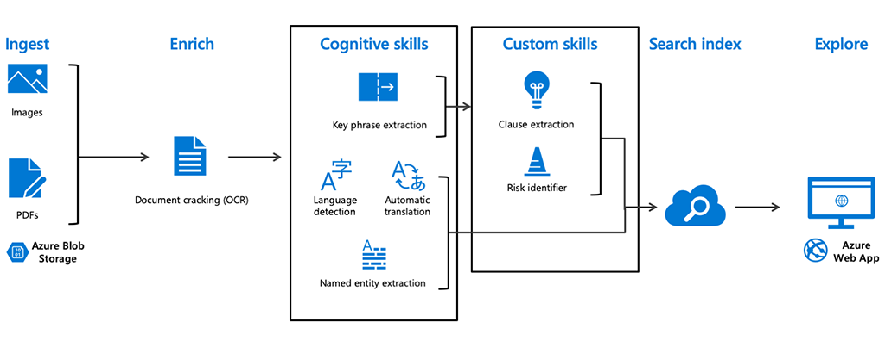

## What is knowledge mining?

Real-world data is messy. It often spans media types, such as text documents, PDF files, images, and databases. It changes constantly, it’s constantly growing, and it carries valuable knowledge in ways that aren’t readily usable. **Knowledge mining** refers to the ability to retrieve information and extract insights within a vast amount of data. Azure Search enables knowledge mining by using built-in AI capabilities to uncover latent insights from all your content–documents, images, and media. Azure Search is the only cloud search service with built-in AI capabilities that enable you to discover patterns and relationships in your content, understand sentiment, extract key phrases and more. Customer support organizations, for example, often use knowledge mining to extract data and intelligence out of case documentation. They can analyze customer sentiment to improve agent productivity and customer experience.

:::row:::

:::column:::
Watch this video to learn how knowledge mining can help you unlock valuable information lying latent in all your content.

:::column-end:::
:::row-end:::

 

>[!VIDEO https://www.microsoft.com/videoplayer/embed/RWqWDE]

Now that you understand more about how knowledge mining is used to interpret data, let’s explore how knowledge mining works.

## How does knowledge mining work and how is it built?

:::row:::

:::column:::
Now let’s take a look at how knowledge mining works, and how it was applied by iCertis, a contract management company, to draw valuable insights from a large amount of unstructured data.

:::column-end:::
:::row-end:::

 

>[!VIDEO https://www.microsoft.com/videoplayer/embed/RWrH6A]

As you saw in the video, Azure Cognitive Search ingested data in the form of PDFs into Azure Blob Storage. Then, with key phrase extraction and named entity recognition, language detection, and automatic translation, cognitive services enriched the data and created a custom General Data Protection Regulation (GDPR) risk model. When connected to Azure web apps, it created a searchable experience that enabled two million users to manage more than five million contracts.

Here is a diagram of the knowledge mining process similar to the process used by iCertis. This diagram illustrates how content is ingested, cracked, enriched, and indexed in order to allow for data mining and search through various applications (such as websites and chatbots).  

Now that you’ve seen an example of how knowledge mining works, here are a few other industry examples where knowledge mining is applied to solve a business problem.

**Healthcare** organizations face the challenge of too much clinical data. Large volumes of data may include patient names, demographics, years of medical records and health history, diagnoses, and lab results. With knowledge mining, healthcare providers can sift through large amounts of data to identify infections sooner, predict which patients are likely to have certain problems, and allow doctors to better serve patients.

In **Financial Services**, businesses need to address the challenge of making sense of large volumes of documents, forms, contracts, and more. Natural language processing techniques combined with specialized content understanding models enable financial services organizations to better understand and serve their customers in a personalized way.

**Oil and Gas** companies have teams of geologists and other specialists that need to understand seismic and geologic data. They often have decades of files with images and handwritten field notes. They need to connect places, domain experts, and events, and synthesize this information to make informed decisions.

Now that we have seen how powerful Azure AI knowledge mining capabilities are, we will dive into the AI capabilities related to machine learning.
