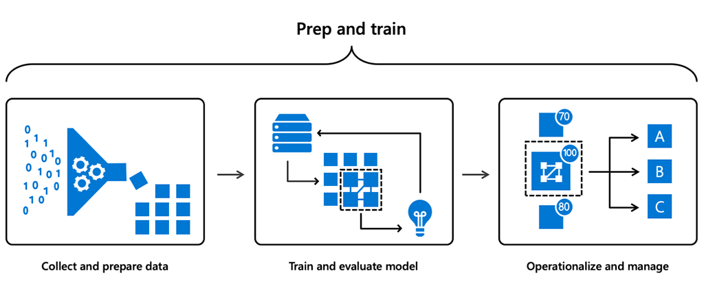

## What is machine learning?

Machine learning is a data science technique that allows computers to learn to use existing data, without being explicitly programmed, to forecast future behaviors, outcomes, and trends.

Azure’s advanced machine learning capabilities allow your business to quickly and easily build, train, and deploy machine learning models using Azure Machine Learning, Azure Databricks, and ONNX (Open Neural Network Exchange). You can use tools and frameworks of your choice without being locked in to specific technologies, develop models faster using automated machine learning, and manage models across the cloud and the edge.

:::row:::

:::column:::
Watch this video to learn about the different layers of machine learning.

:::column-end:::
:::row-end:::

 

>[!VIDEO https://www.microsoft.com/videoplayer/embed/RWqOXa]

You have just seen a few examples (retail recommendations, predictive maintenance, and risk detection) of how machine learning is applied across different industries to improve business outcomes, as well as the benefits of the services and features that Microsoft Azure AI provides to meet your business objectives. 

## How does machine learning work?

To simplify and accelerate machine learning, Azure Machine Learning has been built on the following design principles:

- Enable data scientists to use a familiar and rich set of data science tools.
- Simplify the use of popular machine learning and deep learning frameworks.
- Accelerate time-to-value by offering end-to-end machine learning lifecycle capabilities.

There are three main steps for using machine learning:

Azure Machine Learning service provides a cloud-based environment that you can use to develop, train, test, deploy, manage, and track machine learning models.  

## Machine learning in action

:::row:::

:::column:::
Discover how TAL, a 150-year-old life insurance company, is embracing AI with Microsoft Azure Machine Learning to transform its business.

:::column-end:::
:::row-end:::

 

>[!VIDEO https://www.microsoft.com/videoplayer/embed/RE2NAE7]

With Azure Machine Learning service, data scientists can build models faster with automated machine learning, increase productivity with DevOps capabilities for machine learning, and easily deploy models to the cloud and the edge.

In the next unit, we will cover AI Apps and Agents.