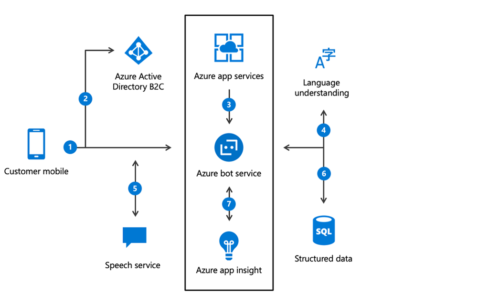
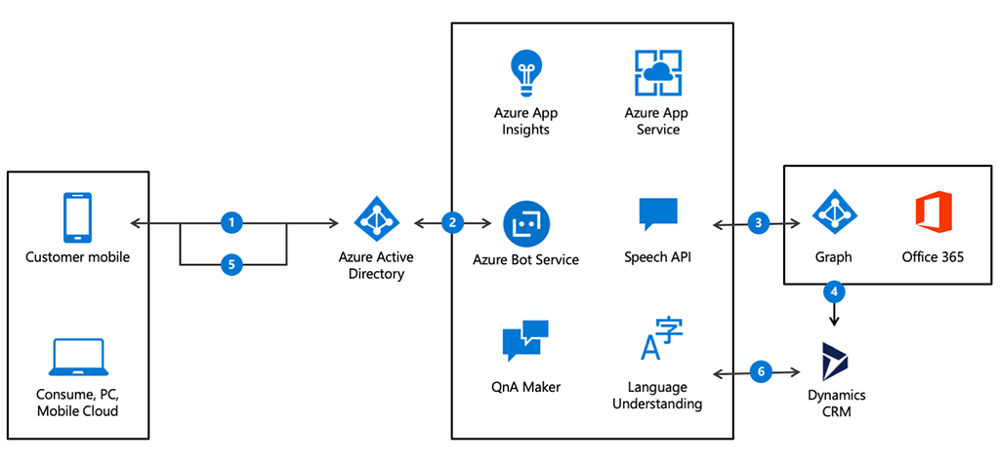

## What are AI apps and agents?

An **AI app** is simply a web or mobile application that is infused with AI capabilities, such as vision or language processing. For example, a financial services app that uses facial recognition as part of its mobile login process is a mobile application infused with AI capabilities. An **AI agent** is a machine program that uses AI capabilities to interact with a human user. For example, a chat bot used by a company to manage live, web-based customer service requests is an example of an AI agent. Microsoft delivers intelligent AI app services with Azure Cognitive Services and develops AI agents with Azure Bot Services. Our AI models that power these intelligent apps and agents can be customized to your business using your own data and can be deployed anywhere.

Microsoft delivers breakthrough experiences in your apps with Azure Cognitive Services and Azure Bot Service. Leading AI models are being used across industries, and across a variety of different products today, such as Microsoft 365, Xbox, and Bing.

|  |  |
| ------------ | -------------| 
||Watch this video to see the impact of AI apps and agents on businesses today.|

>[!VIDEO https://www.microsoft.com/videoplayer/embed/RWqOXG]

Now let’s take a closer look at the services in intelligent apps and agents. Some of these services are built in to existing AI models, but you can also use your data to automatically build and train algorithms that fit your needs.

## Azure Cognitive Services

Cognitive services are a collection of domain-specific pre-trained AI models that can be customized with your data. They are categorized broadly into vision, speech, language, and search. For more information about each service, see the links in the resources section.

| | |
|:---------:|---------|
|**Vision**     |Vision makes it possible for apps and services to accurately identify and analyze content within images and videos.           |
|**Speech**      | Speech services can convert spoken language into text, or produce natural-sounding speech from text using standard (or customizable) voice fonts.        |
|**Language**      | Language services can understand the meaning of unstructured text or recognize the speaker’s intent.         |
|**Knowledge**      | Knowledge services create rich knowledge resources that integrate into apps and services.          |
|**Search**       | Enable apps and services to harness the power of a web-scale, ad-free search engine. Use search services to find information across billions of web pages, images, videos, and news search results.         |

## Azure bot service

A bot, or AI agent, is a computer program designed to mimic the actions of a person. It is a  piece of software that can execute commands, reply to messages, or perform routine tasks such as online searches, either automatically or with minimal human intervention, and often used in combination.

**Azure Bot Service**, which enables AI agents, is a powerful framework for accelerating bot development using an integrated environment and pre-built templates. It provides tools to build, test, deploy, and manage intelligent bots all in one place. Through the modular and extensible framework provided by the Software Development Kit (SDK), developers can leverage templates to create bots that provide speech, language understanding, question and answer, and more.

You can combine Azure Cognitive Services capabilities with our Azure Bot Service and engage your audience easily across multiple channels.

Let’s explore some key scenarios involving Azure Bot Service – commerce agents, information bots, and productivity bots. With each scenario, review the diagram to see how the underlying components and services work together to enable AI capabilities.

## Explore Azure apps & agents scenarios

### Commerce agent

Together, the Azure Bot Service and Language Understanding services enable developers to create conversational interfaces for various scenarios in banking, travel, entertainment, and other industries. For example, a hotel’s concierge can use a bot to enhance traditional e-mail and phone interactions by validating a customer via Azure Active Directory and then using Azure Cognitive Services to better contextually process customer requests using text and voice. The Speech recognition service can be added to support voice commands.

Flow through the above:

1. A customer logs into your mobile app.
2. Azure Active Directory B2C authenticates the user.
3. Using the custom Application Bot, the user requests information about a reservation.
4. Cognitive Services helps process the natural language request.
5. The response is reviewed by the customer, who can refine the question using natural conversation. Suppose the customer wants to update the check-out time. They can go ahead and request the change.
6. Once the user is happy with the results, the Application Bot updates the customer’s reservation.
7. Application insights gathers runtime telemetry to help development with Bot performance and usage.

### Information bot

This bot can answer questions defined in a knowledge set or frequently asked questions (FAQ) using Azure Cognitive Services QnA Maker and answer more open-ended questions using Azure Search.

Flow through the above:

1. The Application Bot starts.
2. Azure Active Directory validates the user’s identity.
3. The bot verifies what type of queries are supported. 
4. Cognitive Services returns a FAQ built with the QnA Maker. 
5. A valid query is defined. 
6. The bot submits the query to Azure Search which returns information about the application data. 
7. Application insights gathers runtime telemetry to help development with Bot performance and usage.

### Enterprise productivity bot

You can combine Azure Bot Service with Language Understanding to build powerful enterprise productivity bots. These allow you to streamline common work activities by integrating external systems, such as Microsoft 365 calendar, customer cases stored in Dynamics CRM, and much more.

Flow through the above:

1. A user accesses the Enterprise Productivity Bot.
2. Azure Active Directory validates the user’s identity.
3. The bot queries the employee’s Microsoft 365 calendar via the Azure Graph.
4. Using data from the calendar, the bot accesses case information in Dynamics CRM.
5. Information is returned to the employee who can filter the data without leaving the Bot.
6. Application insights gathers runtime telemetry to help developers improve bot performance and usage.

> [!TIP]
> You can find more details on Azure products and services for knowledge mining, machine learning, and AI apps and agents by using the products tab on azure.com in the “Summary and resources” unit at the end of the module.

|  |  |
| ------------ | -------------|
||*Familiarize yourself with the elements that enable these capabilities. Although each capability is different, the architectures share common elements. Suppose you want an application to begin fielding commonly asked questions. What tools, APIs, and services could you integrate? For a challenge, write these out and create your own diagram.*
|

### AI in action

|  |  |
| ------------ | -------------| 
||Watch this video to see what Azure Cognitive Services and Azure Bot Service can do together.|

>[!VIDEO https://www.microsoft.com/videoplayer/embed/RWrRTR]

You just saw how Telefonica was able to modernize their business and use AI to transform how they interact with their customers.