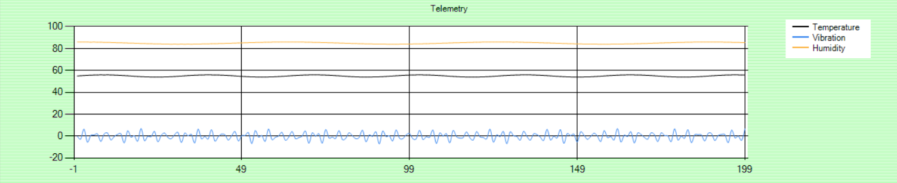

### What is IoT?

The Internet of Things (IoT) is a network of Internet connected devices that communicate sensor data to the cloud for centralized processing. These sensors are typically embedded in monitoring devices. These devices, known as _IoT devices_, have some processing power to control communications. The stream of data they generate is known as _telemetry_. The most used telemetry values are acceleration, humidity, location, pressure, temperature, and velocity. There are many other values that might be useful.

At the other end, in the cloud, a resource known as an _IoT hub_ collects the data, and processes it. The hub might also communicate back to the devices, perhaps changing settings or parameters.

### Why is IoT useful?

IoT enables a single human operator, through a cloud portal, to monitor and control a vast array of remote devices. IoT enables businesses to evolve their operations. Once data is collected, it becomes possible to analyze the data to gain meaningful, actionable insights. These insights might help increase efficiency, reduce waste, or lower costs. Alternatively, these insights might make smart spaces more secure. From manufacturing, to transportation, to retail, Azure IoT can start fueling new business operations with IoT solutions designed for that industry's needs.

## Learning objectives

In this module, you will:

- Learn about the Microsoft vision for Azure IoT
- Understand what Azure IoT is, how it works, and how it's built
- Identify ways you can use Azure IoT
- Learn how Azure IoT enables digital transformation to address business challenges

### IoT solutions

With IoT solutions, everyday things can be IoT-enabled: office buildings, conveyor belts, food processing plants, delivery vehicles, elevators, production lines, retail shelves, retail checkouts, vending machines, drilling equipment, and so on. The technological enhancements that IoT offers enable organizations to increase operational efficiency, deliver better customer experiences, increase levels of security, enhance workplace safety, and reduce costs.

IoT can be envisioned as a set of technologies connected across three main areas:

- **Things:** Physical "things," with embedded sensors, that are connected to the Internet. These things send telemetry data.
- **Insights:** The results from processing and analyzing the data. IoT real-time analysis, machine learning, and other backend processes, produce these insights.
- **Actions:** The automated, or manual, response to the insights. Actions include the automated changing of device settings, a manual intervention to repair a piece of equipment, or an update to a computer system that is not working optimally.

|  |  |
| ------------ | -------------|
||*Let's review one example of an IoT-enabled object. An engine sensor(a thing) collects pressure and temperature data that is used to evaluate whether the engine is performing as expected (the insights). This data is used to prioritize the engine maintenance schedule (the actions).  Now think about the things that you use every day at work. Pick one, and list out some insights that data from this item might expose. What actions would these insights enable? How might these actions simplify your work?*
|

Now that you know more about IoT in everyday business, let's apply it to Microsoft Azure IoT.
