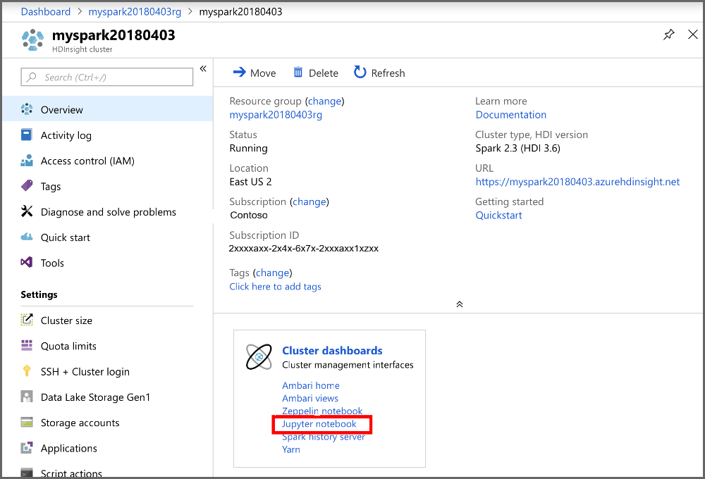
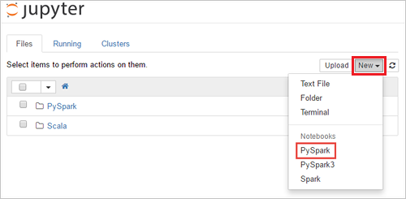

Once the HDInsight Spark cluster is created, you can run interactive Spark SQL queries or jobs against an Apache Spark cluster in Azure HDInsight. In order to do this, you must first create a notebook. A notebook is an interactive editor that enables Data Engineers and Data Scientists to use a range of languages to interact with data. This can include Python, SQL, Scala, and other languages. HDInsight supports Jupyter, Zeppelin, and Livy to interact with data. The level of interaction depends on the workload that you are managing. 

Apache Spark on HDInsight supports the following workloads:

## Interactive data analysis and BI

You can use a notebook to ingest unstructured/semi structured data, and then define a schema within the notebook. You can then use the schema to create a model in tools such as Power BI that will enable business users to perform data analysis on the data in the notebook

## Spark Machine Learning

You can use a notebook to work with MLlib, (a Machine learning library built on top of Spark) to create machine learning applications

## Spark streaming and real-time data analysis

Spark clusters in HDInsight offer a rich support for building real-time analytics solutions. While Spark already has connectors to ingest data from many sources like Kafka, Flume, Twitter, ZeroMQ, or TCP sockets, Spark in HDInsight adds first-class support for ingesting data from Azure Event Hubs.

### Create a Jupyter notebook

Use the following steps to create a Jupyter notebook in the Azure portal.

1. From the portal, in the **Cluster dashboards** section, select **Jupyter Notebook**. If prompted, enter the **cluster login credentials** for the cluster.

    

2. Select **New > PySpark** to create a notebook.

    

3. A new notebook is created and opened with the name Untitled (Untitled.pynb) that enables you to start creating jobs are executing queries
