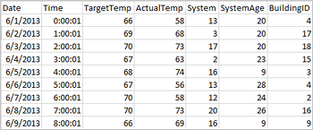
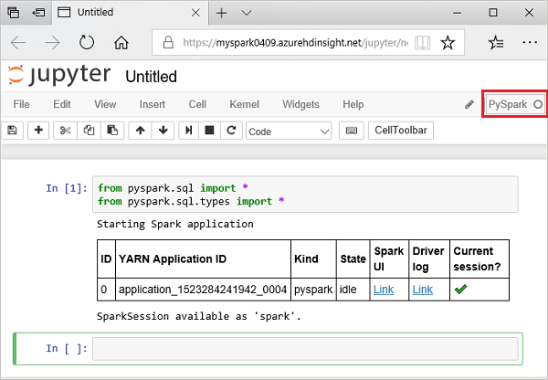
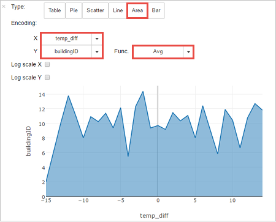

In this exercise, you learn how to create a dataframe from a csv file, and how to run interactive Spark SQL queries against an Apache Spark cluster in Azure HDInsight. In Spark, a dataframe is a distributed collection of data organized into named columns. The dataframe is conceptually equivalent to a table in a relational database or a data frame in R/Python. 

In this tutorial, you learn how to:

- Create a dataframe from a csv file
- Run queries on the dataframe

## Create a dataframe from a csv file

The following sample csv file contains temperature information of a building and it is stored on the file system of the Spark Cluster.



1. Paste the following code in an empty cell of the Jupyter notebook, and then press SHIFT + ENTER to run the code. The code imports the types required for this scenario

    ```python
    from pyspark.sql import *
    
    from pyspark.sql. types import *
    ```

2. When running an interactive query in Jupyter, the web browser window or tab caption shows a **(Busy) status** along with the notebook title. You also see a solid circle next to the **PySpark text** in the top-right corner. After the job is completed, it changes to a hollow circle.

    

3. Run the following code to create a dataframe and a temporary table (hvac) by running the following code.

    ```python
    # Create a dataframe and table from sample data
    
    csvFile = spark.read.csv ('/HdiSamples/HdiSamples/SensorSampleData/hvac/HVAC.csv', header=True, inferSchema=True)
    
    csvFile.write. saveAsTable("hvac")
    ```

## Run queries on the dataframe

Once the table is created, you can run an interactive query on the data. 

1. Run the following code in an empty cell of the notebook:

    ```python
    %%sql
    
    SELECT buildingID, (targettemp - actualtemp) AS temp_diff, date FROM hvac WHERE date = \"6/1/13\"
    ```

    The following tabular output is displayed.

    

    You can also see the results in other visualizations as well. To see an area graph for the same output, select Area then set other values as shown.

    

2. From the notebook menu bar, navigate to **File > Save and Checkpoint**.
3. Shut down the notebook to release the cluster resources: from the notebook menu bar, navigate to **File > Close and Halt**.