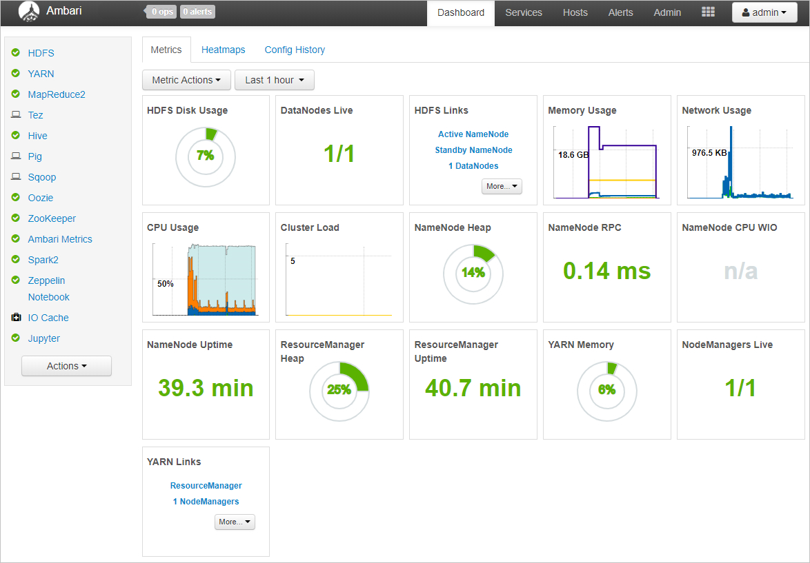
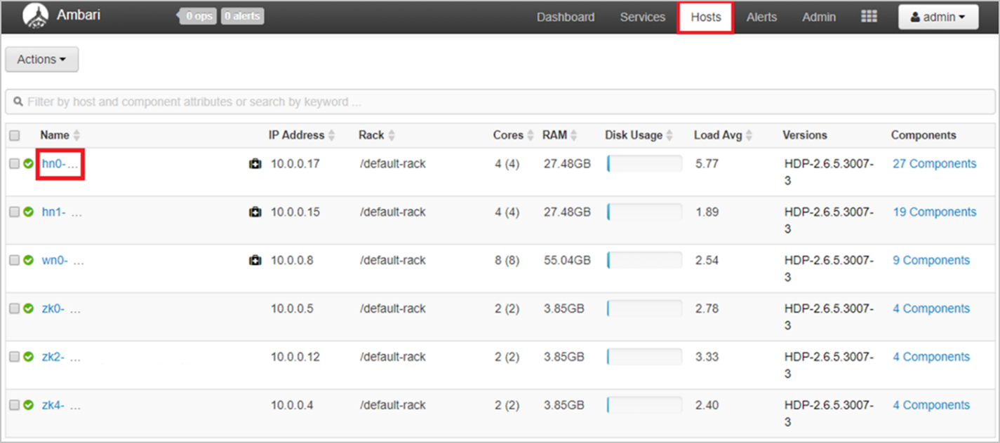
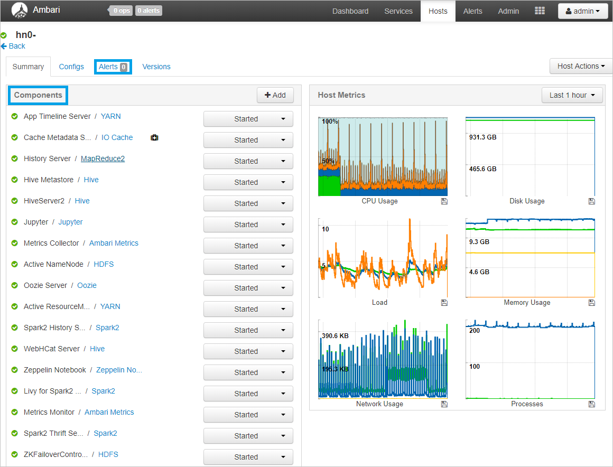

1. The Ambari dashboard can be accessed by clicking the Ambari home link in the Cluster dashboards section of the HDInsight Overview blade in Azure portal.

2. You will then be prompted for a cluster login username and password. Enter the credentials you chose when you created the cluster.

3. You will then be taken to the Ambari dashboard.

4. Click the Hosts tab to view a list of all nodes in your cluster and see basic information about each node. You will see a screen that is like the one below. You can then click on the name of a node to view more detailed host metrics for that node.

5. You will see a screen that is like the one below, that will provide a summary of the components that are running, and a real-time view of the hosts metrics including the CPU, disk and memory usage, current load, processes, and network usage.

