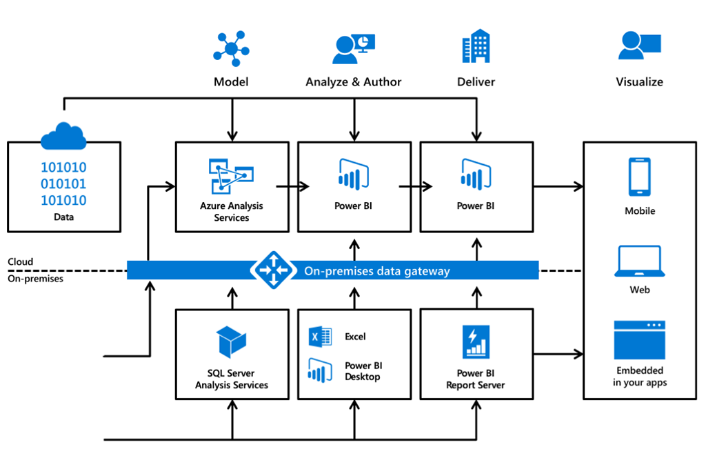

### What is modern business intelligence?

Organizations have enormous amounts of data, and the ultimate goal is getting important insights that can help you drive your business forward. Organizations that are taking steps to evolve how they leverage data, analytics, and the cloud generate an average of $100 million dollars, or eight percentage points, more operating income each year than those who lag behind. It all starts with data.

:::row:::

:::column:::
Watch this short video to learn how Microsoft Power BI helps organizations generate business insights, create a culture of data-driven decision making, and address common challenges.

:::column-end:::
:::row-end:::

 

>[!VIDEO https://www.microsoft.com/videoplayer/embed/RWqGZf]

### How does modern business intelligence work?

Businesses want to empower people with insights at the point of decision. 

:::row:::

:::column:::
Watch this video to learn more about how Microsoft Power BI helps organizations experience their data in a real-time, customized, and intuitive way.

:::column-end:::
:::row-end:::

 

>[!VIDEO https://www.microsoft.com/videoplayer/embed/RWqWCC]

### What does modern business intelligence look like?

To effectively create a Modern BI experience that drives data-driven decision making throughout the workplace, it’s necessary to work with a platform that enables extracting intelligence seamlessly by:  

- **Connecting to the data in seconds**, whether it is structured or unstructured, in the cloud, or on-premises.
- **Modeling** without limits, regardless of the size of the model that is required.
- **Analyzing and authoring** through unique experiences that empower all users to extract value from the data, like asking questions with plain language, using visuals that are customized to the use case, or getting insights in an automated fashion.
- **Delivering** insights to everyone and enabling anyone to share their findings broadly in a targeted and secure way.

The Microsoft BI platform offers the flexibility that organizations need to transition to Modern BI on their terms. In the cloud, we are primarily relying on Power BI to deliver business insights, with data connections to many cloud data sources and SaaS apps. In addition to cloud data sources, organizations can access on-premises data sources such as SQL Server Analysis Services using the on-premises data gateway.

### How is modern business intelligence used?

Modern BI is used across industries. 

:::row:::

:::column:::
Watch the following video on customer momentum.

:::column-end:::
:::row-end:::

 

>[!VIDEO https://www.microsoft.com/videoplayer/embed/RWqWCA]

Now, let's wrap up everything you've learned with a knowledge check.