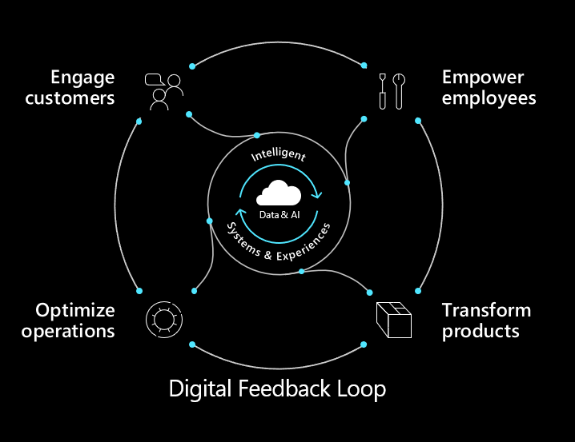

**Digital transformation** is about reimagining how you bring together people, data, and processes to create value for your customers and maintain a competitive advantage in a digital-first world.  

Digital technologies create new opportunities for businesses across the globe by changing the way that goods and services are produced, sold, and consumed. These technologies help your organization adapt in the face of competitive pressures and evolving customer needs. Doing so often involves reimagining the digital platform, culture, and overall approach to transformation with a focus on customer engagement, business processes, and data and intelligence.
Microsoft enables impactful digital transformation across four pillars:

| Pillars | Advantages |
|:--:|---|
| **Empower employees**|Help your employees achieve more by creating a work environment that’s intelligent, flexible, and secure.|
| **Engage customers**|Tailor individual customer experiences by harnessing data and drawing actionable insights.|
| **Optimize operations**|Accelerate the responsiveness of your business, improve service levels, and reduce costs with intelligent processes.|
| **Transform products**|Find and capture the best new opportunities by using data as a strategic asset and shifting from hindsight to foresight.|

## Digital feedback loop

Microsoft uses the term digital feedback loop as a framework to describe how digital transformation is enabled. 

The digital feedback loop takes data endpoints or signals from new software-infused sources, and then brings them together to gain insights that drive continuous innovation. The intelligent edge then multiplies the available data points to bring in and enhance the information available to the digital feedback loop. Dynamics 365 uses the digital feedback loop by picking up telemetry data from multiple sources, including external sources. 

Dynamics 365 and Power Platform then analyze the telemetry to create business insights. For example, you can train AI to review data collected from IoT enabled equipment and develop preventative maintenance schedules and improved manufacturing processes. You can then further apply the insights to help better qualify sales leads and identify marketing prospects.

Microsoft has identified the digital feedback loop as a key to success by studying patterns and disruptions across industries, and by looking at our own business. We use the digital feedback loop as our guide for how we build everything at Microsoft. It’s a concept that we take seriously.

> [!div class="mx-imgBorder"]
> 

Organizations transform by developing new capabilities across these four pillars. By partnering with Microsoft, you can harness the world of ubiquitous data and computing to build innovative solutions to today’s business challenges.

> [!TIP]
> Think about your industry and how technology has transformed it. 
> - What new trends currently are emerging? 
> - What challenges or opportunities do current trends present? 

Let’s dive deeper with Judson Althoff, Microsoft Executive VP, Worldwide Commercial Business, and look at how Microsoft 365, Dynamics 365, Microsoft Azure, and Microsoft’s commitment to continued innovation are delivering the most complete, most secure cloud productivity service to business customers, supporting companies on their digital transformation journey.

 

---
:::row:::

:::column:::
Watch this video from Judson Althoff and begin to envision what it means to be digital and see the possibilities unlocked by Microsoft solutions.

:::column-end:::

> [!VIDEO https://www.microsoft.com/videoplayer/embed/RE4wDFw]

:::row-end:::

The role of Microsoft is to help organizations realize the benefits of their digital transformation.

