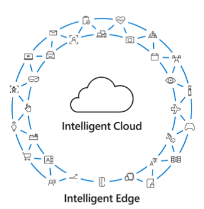

Microsoft enables its customers and partners to build cutting-edge, individualized solutions utilizing the power of the **intelligent cloud** and the **intelligent edge**. These solutions improve how they operate and compete in a rapidly changing world. The intelligent cloud is ubiquitous computing enabled by the cloud and powered with AI. In this way, we refer to Azure as the world’s computer, powering every type of intelligent application and system our customers envision. 

The **intelligent edge** is the continually expanding set of connected systems and devices that gather and analyze information close to the physical world where data resides. These systems and devices deliver real-time insights and create immersive experiences that are highly responsive and contextually aware. With compute power everywhere and devices that are generating more data than ever before, organizations today can create the leading experiences that can transform business.

Partnering with Microsoft enables your organization to unlock new capabilities and analyze and apply business intelligence in ways never before possible.

> [!div class="mx-imgBorder"]
> 

The Microsoft solution areas use the power of the intelligent cloud and intelligent edge to create impactful experiences and digital transformation across the four pillars.

> [!TIP]
> What are some use cases for the intelligent cloud in your organization?

Microsoft solutions, including Microsoft 365, Dynamics 365, and Azure, have the unique ability to support and scale any organization’s digital transformation. 

### Envision your future business   
The first step is to envision your future business. From that vision, develop a prioritized list of capabilities that can help drive digital transformation in your organization.

Microsoft Dynamics 365 and Power Platform can help you start this process with insights into your customers’ experience, and the proven capabilities to provide new business models, products, and services. 

### Define business and operating models 
Driven by customer expectations, businesses have shifted from prioritizing transactional relationships to valuing ongoing quality engagement. This shift means that relationships are fluid and your organization must ensure that customers are satisfied and making the best use of the products and services they consume. 

Customer feedback has greater power to shape the development of new products and services, with organizations collecting customer feedback through observation and signal analysis. A digitally transformed company leverages these insights to proactively provide better products and service without depending on customers to act. If done right, these observations can lead you to quicker innovation and a more impactful value proposition.

### Build a compelling case for change     
A business value assessment helps financially quantify the business value of your organization’s digital transformation. 

Metrics include: 
- Return on investment (ROI).
- Revenue growth.
- Cost savings.
- Employee efficiencies. 

A technology assessment brings stakeholders together to review current technology in light of solution objectives. The output is a customized, technical roadmap.

### Share your vision   
Decision makers who didn’t participate in earlier phases of your digital transformation process may not fully understand what you’re trying to accomplish and why. You need to generate a solution demonstration to share your vision, build excitement, and persuade key decision makers and influencers.

### Execute on your vision 
There is no single, “right” way to approach digital transformation. Some organizations start with a pilot project in a small part of the organization. Others roll out a larger proof of concept and quickly test and iterate for a broader and more immediate business impact. 

Regardless of the size of your project, agility and iteration are key to the desired business impact of your digital transformation strategy.

Now that you’ve seen how Microsoft solutions help change how value is created for organizations, let’s wrap up everything you’ve learned with a knowledge check.