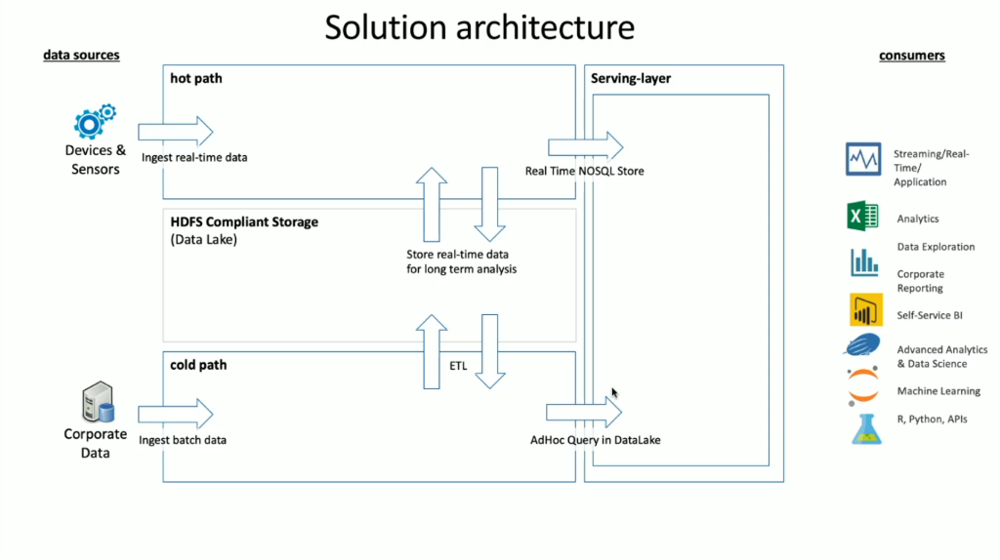

HDInsight has a wide range of OSS technologies embedded within it that can be used to deal with both streaming and batch data scenarios, which are terms that are defined within Lambda architectures. In this architecture model, there is a hot path of data and a cold path of data. The hot path of data is generated in real time by devices, sensors, or applications and data analysis is performed in near real time, this is often referred to as streaming data. A cold data path is when data is moved in batches, typically from other data stores and is often referred to as batch data.

When implementing HDInsight, the storage of data is held within a compliant Hadoop Distributed File System (HDFS). In Azure, Data Lake Gen2 is typically used as a data store as it is HDFS-compliant. Data from the hot path and cold path after processing is stored in a centralized data store called Data Lake. The Data lake in itself can be compartmentalized to hold data in different compartments, which can be defined by the state of data (landing zone, transformation zone etc.), access requirements (hot, warm, and cold) and, business groups. The Serving layer is the final compartment in the data lake that holds data in a format that is ready for consumption by various types of consumers.

Critically, the compute aspect of HDInsight deals with the processing of either streaming or batch data and can vary depending on the cluster type that you select when you provision an HDInsight cluster. HDInsight offers the services in individual cluster options as shown in the following table.

|**Cluster Type**|**Description**|
|-|-|
|Apache Hadoop|A framework that uses HDFS, and a simple MapReduce programming model to process and analyze batch data.|
|Apache Spark|An open-source, parallel-processing framework that supports in-memory processing to boost the performance of big-data analysis applications.|
|HBase|A NoSQL database built on Hadoop that provides random access and strong consistency for large amounts of unstructured and semi-structured data--potentially billions of rows times millions of columns.|
|Apache Interactive Query|In-memory caching for interactive and faster Hive queries.|
|Apache Kafka|An open-source platform that's used for building streaming data pipelines and applications. Kafka also provides message-queue functionality that allows you to publish and subscribe to data streams.|

Therefore, it is important to select the correct cluster type to meet the business case that you are trying to solve. Regardless the cluster type that is selected, additional open-source components are also added inside the cluster to provide additional capabilities including:  

## Hadoop management  

**HCatalog** - A table and storage management layer for Hadoop  

**Apache Ambari** - Facilitates management and monitoring of an Apache Hadoop cluster  

**Apache Oozie** - A workflow scheduler system to manage Apache Hadoop jobs

**Apache Hadoop YARN** – Manages resource management and job scheduling/monitoring  

**Apache ZooKeeper** - A centralized service for maintaining configuration information, naming, providing distributed synchronization, and providing group services.  

## Data processing  

**Apache Hadoop MapReduce** - A framework for easily writing applications, which process vast amounts of data  

**Apache Tez** - An application framework for processing data  

**Apache Hive** - Facilitates managing large datasets residing in distributed storage using SQL

## Data analysis  

**Apache Pig** – Provides an abstraction layer over MapReduce to analyze large datasets  

**Apache Phoenix** - Enables OLTP and operational analytics in Hadoop  

**Apache Mahout** – An Algebra framework to create your own algorithms  

> [!NOTE]
> At the time of writing, Azure Data Lake Gen1, and Azure Blob Storage are supported data storage layers for HDInsight. You should look migrate this data to Azure Data Lake Gen2 as it is the recommended storage platform for Spark and Hadoop, as well as being the default choice for HBase.  
