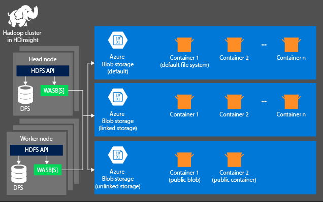
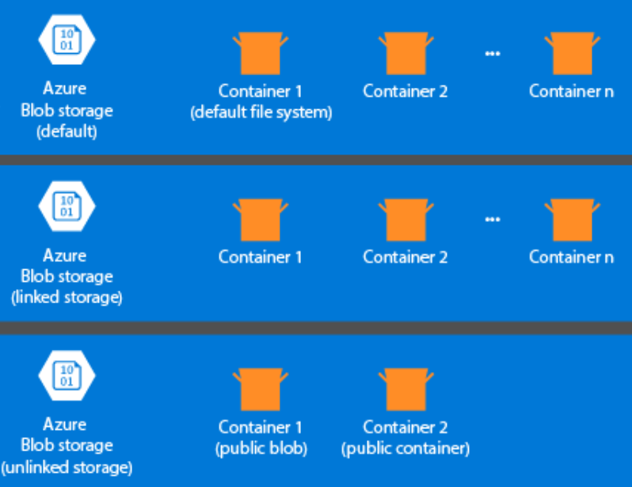
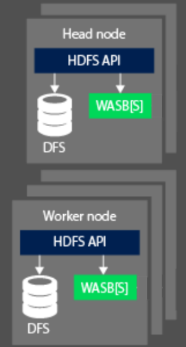

HDInsight is a cloud distributed data processing system that is highly available and secure by default. At the heart of this system is Apache Hadoop. Apache Hadoop includes two core components: The Apache Hadoop Distributed File System (HDFS) that is used for storage, and the Apache Hadoop Yet Another Resource Negotiator (YARN) that provides the processing.  In addition is a simple MapReduce programming model that enables you to process and analyze data. The benefits of using MapReduce are that it is easy to set up, and you can control your costs through the autoscaling feature.

## Storage

The storage aspect is not created automatically when you provision an HDInsight cluster. Instead, it is provided by an HDFS-compliant system such as Azure Storage or Azure Data Lake.  Decoupling the storage from the processing layer enables you to safely delete an HDInsight clusters that are used for computation without losing user data. When you are adding an HDInsight cluster, you must define a default file system. You can link and unlink file systems as needed to increase the size of the storage.

The following information is specific to HDInsight 3.6 and above. During the HDInsight cluster creation process, you can select either Azure Storage or Azure Data Lake Storage Gen2 as the default files system with a few exceptions. Providing a default file system ensures that relative file references can be resolved when searching for files. For Azure Storage, you should specify a blob container as the default file system.

Most setups use Azure Data Lake Storage Gen2. This type of setup uses core features of a file system that are compatible with Hadoop, Azure Active Directory (Azure AD) integration, and POSIX-based access control lists (ACLs). You can use Azure Blob Storage for backward compatibility, but it is highly recommended to make use of Azure Data Lake Storage Gen2 wherever possible. 

## Processing

When processing data, the compute aspect of a Hadoop cluster on HDInsight are broken down into two logical areas. Head (Master) nodes and Worker Nodes. The Head (Master) node is responsible for accepting and managing client requests and then passing the request down to the worker nodes to perform the processing of the data. There are typically two master nodes. An active master node that will manage the client connections. A second passive master node that provides resilience in the event the primary should become offline.

The worker node is responsible for processing the data that has been assigned to it by the Master node. The data managed is dependent on how the MapReduce programming model has defined how to work with the data, and how the Master node allocates the work. Both the Head and Worker node can connect either directly to a locally attached Distributed File System (DFS), or access data that is stored in Azure Blob or Azure Data Lake. 

From an OSS perspective, the resource management capabilities of an HDInsight cluster are performed by YARN. This service manages the resources and job scheduling that is undertaken when you are processing data. It sits between the HDFS and the computation system of the HDInsight cluster. The service works with other OSS technologies to ensure that the resources to process the HDInsight job are available. YARN works with the head node to distribute the job across the worker nodes of the cluster to ensure that the data processing jobs are parallelized.  

HDFS, YARN, and MapReduce are the three core services required for Hadoop on HDInsight. It is typical to use additional OSS technologies to make it easier to create a solution. For example, you may use Hive as an abstraction layer. One that sits on top of MapReduce so that you can write SQL type language constructs to perform ad hoc data processing and analytics. Or you can use Apache Ambari to perform monitoring on the HDInsight cluster.

