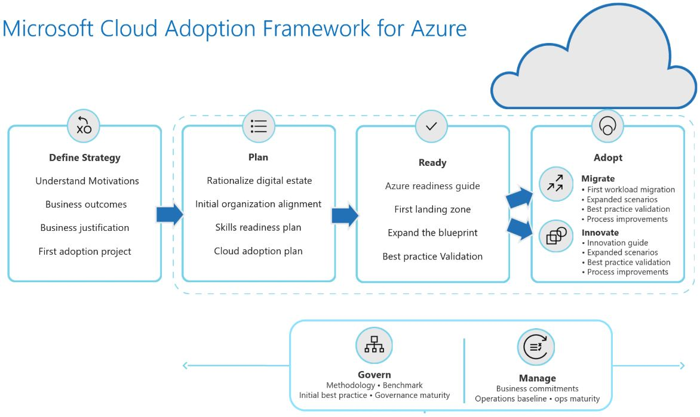

## What is the Microsoft Cloud Adoption Framework for Azure?

The Cloud Adoption Framework is a collection of documentation, technical guidance, best practices, and tools that aid in aligning business, organizational readiness, and technology strategies. This alignment enables a clear and actionable journey to the cloud that rapidly delivers on the desired business outcomes.

The cloud fundamentally changes how organizations procure and use technology resources, allowing them to provision and consume resources only when needed. While the cloud offers tremendous flexibility in design choices, organizations need a proven and consistent methodology for adopting cloud technologies. The Microsoft Cloud Adoption Framework for Azure meets that need, helping guide decisions throughout cloud adoption to accelerate a specific business objective.

## How is it structured?

The Cloud Adoption Framework helps customers undertake a simplified cloud journey in three main stages (Plan, Ready, and Adopt) preceded by a business strategy phase, and surrounded by an operations phase expanding through the cloud adoption journey.

This framework contains detailed information covering an end-to-end cloud adoption journey. It begins with setting the business strategy, which should align to actionable technology projects that deliver on the desired business outcomes. It then describes how the organization must prepare its people with technical readiness, adjust processes to drive business and technology changes, and enable business outcomes through implementation of the defined technology plan. Finally, it covers cloud operations, such as governance, resources, and people and change management.

| | |
| ---| --- |
| | *The cloud offers nearly unlimited potential, but successful adoption requires careful planning and strategy. And the adoption strategy will depend on where you are in your cloud journey. When you think about your use of the cloud, what is your motivation?*|
|

 Let’s explore some of the common business motivations that may trigger an organization to move to the cloud.     
