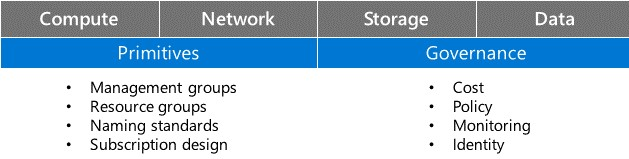
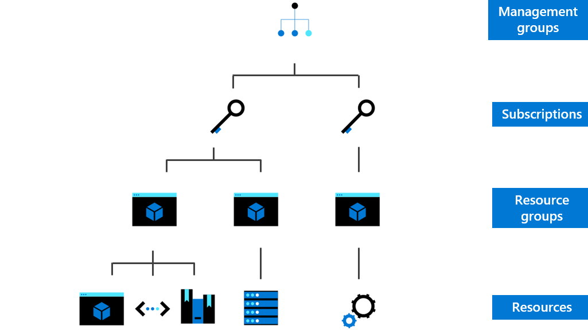

We just looked at how a business plan aligned to a digital estate rationalization can ensure you know why you’ll benefit from moving to the cloud. Cloud adoption is a strategic change that requires involvement from both business decision makers and end users. Now, let’s talk about getting your organization ready for this journey:

- **Define skills and support readiness** - Create and implement skills readiness plan to address current gaps, ensure people are ready (IT and business) for the change and new technologies, and define support needs.

- **Create your landing zone** - Set up a migration target in the cloud, to handle prioritized applications.

## Define skills and Support readiness

Ensuring your organization's business leaders are well prepared and educated on cloud concepts, terminology, and business value is critical to a successful cloud adoption journey.  Also, driving a solid foundation among business leaders and teams within the organization will create a healthy, connected organization, avoiding silos and obstacles, setting up the organization for success in their cloud adoption journey.

IT staff members might feel anxious about their roles and positions as they realize that a different set of skills is needed to support cloud solutions. But agile employees who explore and learn new cloud technologies can lead the adoption of cloud services and help an organization understand and embrace the associated changes. Most roles in the existing business might well shift to new roles and use new skills after cloud adoption.

Microsoft and partners offer a variety of options to help all audiences develop these strategic skills with Microsoft Azure services. Training resources are available on Microsoft Learn to make this transition even easier across the entire organization, including specific learning resources for business users, solution architects, cloud administrators, and developers.

Before anything gets tested, deployed, or potentially broken, explore Azure Support options and choose the plan that best fits your needs, whether you're a developer just starting your cloud journey or a large organization deploying business-critical, strategic applications.

> [!TIP]
> Links to sample skills readiness learning paths on Microsoft Learn and Azure Support are available in the “Summary and resources” unit at the end of this module.

## Create your landing zone

Before you begin to build and deploy solutions with Azure services, you need to make sure your environment is ready. The term landing zone is used to describe an environment that has been provisioned and prepared to host workloads in a cloud environment, such as Azure. A fully functioning landing zone is the final deliverable of any iteration of the Cloud Adoption Framework methodology.

There are major considerations when implementing any landing zone. These considerations, also commonly referred to as Azure Foundations, can be broken into three categories or types of considerations: hosting, Azure primitives, and governance.

### Hosting considerations

All landing zones provide structure to hosting options. There are four decision areas to be considered when hosting your landing zone:

- **Compute decisions** - Align compute options with the purpose of the landing zone to minimize operational complexity.

- **Networking decisions** - Choose the networking services, tools, and architectures that will support your organization's workload, governance, and connectivity requirements.

- **Azure Storage guidance** - Select the right Azure storage solution to support your usage scenarios.

- **Correct SQL Server option in Azure** - Choose the PaaS or IaaS solution that best supports your SQL Server workloads.

### Azure primitives

Each landing zone is part of a broader solution for organizing resources across a cloud environment. Azure primitives are the foundational building blocks for the organization.

- **Azure fundamental concepts** - Learn fundamental concepts and terms used to organize resources in Azure. Also learn how these concepts relate to one another.

- **Resource organization decision guide** - Azure offers many services that help you organize resources, control costs, and secure and manage your organization’s Azure subscription.

  - Organize resources: set up a management hierarchy to consistently apply access control, policy, and compliance to groups of resources and use tagging to track related resources. The organizing structure for resources in Azure has four levels:

  

  - Management groups: these are containers that help you manage access, policy, and compliance for multiple subscriptions.

  - Subscriptions: a subscription groups together user accounts and the resources that have been created by those user accounts.

  - Resource groups: a resource group is a logical container into which Azure resources like web apps, databases, and storage accounts are deployed and managed.

  - Resources: resources are instances of services that you create, like virtual machines, storage, or SQL databases.

- **Manage costs and billing** - Identify your subscription type, understand how billing works, and how you can control costs. Cost control is critical to maximize the value of your cloud investment.

  - *Azure Cost Management*: provides a few ways to help you predict, analyze, and manage costs. You can view aggregated cost for your account or view accumulated costs over time.

  - *Billing and subscription support*: create support requests to help you understand your usage, billing, and subscription details directly from the Azure portal.

- **Plan for governance, security, and compliance** - Enforce and automate policies and security settings that help you follow applicable legal requirements.

  - *Azure Policy*: is a service that you use to create, assign, and manage policies.

  - *Azure Security Center*: provides a unified view of security across your applications and generates recommendations to fix issues before they can be exploited.

- **Stay current with Azure** - Track product updates so you can take a proactive approach to change management.

> [!TIP]
> For an interactive experience, view this environment readiness content in the Azure portal. Go to the Azure Quickstart Center in the Azure portal and select Introduction to Azure Setup, then follow the step-by-step instructions. 

Now that you know how to prepare your environment, you need to define the order or prioritization of all applications you would like to deploy in the cloud.

Implementing the first application is key to learning and testing with confidence, as your cloud adoption journey starts. Leverage two-pronged criteria to select it:

- Business criteria - Identify an application currently in operation where the owner has a strong motivation to move to the cloud.

- Technical criteria - Select an application that has minimum dependencies and can be moved as a small group of assets. The first application is often deployed in an experimental environment with no operational or governance capacity. It's important to select an application that does not interact with secure data.

Plan subsequent releases as additional applications are deployed to the cloud, creating first prioritized migration application and first prioritized release backlog.

You’ve just learned how critical readying your people, your business processes, and your environment are to a successful cloud adoption journey. Next, you'll learn about implementing your cloud adoption plan, either due to a migration or innovation path.

:::row:::

:::column:::

Here are the key points from this module:

- Cloud adoption is a strategic change that requires involvement from both business decision makers and end users, so when getting your organization ready for the cloud adoption journey, it is important to define skills and support readiness, and create your landing zone.

- When defining skills and support readiness, create and implement a skills readiness plan to address current gaps, ensure people are ready for the change, and define support needs.

- Creating your landing zone is setting up a migration target in the cloud to handle prioritized applications. When implementing any landing zones, refer to the Azure Foundations considerations categories of hosting, primitives, and governance.

:::column-end:::
:::row-end:::
