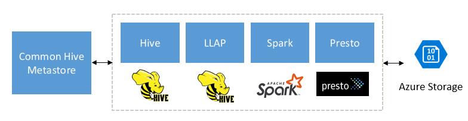

As a business analyst, you need to determine the most appropriate kind of HDInsight cluster to create in order to build your solution. Interactive Query clusters provide a number of features and interoperability options that make it uniquely beneficial to business analysts familiar with SQL. It's great for users who want to work with business intelligence tools and require fast interactive queries. There are other benefits, such as support for a range of file formats, concurrency, and Atomic, Consistent, Isolated, and Durable (ACID) transactions. Not to mention integration with Apache Ranger for granular row and column level control over the data.

> [!NOTE]
> The content of this module pertains to Interactive Query clusters created for HDInsight 4.0, which uses Hive 3.1 and LLAP, also known as Hive LLAP.

## You have a large data set that’s ready to be queried
Interactive Query clusters are best suited for large data sets that can be queried as-is, or with minimal transformations. Situations where you’ll be performing a variety of queries on the data and you need immediate responses. Interactive Query clusters are not optimized for performing long-running batch computations. Interactive query supports the following file formats: ORC, Parquet, CSV, Avro, JSON, text, and tsv.

## You require SQL-like functionality
When you need to perform interactive and ad hoc sub second latency queries on the big data you have in Azure storage and Azure Data Lake Storage, and you prefer a SQL-like experience, Azure HDInsight Interactive Query clusters are an excellent choice. As a business analyst, you’re highly familiar with SQL tables and creating queries using SQL. Apache Hadoop is a powerful tool for performing big data analytics. Apache Hadoop’s use of the MapReduce framework and its Java APIs can be a blocker for you if your Java programming skills are a little rusty. 
In this case, HDInsight Interactive Query is a better fit as it’s built on top of Apache Hadoop but is simpler for anyone with SQL experience to use. Interactive Query uses SQL-like Hive tables to process data and a SQL-like query language called HiveQL to query data. Using Hive is less complex than processing data using MapReduce in Apache Hadoop. Hive makes it faster and more efficient to roll out solutions to your company.

##  Fast interactive queries with intelligent caching
Interactive Query clusters use intelligent caching techniques to tier the data across Dynamic RAM, local cluster node SSD, and remote storage systems such as Azure Blob and Azure Data Lake Storage to achieve interactive and fast query results over the big data. One good example of advanced caching technique is dynamic text cache, which converts CSV data into an optimized in-memory format on-the-fly, so caching is dynamic, and the queries determine what data is cached. This functionality means you don’t have to load and transform your data first. You can upload the data to Azure storage in its original format and start querying it.  And it also means that queries are more performant the second time they run. 
The first time a query is executed, the data is read from the business data storage layer in Azure Storage or Azure Data Lake Gen2. Then the data is cached to the shared in-memory cache in the cluster. The next time the query is run, the data is simply retrieved from the shared in-memory cache and you save time by not retrieving data from the remote storage layer.

## Run queries using popular tools
Interactive query makes it easy to work with the big data using BI tools you’re familiar with, such as Microsoft Power BI and Tableau. In big data analytics, organizations are increasingly concerned that their end users aren’t getting enough value out of the analytics systems because it is often too challenging and requires using unfamiliar and difficult-to-learn tools to run the analytics. HDInsight Interactive Query addresses this issue by requiring minimal to no new user training to get insight from the data. 
Users can write SQL-like HiveQL queries in the tools they already use. These tools include Visual Studio Code, Power BI, Apache Zeppelin, Visual Studio, Ambari Hive View, Beeline, Data Analytics Studio, and Hive ODBC. You cannot perform queries on your Interactive Query cluster using the Hive console, Templeton, the Azure Classic CLI, or Azure PowerShell.

## You require transaction consistency and concurrency
With the introduction of fine-grained resource management, pre-emption and sharing cached data across queries and users, Interactive Query supports concurrent users with ease. HDInsight supports creating multiple clusters on shared Azure storage. Hive metastore helps in achieving a high degree of concurrency. You can scale the concurrency by adding more cluster nodes or by adding more clusters pointing to same underlying data and metadata.
Interactive Query also supports database transactions that are Atomic, Consistent, Isolated, and Durable (ACID). ACID transactions guarantee that a transaction, even if it contains multiple operations, is contained in a single unit. Thus, if any single operation in the transaction fails, the entire operation can be rolled back, which keeps the data consistent and accurate.

## Built to complement Spark, Hive, Presto, and other big data engines
HDInsight Interactive query is designed to work well with popular big data engines such as Apache Spark, Hive, Presto, and more. This type of query is especially useful because your users may choose any one of these tools to run their analytics. With HDInsight’s shared data and metadata architecture for external tables, users can create multiple clusters with the same or different engine pointing to same underlying data and metadata. This functionality is a powerful concept as you are no longer bounded by one technology for analytics.

