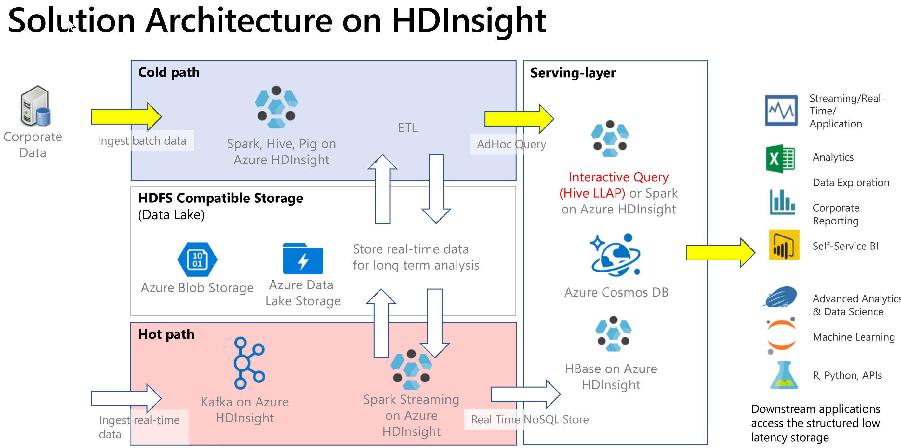
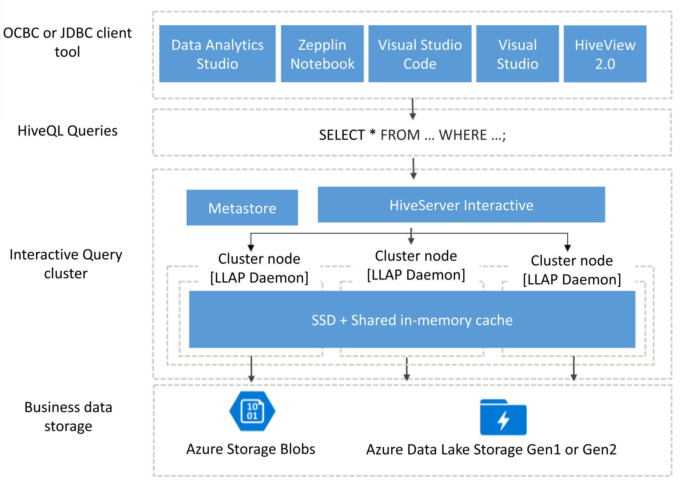

Interactive queries are typically implemented in a cold path scenario, where you have data in tabular format and want to quickly ask questions and get an interactive response using SQL syntax. The following diagram shows the solution architecture for all HDInsight cold path and hot path solutions and calls out how interactive queries are handled via Hive LLAP in the serving-layer. Data can be ingested via Hive, interactive queries are processed via Hive LLAP, and the output put can be served to downstream applications such as Power BI.

## Interactive Query architecture

Now let’s dive into the Interactive Query architecture.

Interactive Query users can choose from a variety of ODBC or JDBC clients to run queries against their business data, such as Data Analytics studio, Zeppelin Notebooks, and Visual Studio Code. After a client submits a HiveQL query, the query arrives at the HiveServer, which is responsible for query planning, optimization, as well as security trimming. Hive works by dividing the analytics tasks across distributed nodes in the cluster. Queries are split into subtasks and sent to nodes that process each of the subtasks, and those subtasks are split even further, and each of those tasks reads data from the underlying business data storage layer. 
The architecture is optimized because of its use of “always on” LLAP daemons, which avoid startup times, as well as the shared in-memory cache, which stores data that’s been retrieved from storage and shares the data across all nodes.

The solid-state drives (SSD) utilized by Interactive Query clusters combine both RAM and SSD into a giant pool of memory that is used by the cache. With this combination of resources, a typical server profile can cache 4x more data, letting you process larger datasets and support more users. The Interactive Query cache is aware of the underlying data changes in remote store (Azure Storage), so if the underlying data changes and user issues a query, updated data will be loaded in the memory without requiring any additional user steps.