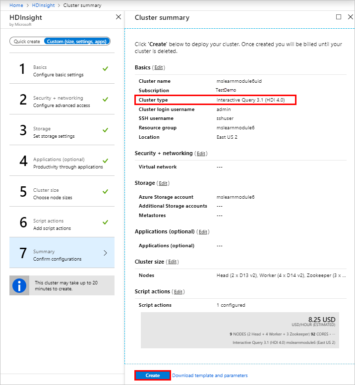

Now that we know about the benefits of Interactive Query, and how it works, it’s time to start deploying resources to build our real estate dashboard.

## Before you create an Interactive Query cluster

Before you can create a cluster, you need an Azure subscription, and an Azure storage account. Azure Storage is a robust general-purpose storage solution that integrates seamlessly with HDInsight. HDInsight can use a blob container in Azure Storage as the default file system for the cluster. 
It's recommended that you use separate storage containers for your default cluster storage and your business data, to isolate the HDInsight logs and temporary files from your own business data.

Interactive Query can also use Azure Data Lake Storage Gen1 or Azure Data Lake Storage Gen2 as discussed in Module 1: How does HDInsight work, however only Azure Storage and Azure Data Lake Storage Gen2 support Hive LLAP. This procedure uses Azure Storage.

## Where to create an Interactive Query cluster
Once you’re sure that an Interactive Query cluster is the best cluster type for your solution, you can create the clusters in a number of places: Azure portal, Azure CLI, Azure PowerShell, cURL, Azure Resource Manager templates, the HDInsight .NET SDK, and you can even use Azure Data Factory to create clusters on demand. This procedure uses the Azure Portal to deploy an Interactive Query cluster.

## Provision a Storage Account in the Azure portal

The first resource to deploy, should you not have one already, is an Azure Storage account. 
1. Sign into the Azure portal using your free subscription.
2. Click **Create a resource > Storage > Storage account**.

    

On the Basics page, fill out the following values:
1. **Subscription**: Ensure your free subscription is selected.
1. **Resource group**: Click Create new, and then name it hdinsightmodule6uid, where uid is a unique identifier for you.
1. **Storage account name**: Enter hdinsightmodule6uid.
1. **Location**: Select the location closest to your users to reduce latency. Note this region as you will create the HDInsight cluster in the same region. 
1. **Performance**: Leave the default of Standard.
1. **Account kind**: Leave the default of StorageV2 (general purpose v2)
1. **Replication**: Change the value to Locally redundant storage (LRS)
1. **Access tier (default)**: Leave the default value of Hot.
1. Click on **Next: Networking**.

    

3. On the **Networking** page, leave the connectivity method of Public endpoint (all networks) and then click **Next: Advanced >**.

    

4. On the Advanced page, fill out the following values:
    - **Security**: Leave the default value of Enabled.
    - **Azure Files**: Leave the default value of Disabled
    - **Data protection**: Leave the default value of Disabled.
    - **Data Lake Storage Gen2**: Leave the default value of Disabled to create a Blob storage account and then click Review + create >.
5. On the Create storage account page, ensure the account kind is set to StorageV2 (general purpose v2), and then click Create.

    

6. When the deployment completes, the following message is displayed:

    

Now that your Storage account has been created, it’s time to deploy the HDInsight Interactive Query clusters. 

## Provision an HDInsight Interactive Query cluster

1. Click **Create a resource > Analytics > Azure HDInsight**.

    

2. On the Basics page, click **Go to classic create experience**.

    

3. On the HDInsight page, click **Custom (size, settings, apps)**.

    

4.	On the Basics page, fill out the following values:

- **Cluster Name**: Enter a unique name for the cluster, such as mslearnmodule6uid. A green tick appears next to the name if the cluster name validated and is available.
- **Subscription**: Ensure your free subscription is selected. 
- **Cluster Type**: Click **Configure required settings**, and then in the Cluster type box, select **Interactive Query**, and in the Version box, select **Interactive Query 3.1.0 (HDI 4.0)**.
- **Cluster login username**: Leave the default value of admin
- **Cluster login password**: Enter a password for cluster login.
- **Secure Shell (SSH) username**: Leave the default value of sshuser.
- **Resource Group**: Select the resource group you created earlier, mslearnmodule6yourid.
- **Location**: Select the same region in which your storage account was created. 

And then click **Next**.

    

5. On the Security + networking page, click **Next**.
6. On the Storage page, fill out the following values:
- **Primary storage type**: Ensure the default value of Azure Storage is selected.
- Select a **Storage account**, click **Configure required settings**.
    - In the Storage accounts page, search for the name of the Storage account you created, mslearnmodule6uid, and select it.
7. Leave all other values as the default, and then click **Next**.

    

8. On the Applications (optional) page, click **Next**. 
9. On the Cluster size page, click **Next**.
10. On the Script actions page, click **Optional**, and then click **Submit new**.
11. In the Submit script action page, fill out the following values:
- **Script type**: Select Custom.
- **Name**: Enter mslearnmodule6
- **Bash script URI**: Enter https://hdiconfigactions.blob.core.windows.net/dasinstaller/LaunchDASInstaller.sh
- **Node type**: Select Head.
And then click **Create**.

    

12. After the validation completes on the Script actions page, click **Select** and then click **Next**.
13. In the Cluster summary page, after the validation completes, ensure the cluster type is set to **Interactive Query 3.1 (HDI 4.0)**, and then click **Create**.

    

14.	Click the Notification icon to watch the progress of the deployment. 

    

When the deployment succeeds, the message changes to Deployment succeeded.

15.	Click Go to resource in the Notifications pane.

    

The Overview page for the HDInsight cluster is displayed, which contains information about your cluster and provides links to helpful tools and reports. You can add this resource to your dashboard by clicking the pin button. 

    