Now that you have provisioned a Storage account and an Interactive Query cluster, it’s time to upload your real estate data and run some queries. 
The data you’ll upload is New York City real estate data. It includes over 28,000 property records including addresses, sales prices, square footage, and geocoded location information for easy mapping. Your real estate investment firm uses this info to determine appropriate square footage prices for new properties coming on the market, based on sales prices of previously sold properties.

To upload and query data, we’ll use Data Analytics Studio, which is a web-based application that was installed in the script action we used when we created the Interactive Query cluster. You can use Data Analytics Studio to upload data to Azure storage, transform the data into Hive tables using the data types and column names you set, and then query data on your cluster using HiveQL. In addition to Data Analytic Studio, you can use any ODBC/JDBC compliant tool to work with your Data using Hive, such as the Spark & Hive Tools for Visual Studio Code.

Next, you’ll use a Zeppelin Notebook to quickly visualize trends in the data. Zeppelin Notebooks enable you to send queries and view the results in a number of different pre-defined charts. The Zeppelin Notebooks installed on Interactive Query clusters have a JDBC interpreter with a Hive driver.

## Download real estate data

1. Go to https://github.com/Azure/hdinsight-mslearn/tree/master/Sample%20data, and download the data set to save the propertysales.csv file to your computer. 

## Upload the data using Data Analytics Studio

1. Now open Data Analytics studio in your internet browser by using the following URL, replacing **servername** with the cluster name you used: https://**servername**.azurehdinsight.net/das/

To login, the **username is admin**, and the **password is the password you created**.

If you run into an error, go to the **Overview tab** of the cluster in the Azure portal, and ensure the status is set to **Running**, and the Cluster type, HDI version is set to **Interactive Query 3.1 (HDI 4.0)**.

2. Data Studio Analytics launches in the internet browser.

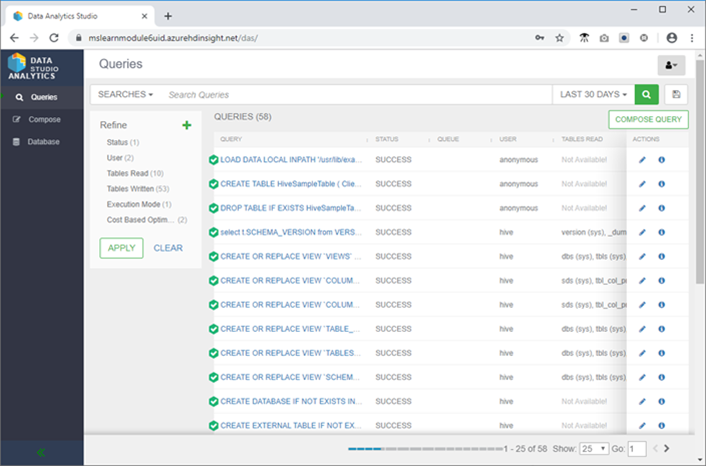

3. Click Database on the left menu, then click the green upright ellipsis button, and then click **Create Database**.

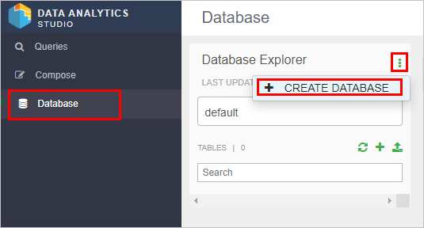

4. Name the database ‘newyorkrealestate’ and then click **Create**.

5. In Database Explorer, click the **database name box**, and then select **newyorkrealestate**.

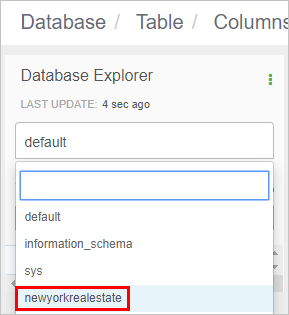

6.	In Database Explorer, click **+** and then click **Create Table**.


7. Name the new table ‘propertysales’ and then click **Upload table**. Table names must only contain lowercase letters and numbers, no special characters.

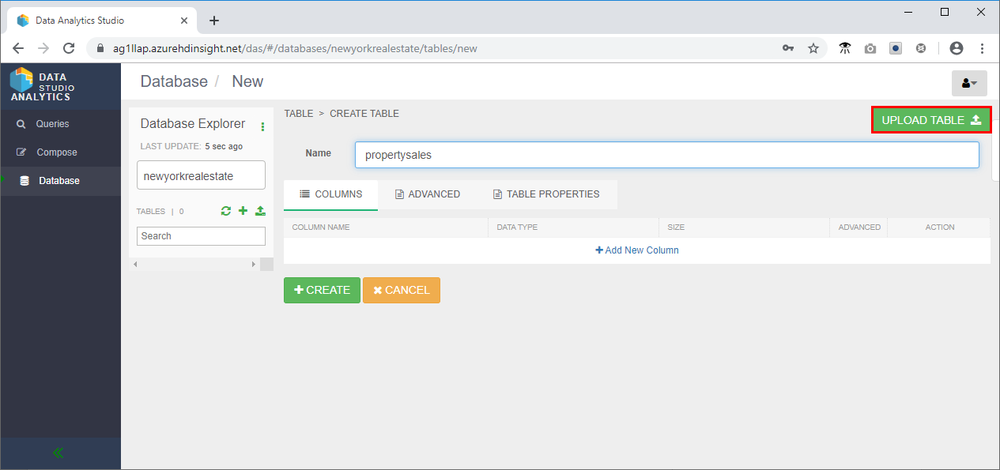

8. In the Select File Format area of the page:
    - Ensure the file format is csv
    - Check the **Is first row header?** box.
9. In the Select File Source area of the page:
    - Select **Upload from Local**.
    - Click **Drag file to upload or click browse** and navigate to the propertysales.csv file.
10. In the Columns section, change the data type of Latitude and Longitude to **String**, and Sale date to a **Date**. 

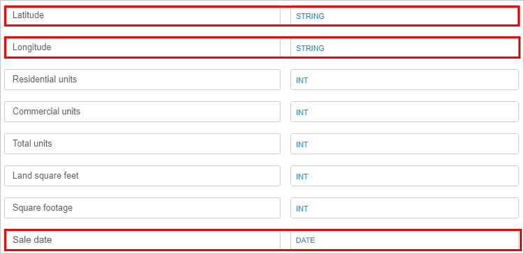

11.	Scroll up and review the **Table Preview** section to validate that the column headings look correct.

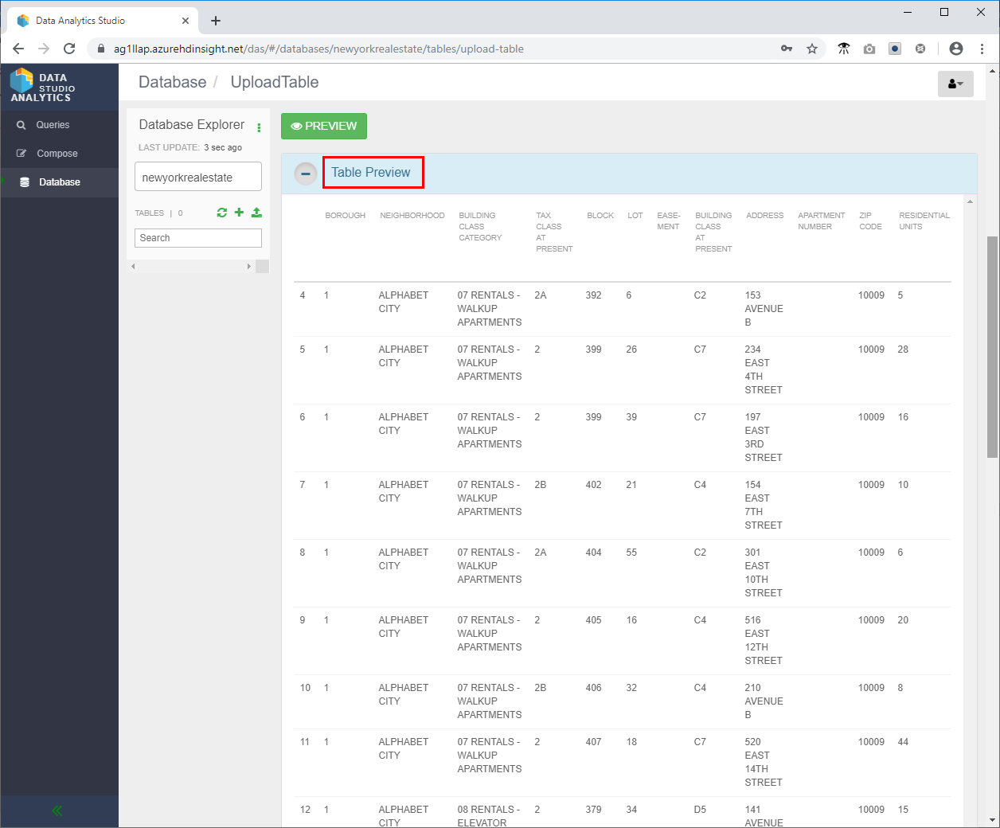

12.	Scroll all the way down and click **Create** to create the Hive table in the newyorkrealestate database.


13.	In the left menu, click **Compose**.


14.	Try the following Hive query to ensure everything is working as expected.

```sql
SELECT `ADDRESS`, `ZIP CODE`, `SALE PRICE`, `SQUARE FOOTAGE`
FROM newyorkrealestate.propertysales;
```

15. The output should look similar to the following.

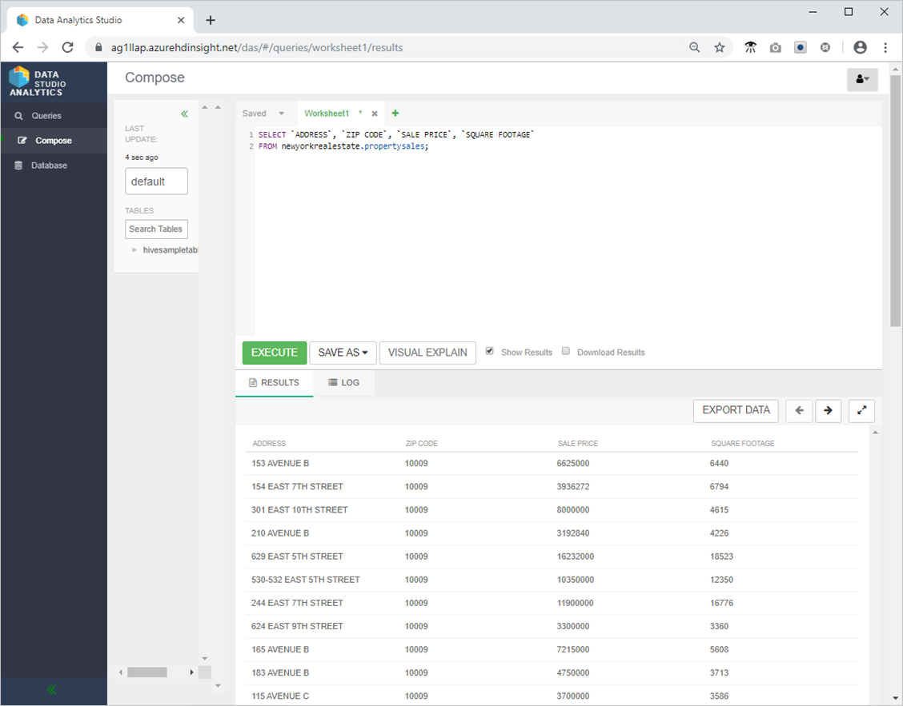

16.	Review the performance of your query by clicking Queries on the left menu, and then selecting the SELECT `ADDRESS`, `ZIP CODE`, `SALE PRICE`, `SQUARE FOOTAGE` FROM newyorkrealestate.propertysales query you just ran. 

If there were any performance recommendations available, the tool would display those recommendations. This page also displays the actual SQL query that was run, provides a visual explanation of the query, shows the configuration details inferred by Hive when running the query, and a gives a timeline that shows how much time was spent executing each part of the query. 

## Explore the Hive Tables using a Zeppelin notebook

1. In the Azure portal, on the **Overview page**, in the **Cluster dashboard** box, click **Zeppelin Notebook**.

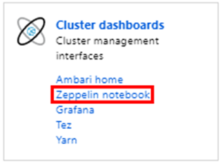

2. Click **New Note**, name the note Real Estate Data, and then click **Create**.

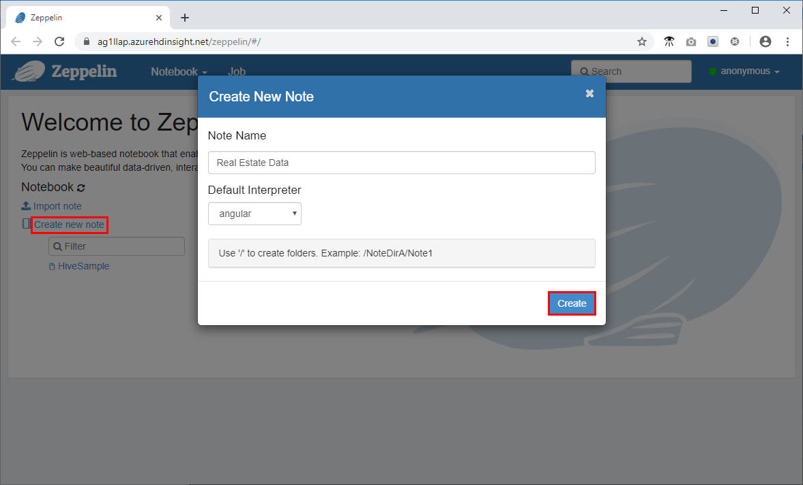

3. Paste the following code snippet into the command prompt in the Zeppelin Window and click the play icon.

```sql
%jdbc(hive)
show databases;
select * from newyorkrealestate.propertysales limit 10 ; 
```
The query output is displayed in the window. You can see that the first 10 results are returned.

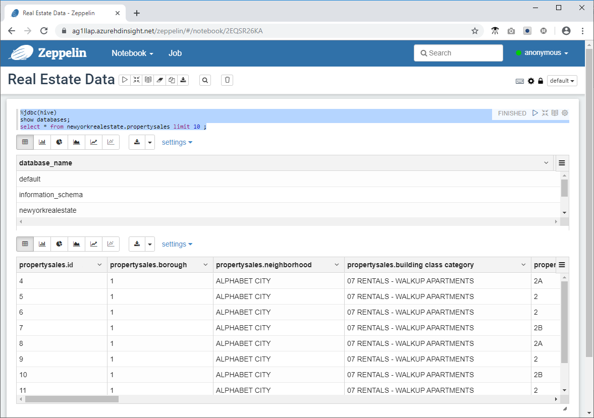

4. Now fire a more complex query to use some of the visualization and graphing capabilities available in Zeppelin. Copy the following query into the command prompt and click  .

```sql
%jdbc(hive)
select `sale price`, `square footage` from newyorkrealestate.propertysales 
where `sale price` < 20000000 AND `square footage` < 50000;
```

By default, the query output is displayed in table format. Instead, select Scatter Chart to see one of the visuals that the Zeppelin notebooks provides.

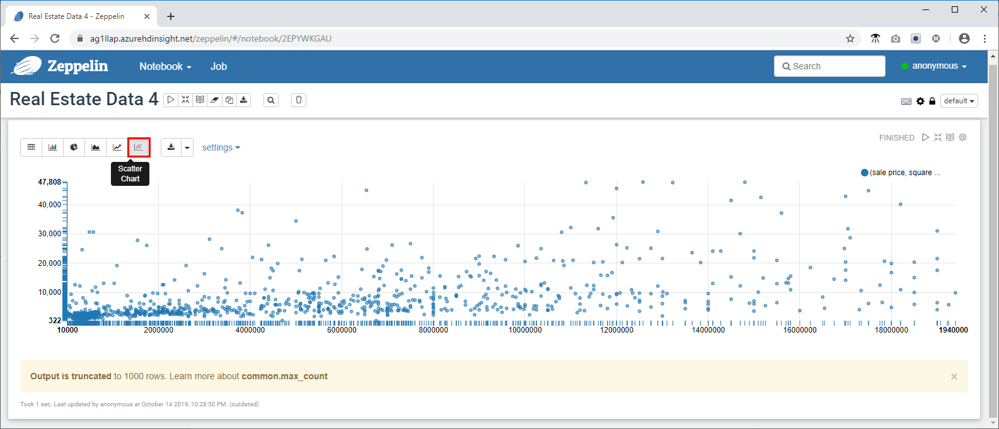
