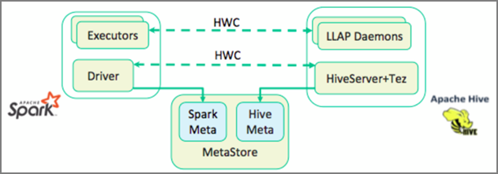

In the previous unit, we looked at two ways to query static data stored in an Interactive Query cluster – Data Analytics Studio and a Zeppelin notebook. But what if you wanted to stream fresh real estate data into your clusters using Spark and then query it using Hive? Because Hive and Spark have two different metastores they require a connector to bridge between the two – and the Apache Hive Warehouse Connector (HWC) is that bridge.  The Hive Warehouse Connector library enables you to work more easily with Apache Spark and Apache Hive by supporting tasks such as moving data between Spark DataFrames and Hive tables, and also directing Spark streaming data into Hive tables. We will not set up the connector in our scenario, but it’s important to know that the option exists.

Apache Spark has a Structured Streaming API that provides streaming capabilities not available in Apache Hive. Beginning with HDInsight 4.0, Apache Spark 2.3.1 and Apache Hive 3.1.0 have separate metastores, which made interoperability difficult. The Hive Warehouse Connector makes it easier to use Spark and Hive together. The Hive Warehouse Connector library loads data from LLAP daemons into Spark executors in parallel, making it more efficient and scalable than using a standard JDBC connection from Spark to Hive.

Some of the operations supported by the Hive Warehouse Connector are:

- Describing a table
- Creating a table for Optimized Row Columnar (ORC)-formatted data
- Selecting Hive data and retrieving a DataFrame
- Writing a DataFrame to Hive in batch
- Executing a Hive update statement
- Reading table data from Hive, transforming it in Spark, and writing it to a new Hive table
- Writing a DataFrame or Spark stream to Hive using HiveStreaming

Once you have a Spark cluster and an Interactive Query cluster deployed, you configure the Spark cluster settings in Ambari, which is a web based tool included in all HDInsight clusters. To open Ambari, navigate to https://**servername**.azurehdinsight.net in your internet browser where **servername** is the name of your Interactive Query cluster.

Then to write Spark streaming data into the tables, you create a Hive table and start writing data to it. Then run queries on your streaming data, you can use any of the following:

- spark-shell
- PySpark
- spark-submit
- Zeppelin
- Livy