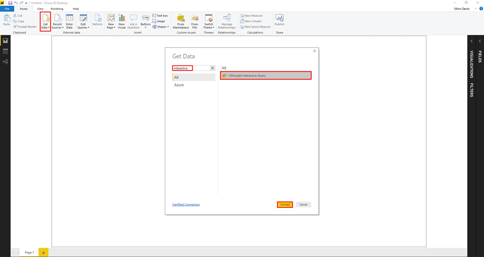
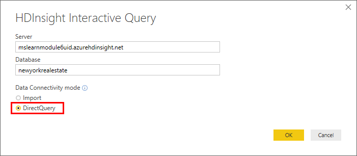
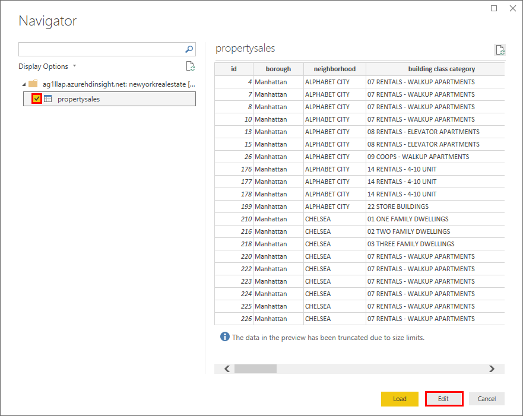
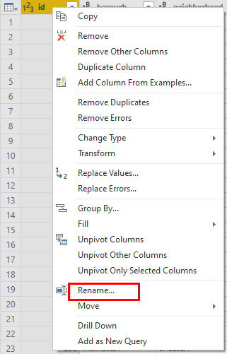
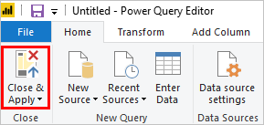
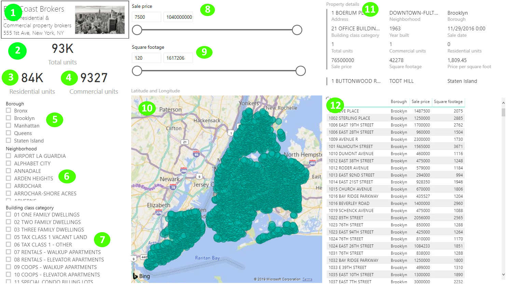
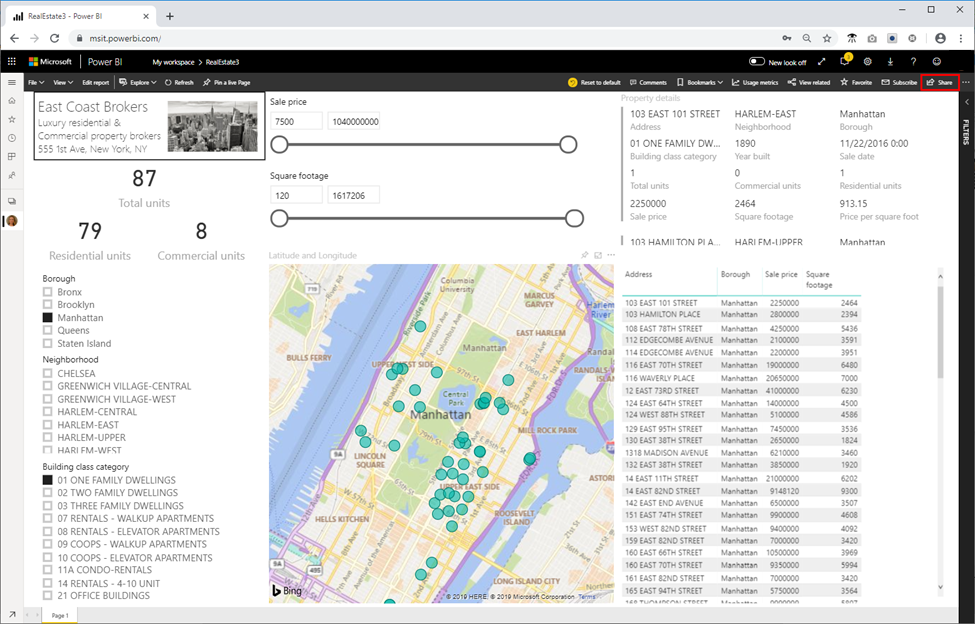

Now that we know how to import data into HDInsight, query data and see some basic insights, lets make this data truly useful and accessible to the real estate agents at your firm by creating a Power BI dashboard where they can quickly and easily filter data, map the locations, and gain the insights they need to make wise investments. 
Because we’re dealing with big data here, we don’t want to import this data into Power BI. Instead, we’ll use Direct Query with HDInsight Interactive Query to lookup data quickly.

1. Open Power BI Desktop. 
2. Click **Get Data**, then in the Get Data window, search for **‘interactive’**, then select **HDInsight Interactive Query**, and then click **Connect**.

3. If the Connecting to a third-party service window is displayed, click **Don’t warn me again for this connector**, and then click **Continue**. 
4. In the HDInsight Interactive Query box, do the following: 
    - **Server**: Enter **servername**.azurehdinsight.net. where **servername** is the name of your cluster.
    - **Database**: Enter newyorkrealestate.
    - **Data Connectivity Mode**: Select DirectQuery.

5. Enter the username (admin) and password you created for the cluster and click **Connect**.

6. In the Navigator window, check the **propertysales** table on the left menu, and then click **Load**. 

7. When the Power Query Editor window opens, capitalize each column heading by right-clicking the column header and clicking **Rename**, then capitalizing the first letter. This will improve the formatting of the Power BI dashboard.

8. Click **Close & Apply**.

9.	Add the following elements and visualizations onto your Power BI dashboard. 
    1. A text box and image.
    2. A card for Total units.
    3. A card for Residential units.
    4. A card for Commercial units.
    5. A slicer for Borough.
    6. A slicer for Neighborhood.
    7. A slicer for Building class category.
    8. A slicer for Sale price.
    9. A slicer for Square footage.
    10. A map where the Latitude field is set to Latitude and the Longitude field is set to Longitude.
    11. A multi-row card that includes the following fields: Address, Neighborhood, Borough, Building class category, Year built, Sale date, Total units, Commercial units, Sale price, Square footage, and Price per square foot.
    12. A table that includes the following values: Address, Borough, Sale price, Square footage.

10. Click **File > Save As**, name the file RealEstate and save your pbix file locally. 
11. Click **Publish > Save > and select My workspace** as a destination. 
12. In the Publishing to Power BI window, click **Open ‘Real Estate.pbix’** in Power BI. If you get a message about adding permissions, enter your username (admin) and password, and then set the permissions to Organization.

You can now use the Share button to share your report with your organization.

