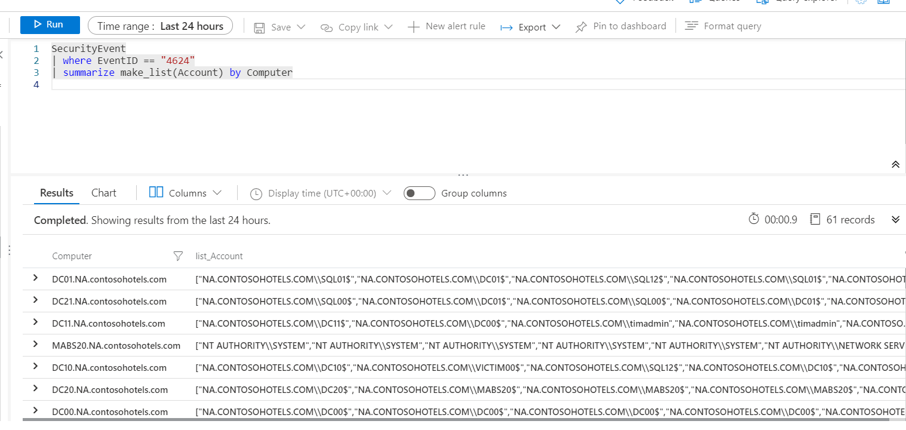
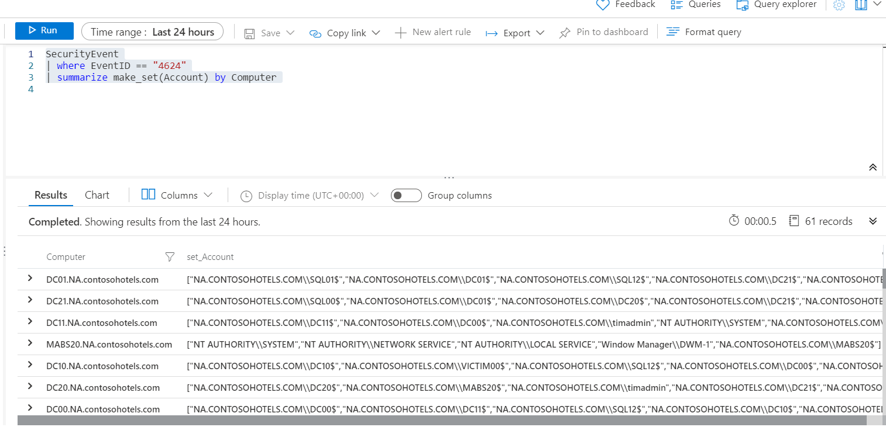

The make_ functions return a dynamic (JSON) array based on the specific function's purpose.

## make_list() function

The function returns a dynamic (JSON) array of all the values of Expression in the group.

This KQL query will first filter the EventID with the where operator.  Next, for each Computer, the results are a JSON array of Accounts. The resulting JSON array will include duplicate accounts.

```kusto
SecurityEvent

| where EventID == "4624"

| summarize make_list(Account) by Computer

```



## make_set() function

Returns a dynamic (JSON) array containing distinct values that Expression takes in the group.

This KQL query will first filter the EventID with the where operator.  Next, for each Computer, the results are a JSON array of unique Accounts.

```kusto
SecurityEvent

| where EventID == "4624"

| summarize make_set(Account) by Computer

```



