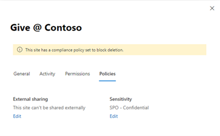
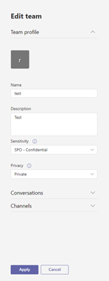
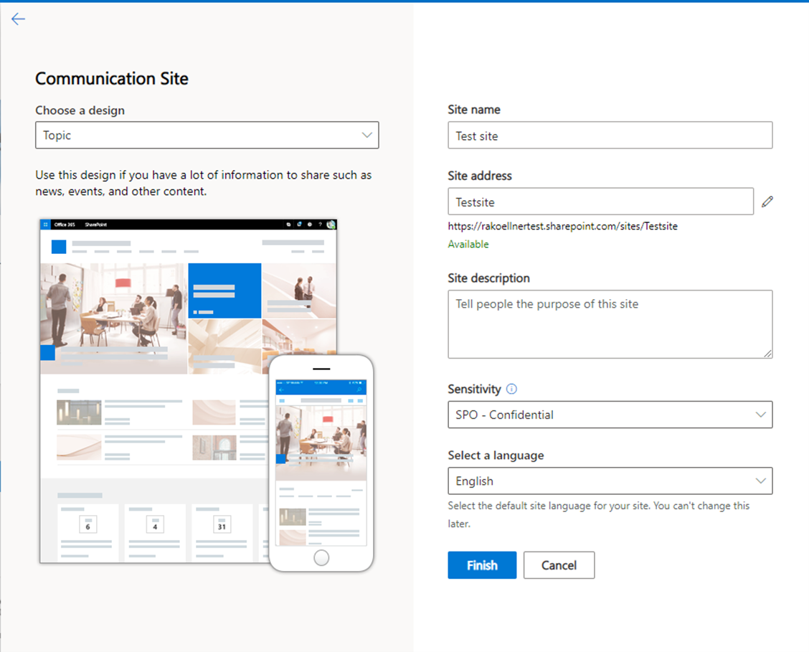
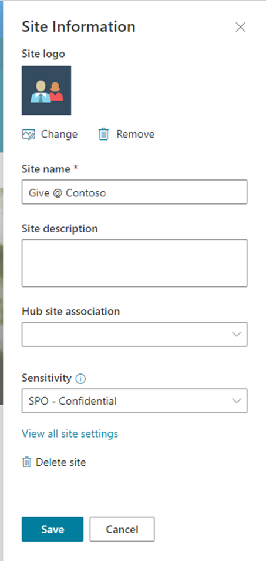
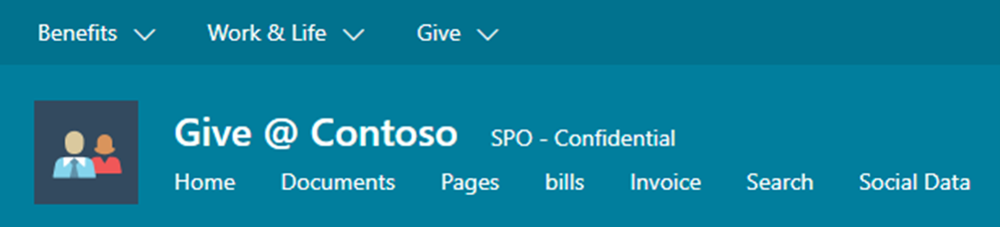
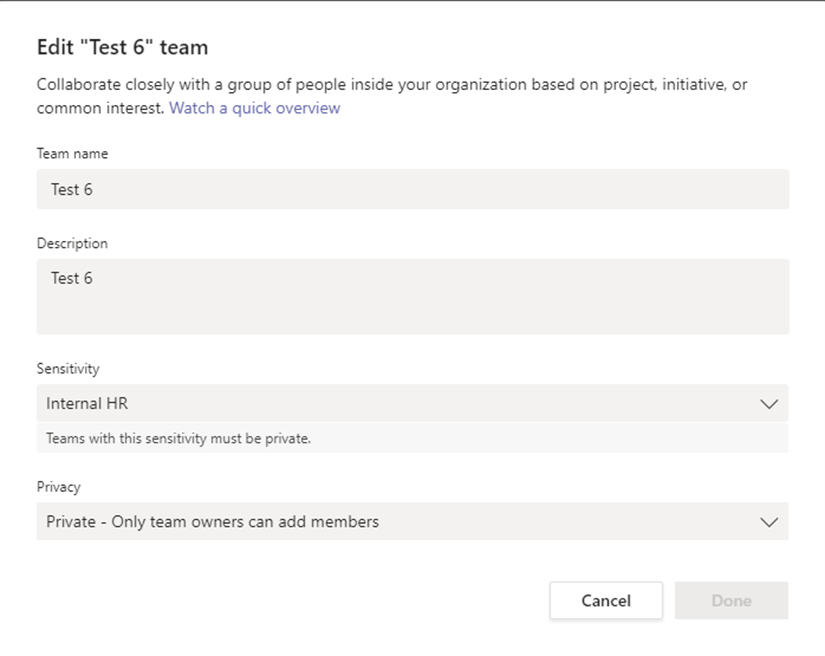

You can apply sensitivity labels to Microsoft 365 Groups and SharePoint sites. This enables lifecycle management of content within different types of containers of Microsoft 365.

Containers where labels can be published include:

- Microsoft 365 Groups

- Microsoft Teams

- Yammer Communities

- SharePoint Sites

Possible restrictions to configure via sensitivity labels:

- Privacy option (Public/Private/None)

- External User Access (Allowed/Forbidden)

- Control external sharing from labeled SharePoint Sites (Anyone/New and existing guests/Existing guests/Only people of organization)

- Access from unmanaged devices (Allow full access/Allow limited, web-only access/Block access)

## Options for applying a sensitivity label to Groups and SharePoint sites

There are many ways to apply a label to a Group and SharePoint site.

- Creation wizard of a Group or SharePoint Site

- SharePoint Admin Center for existing ones

- Microsoft Teams Admin Center for existing ones

- Azure portal

- PowerShell

### Applying labels to SharePoint Online & Microsoft 365 Groups

Sensitivity labels can be applied at different locations and via different applications.

### SharePoint admin center

As a SharePoint administrator you can use the SharePoint Admin center to change or assign a sensitivity label to a SharePoint Site:

1. Navigate to the **Microsoft 365 admin center** at [https://admin.microsoft.com/](https://admin.microsoft.com/?azure-portal=true)

1. Select **… Show all** and **SharePoint**.

1. Navigate to **Sites** > **Active Sites**.

1. Select the checkmark left of an existing site in which you want to apply a published Sensitivity Label to.

1. For the selected site, navigate to **Policies**.

    

1. Select **edit** to set the Sensitivity label

### Microsoft Teams admin center

A Microsoft Teams Administrator can change or select a sensitivity label at the Microsoft Teams admin center. After choosing a team and moving to the settings, the label can be set or change for the Team.

1. Navigate to the **Microsoft 365 admin center** at [https://admin.microsoft.com/](https://admin.microsoft.com/?azure-portal=true)

1. Select **… Show all** and **Teams**.

1. In the **Microsoft Teams admin center**, navigate to **Teams** > **Manage teams.**

1. Select the checkmark left of an existing team that you want to apply the published Sensitivity Label to.

1. Select **Edit**

1. Select **Sensitivity** and chose the desired label for the team.

### Microsoft Teams creation controls for sensitivity labeling

If sensitivity labels are created with a Group & site setting and the user has an Azure AD P1 license, then it´s possible to control the creation of Microsoft Teams with sensitivity Labeling.

1. Open the Teams desktop client.

1. From the bottom left menu, select **Join or create a team.**

1. Select **Create team.**

1. Select a team template.

1. Select a **published sensitivity label.**

1. Select the **privacy** option. The privacy options available are set within the sensitivity label.

1. Enter a meaningful **Team name** and **description.**

1. Optionally select the team members who should have security access to the team.

1. Select **Close.**

> [!TIP]
> The sensitivity label applies to the Microsoft Team, SharePoint Site and to the private channel SharePoint Site.

### New SharePoint site wizard (user)

In the default wizard, it´s possible to select a sensitivity label. This option is only displayed when the feature is enabled. Under the topic "Sensitivity" the user can select the labels, which are available for them.

1. Navigate to the **Microsoft 365 admin center** at [https://admin.microsoft.com/](https://admin.microsoft.com/?azure-portal=true).

1. Select **… Show all** and **SharePoint**.

1. Navigate to **Sites** > **Active** sites.

1. Select **+ Create.**

1. Select an appropriate **Design.**

1. Enter a meaningful **Site name**, **Group owner** for the required fields and enter the optional fields as required.

    

1. Select the **Published sensitivity label**.

1. Select Finish to create the SharePoint site.

### Applying a label to an existing SharePoint site (user)

If the SharePoint Site is deployed, the label can be changed to handle a lifecycle of the site. The label option is displayed under site information for site administrators.

1. Navigate to an existing **SharePoint online site**.

1. In the top right corner, select the **setting icon (Gear/Cog icon).**

1. Navigate to **Site Information.**

1. Set the **Sensitivity label.**

1. Select **Save.**

The label will be displayed near to the site name after some time.

> [!WARNING]
> If the new label is displayed and has the option "no external user", this setting will only apply to new external uses. 

### Applying and changing a label to a Microsoft Teams team as a user with a life-cycle example

As a Microsoft Team's Owner you can change the label of a Microsoft Team to handle the lifecycle.

1. Within the Teams application.

1. Navigate to **Teams**

1. Within the **Your teams** list select the required team

1. For the selected team, select **[…]** > **Edit team**

1. Set the **Sensitivity Label.**

1. Select **done.**

